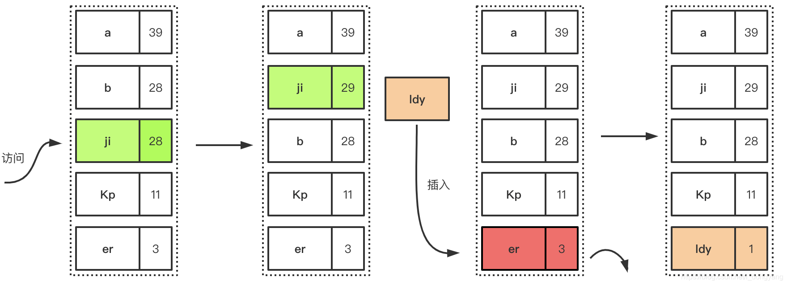
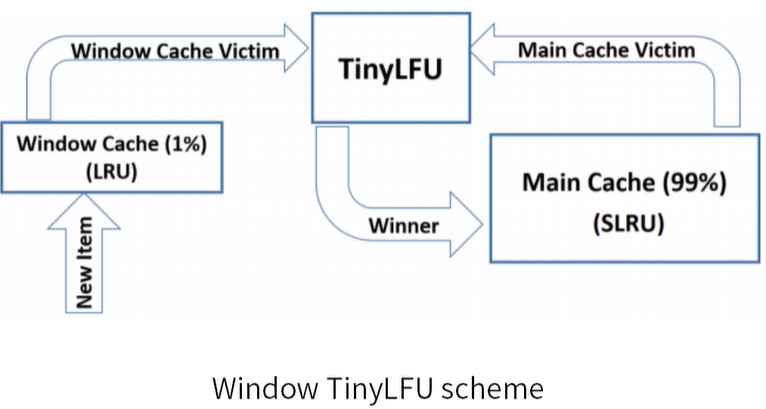
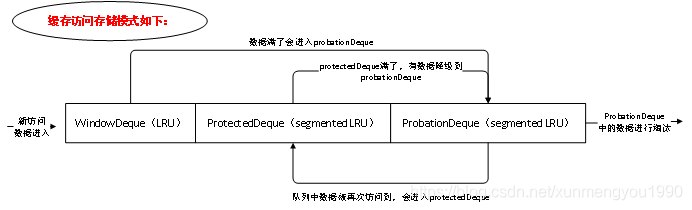
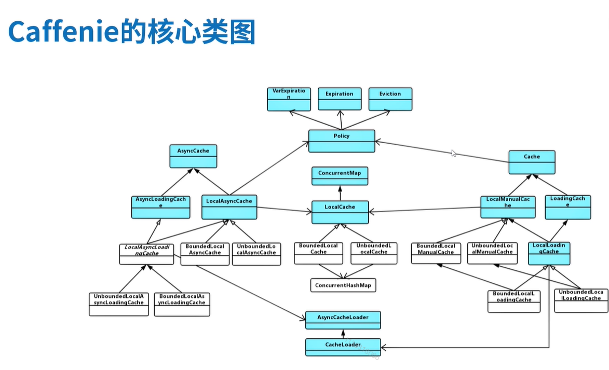
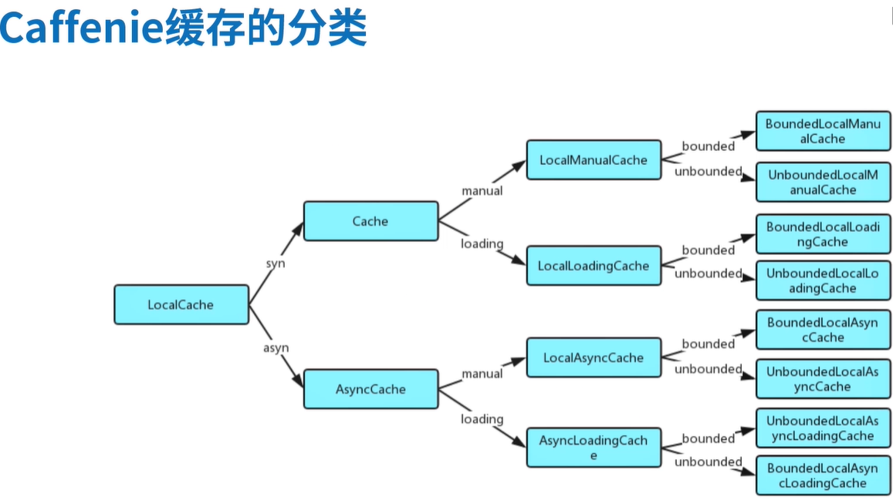

# Caffiene

## 1. 本地缓存简单介绍

Redis这种内存型NoSql作为缓存组件，能够很好的座位分布式缓存组件提供多个服务间的缓存，但是Redis这种需要网络开销，增加时耗，对于大key本地也需要format，消耗性能。本地缓存是直接从本地内存中读取，没有网络开销，且没有format的消耗。但是在分布式系统中，可能存在缓存不一致的问题，本地缓存仅对本地负责。

## 2. Caffiene简介

Caffenie是基于Java8的高性能缓存库。在Springboot2.X后，spring官方放弃了Guava作为本地缓存的媒介，使用了性能更优秀的Caffeine作为默认缓存组件。

3.0后版本基于jdk11

> Caffeine 基于大小的淘汰机制的原理，是通过线程池的方式来异步执行清理任务的。所以上面的验证代码中，put大量不同key的情况下，清理任务可能出现堆积，也就是说极端情况下会出现缓存项未被及时清理掉，而占用大量内存的情况出现。
> 实际的表现是缓存对象会从Eden区进入到Old区，以至于Old区内存飙升。导致频繁的YoungGC和FullGC，甚至最终出现OOM。
>
> 结合业务场景来分析，对于命中率极低的业务场景，使用本地缓存是不合适的，因为这种场景使用本地缓存，根本没有利用本地缓存的特性，请求还是大量的穿透到了下游的redis或db上，同时还多存储了一份数据，浪费了空间，所以本地缓存不是所有场景都适用的，使用前一定要结合业务特性具体分析。

### 2.1 caffiene的基础

#### 2.1.1 W-TinyLFU

##### 2.1.1.1 LFU

LFU： 最不经常使用，如果一个数据在最近一段时间内使用次数很少，那么在将来一段时间内被使用的可能性也很小。

LFU通常能带来最佳的缓存命中率，但是LFU有两个缺点

1. 需要给每个记录项维护频率信息，每次访问都要更新，需要一个巨大的空间记录所有出现的key和其对应的频次。
2. 如果数据访问模式随时间有变，LFU 的频率信息无法随之变化，因此早先频繁访问的记录可能会占据缓存，而后期访问较多的记录则无法被命中。（时间窗口）

##### 2.1.1.2 TinyLFU

为了解决传统LFU算法空间存储比较大的问题，提出了TinyLFU算法。可以在较大访问量的场景下近似的替代LFU的数据统计部分。原理类似于BloomFilter

> BloomFilter：使用一个大的bit数组用于存储对应的bit位设置为1，这样就可以通过商量的存储空间进行大量的数据过滤

在TinyLFU中，把多个bit位看作一个整体（记录频次数据，频次>1，需要多位bit来支持，实际支持的频次数量在0-（2^n-1）），用于统计一个key的使用频率，TinyLFU中的key也是通过多次不同的hash计算来映射多个不同的bit数组。在读取时，取映射的所有值中的最小的值座位key的使用频率。

在Caffeine中，维护了一个4-bit CountMinSketch用于记录key的使用频率。4-bit即最大的使用频率为15。具体的实现逻辑可以参照FrequencySketch。每个entry使用8bytes以保证准确。

> 用一个Long型一维数组保存所有数据，每个数组元素包括16个分段（下面将每个数组元素称为一个slot，每个4bit分段称为一个counter）
>
> 使用hash算法将每个key的频次映射到某个Counter中。并借鉴BloomFilter思想，用多种hash算法降低hash重复带来的误差。
>
> 每个key计算一个hash值，再用hash值计算出4种index，表示在哪些slot中；用hash值计算出在16个counter中的位置，每个slot中的counter下标相差1位，counter下标从右到左为0-16。
>
> 每次命中后将4个counter值加1，最多15。
>
> 由于每个元素的hash值都可能跟其他key相同，所以每次频次加1时，可能将其他key的频次加1。所以取这4个key的最小值最为该key的频次

为了解决数据访问模式随时间变化的问题，也为了避免计数无限增长，TinyLFU还采用了一个基于滑动窗口的时间衰减设计机制，借助一个简易的reset操作：每次添加一条记录到Sketch的时候，都会给一个计数器加1，**当计数器达到一个尺寸W的时候**，把所有记录的Sketch数据都处以2，该reset可以起到衰减的作用。

##### 2.1.1.3 W-TinyLFU

对同一对象的“稀疏突发”的场景下（新突发的key一直保持稀疏的访问频率触发），TinyLFU会出现问题。这种情况下，新突发的key无法建立足够的频率以保留在缓存中，从而导致不断的cache miss。

W-TinyLFU通过两个缓存来解决这个问题：main cache，window cache

- main cache：主缓存，使用SLRU逐出策略和TinyLFU接纳策略，总体大小为总缓存的99%
- window cache：窗口缓存，采用LRU逐出策略而没有任何接纳策略，大小为总缓存的1%

> LRU：Least Recently Used：即最近最少使用，是一种常用的[页面置换算法](https://baike.baidu.com/item/页面置换算法/7626091)，选择最近最久未使用的页面予以淘汰。该算法赋予每个[页面](https://baike.baidu.com/item/页面/5544813)一个访问字段，用来记录一个页面自上次被访问以来所经历的时间 t，当须淘汰一个页面时，选择现有页面中其 t 值最大的，即最近最少使用的页面予以淘汰。
>
> SLRU：Segmented Least Recently Used：SLRU算法在LRU的基础上进行分段，每段大小可变。分段的个数N一旦确定就被固定了，N越大，SLRU算法就更精确，实现就越复杂。感觉上与MySQL对LRU的优化类似，[MySQL内存](../MySQL/bug_你有我也有/(查询)查询数据过多，内存怎么处理.md)
>
> 

主缓存根据SLRU策略静态划分为A1和A2两个区域，80%的空间分给热门项目A2，并从20%的非热门区域（A1）中挑选牺牲块（victim）。所有请求的key都会被允许进入窗口缓存，而窗口缓存的victim则有机会被允许进入主缓存。如果被接受，则W-TinyLFU的victim 是主缓存的victim，否则是窗口缓存的victim。

从Caffiene的实现来看

存在三个队列：window队列，延缓队列，保护队列

新访问的数据进入window队列，当队列满了，低频率的进去延缓队列

延缓队列再次被访问进入保护队列

保护队列满了会有一部分被降级为延缓队列

对延缓队列的数据淘汰，有对应的PK机制

#### 2.1.2 Caffiene 核心源码分析

- Cache：提供了一些方法定义
  - LoadingCache：扩展了三个方法,get、getAll、refresh，定义了加载和更新的机制,通过build方法（构建缓存时的方法）传入的CacheLoader来操作这里面的具体条目（在LocalLoadingCache中有所体现）
  - LocalManualCache：做了一下部分的实现
    - UnboundedLocalManualCache：如果在没有配置任何回收策略的情况下则会使用UnboundedLocalManualCache,该实现也是最低限度的提供了缓存的功能，没有回收策略的本质上是对ConcurrentHashMap操作
    - BoundedLocalManualCache：有回收策略，对于设置了回收策略的Caffeine都会对应到一个具体实现类（全大写的类，由后期代码生成）,具体是由LocalCacheFactory（后期代码生成）来实现
      - LocalCacheFactory：这个方法针对我们配置的每种情况都拼接了一个字符串,最终得到了一个对应的实现类全名然后通过类加载器对它进行加载。重举性的写法也是因为Caffeine对每种情况都做出了优化,这也是前面类名全大写是怎么来的。最终会返回一个BoundedLocalCache,也就是我们最终要用到的一个实现类
        

-----

关键切入代码：

> VarHandle （变量句柄）的出现替代了 java.util.concurrent.atomic 和 sun.misc.Unsafe 的部分操作。并且提供了一系列标准的内存屏障操作，用于更加细粒度的控制内存排序。在安全性、可用性、性能上都要优于现有的API。VarHandle 可以与任何字段、数组元素或静态变量关联，支持在不同访问模型下对这些类型变量的访问，包括简单的 read/write 访问，volatile 类型的 read/write 访问，和 CAS(compare-and-swap)等。
>
> MethodHandle.Lookup可以通过相应的findxxx方法得到相应的MethodHandle，相当于MethodHandle的工厂方法。查找对象上的工厂方法对应于方法、构造函数和字段的所有主要用例。

1. 入口

Caffiene#**buildAsync()**/**build()**/**buildAsync(CacheLoader)**/**build(CacheLoader)**

2. 相关缓存类型

SS(**PS**)->SSL(removeListener)(**PS**)->SSLA(expiresAfterAccess/expiresVariable)(**PSA**)->SSLAW(expiresAfterWrite)(**PSAW**)->SSLAWR(refreshAfterWrite)(**PSWAR**)

SSLMW(weighter)(**PSMW**)：从SSL开始

SSLMS(no weighter)(**PSMS**)：从SSL开始

3. 基本操作：

BoundedLocalCache:put(K,V)

BoundedLocalCache:getIfAbsent(K,V)

4. 核心方法

BoundedLocalCache:maintenance(Runnable task)（后续整理操作，包括异步删除过多的数据，处理过期的数据）

BoundedLocalCache:afterRead

BoundedLocalCache:afterWrite

5. 特殊可以了解的类：

FrequencySketch（访问次数记录）

TimerWheel（时间轴过期）

#### 2.1.3 配置说明

| 参数              | 类型     | 描述                                                 |
| ----------------- | -------- | ---------------------------------------------------- |
| initialCapacity   | integer  | 初始缓存空间大小                                     |
| maximumSize       | long     | 缓存最大条数                                         |
| maximumWeight     | long     | 缓存最大权重                                         |
| expireAfterAccess | duration | 最后一次写入或访问经过固定时间过期                   |
| refreshAfterWrite | duration | 最后一次写入后经过固定时间过期                       |
| refreshAfterWrite | duration | 创建缓存或者最后一次更新缓存后经过固定的时间刷新缓存 |
| weakKeys          | boolean  | 打开key的弱引用                                      |
| weakValues        | boolean  | 打开value的弱引用                                    |
| softValues        | boolean  | 打开value的软引用                                    |
| recordStats       |          | 开发统计功能                                         |

- weakValues 和 softValues 不可以同时使用。
- maximumSize 和 maximumWeight 不可以同时使用。
- expireAfterWrite 和 expireAfterAccess 同事存在时，以 expireAfterWrite 为准。