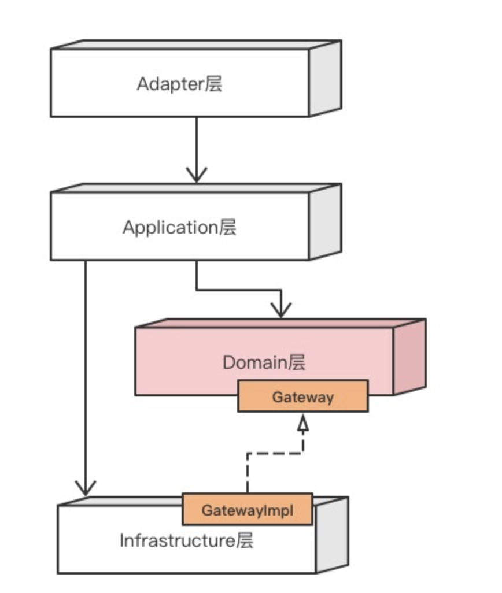
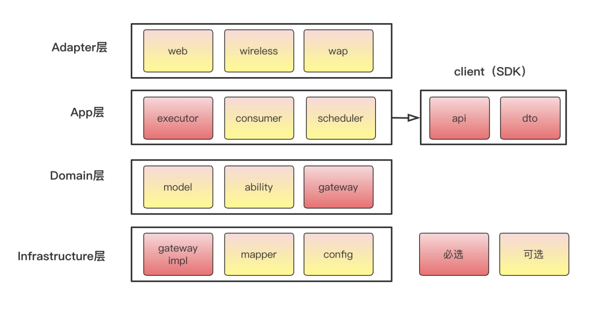
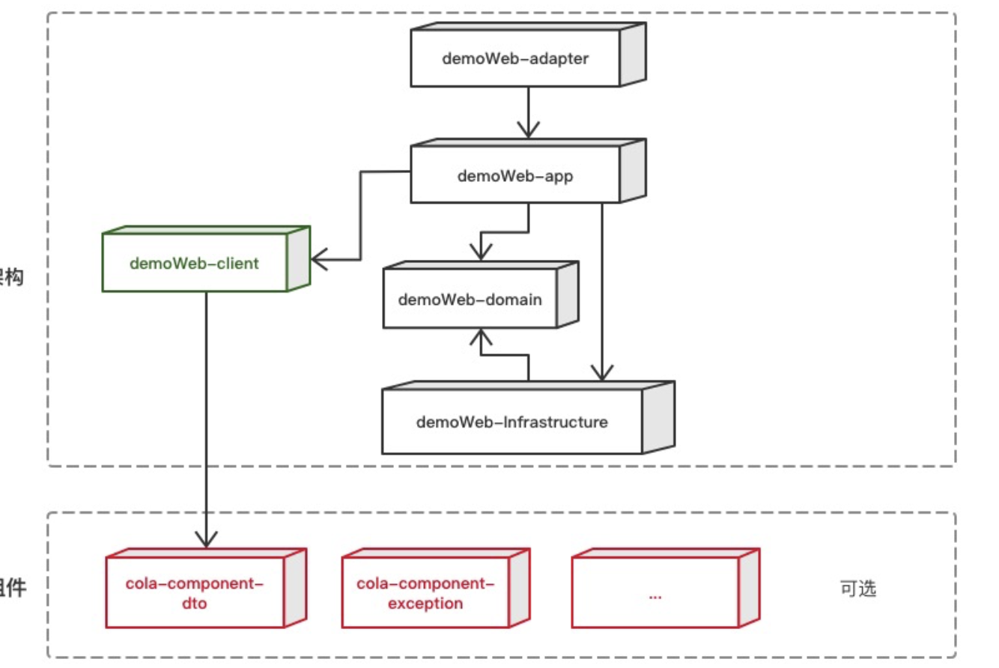

# COLA 4.0.1

## 1. 整体架构

1）适配层（Adapter Layer）：负责对前端展示（web，wireless，wap）的路由和适配，对于传统B/S系统而言，adapter就相当于MVC中的controller；

2）应用层（Application Layer）：主要负责获取输入，组装上下文，参数校验，调用领域层做业务处理，如果需要的话，发送消息通知等。层次是开放的，应用层也可以绕过领域层，直接访问基础实施层；

3）领域层（Domain Layer）：主要是封装了核心业务逻辑，并通过领域服务（Domain Service）和领域对象（Domain Entity）的方法对App层提供业务实体和业务逻辑计算。领域是应用的核心，不依赖任何其他层次；

4）基础实施层（Infrastructure Layer）：主要负责技术细节问题的处理，比如数据库的CRUD、搜索引擎、文件系统、分布式服务的RPC等。此外，领域防腐的重任也落在这里，外部依赖需要通过gateway的转义处理，才能被上面的App层和Domain层使用。

|            |             |                                 |      |
| ---------- | ----------- | ------------------------------- | ---- |
| 层次       | 包名        | 功能                            | 必选 |
| Adapter层  | web         | 处理页面请求的Controller        | 否   |
| Adapter层  | wireless    | 处理无线端的适配                | 否   |
| Adapter层  | wap         | 处理wap端的适配                 | 否   |
|            |             |                                 |      |
| App层      | executor    | 处理request，包括command和query | 是   |
| App层      | consumer    | 处理外部message                 | 否   |
| App层      | scheduler   | 处理定时任务                    | 否   |
|            |             |                                 |      |
| Domain层   | model       | 领域模型                        | 否   |
| Domain层   | ability     | 领域能力，包括DomainService     | 否   |
| Domain层   | gateway     | 领域网关，解耦利器              | 是   |
|            |             |                                 |      |
| Infra层    | gatewayimpl | 网关实现                        | 是   |
| Infra层    | mapper      | ibatis数据库映射                | 否   |
| Infra层    | config      | 配置信息                        | 否   |
|            |             |                                 |      |
| Client SDK | api         | 服务对外透出的API               | 是   |
| Client SDK | dto         | 服务对外的DTO                   | 是   |

