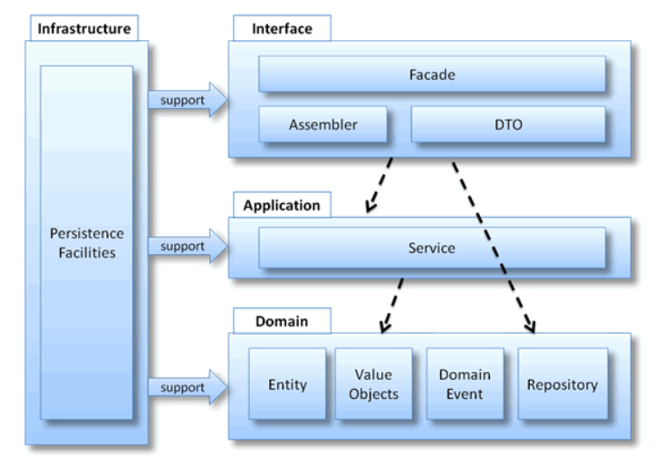
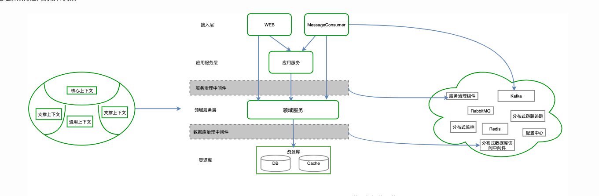
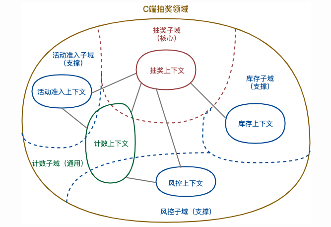
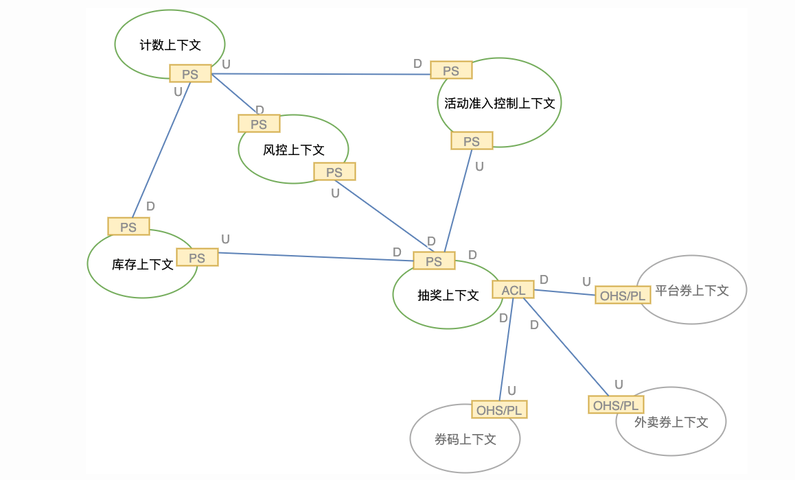
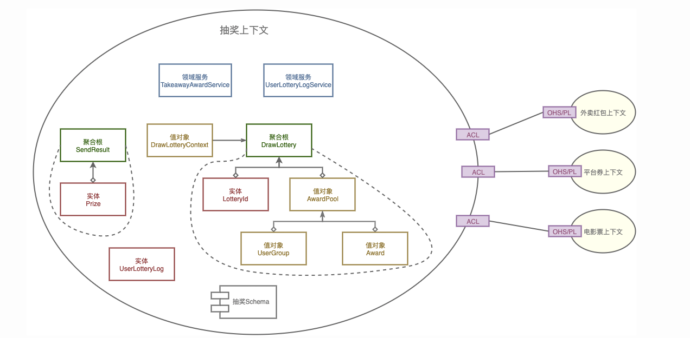
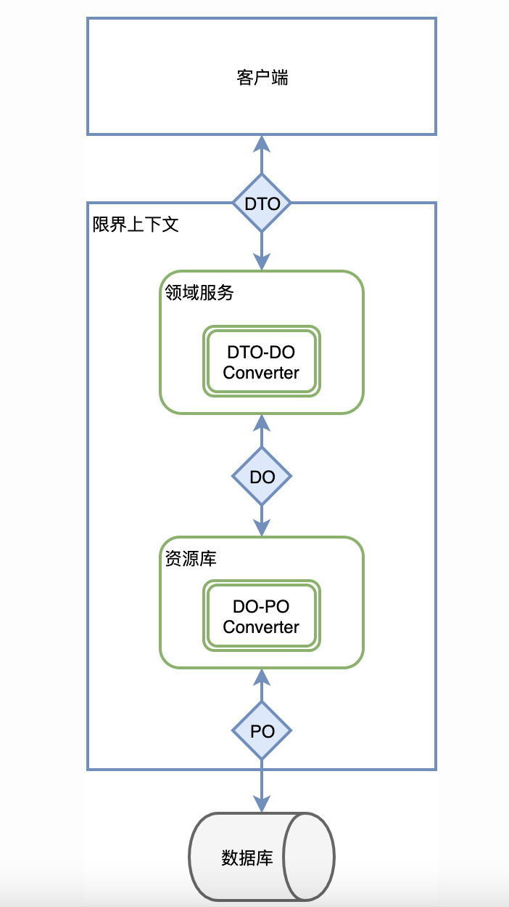

# 领域驱动模型浅谈1

参考文档：[领域驱动设计在互联网业务开发中的实践 - 美团技术团队 (meituan.com)](https://tech.meituan.com/2017/12/22/ddd-in-practice.html)

> 强调：可以尝试DDD思想来解决问题，并不是一概按照DDD模式生搬硬套来处理逻辑。

## 1. 贫血症和失忆症

> 贫血领域对象：仅作为数据载体，而没有行为和动作的领域对象

按照我们正常的逻辑，这种对象仅作为数据载体，所有的业务逻辑都是写在Service中的，但是在复杂逻辑的情况下，业务逻辑，状态就会散落在大量的方法中。原本的意图就会不明确。这种情况就可以称为失忆症（原本对象的意图模糊）。

那么如果将领域对象和领域行为绑定在一起，并与现实世界的业务对象相对应。各类具备明确的职责划分，将领域逻辑分散到领域对象中。

## 2. 领域驱动模块分析（各层级）（宽泛的讲解）

- Infrastructure 层 : 基础实施层，向其他层提供通用的技术能力，（可以通过架构框架来支持四个层次间的交互模式（COLA））
  - 工具类（util）
  - 第三方库类支持
  - 常用基本配置（config）
  - 数据访问底层实现（mapper）
- Domain层 : 主要负责表达业务概念,业务状态信息和业务规则；是整个系统的核心层,几乎全部的业务逻辑会在该层实现。
  - 聚合根：是一组相关对象的集合，作为一个整体被外界访问，聚合根（Aggregate Root）是这个聚合的根节点。聚合内部多个组成对象的关系可以用来指导数据库创建，但不可避免存在一定的抗阻。如聚合中存在List<值对象>，那么在数据库中建立1:N的关联需要将值对象单独建表，此时是有id的，建议不要将该id暴露到资源库外部，对外隐蔽。
  - 实体：具有唯一标识的对象（例如公安系统的身份信息录入，对于人的模拟，即认为是实体，每个人是独一无二的，且具有唯一标识，**他是哪个啥**）
  - 值对象：无需唯一标识的对象，理论上实体的属性也属于值对象的一种，值对象被创建后就不能倍修改，外部不得修改其属性。（例如颜色信息，仅需要知道是颜色的色码就可以满足要求，可以避免对标识追踪带来的系统复杂性，**他是啥**）
  - 领域服务：一些行为无法归并到实体对象和值对象上，本质上是一些操作，而非事物，可以将部分不方便归并的实体和值对象的操作归并至此。（微服务架构分割，一切领域逻辑对外暴露均需要通过领域服务来进行，原本聚合根暴露的业务逻辑也需要依托于领域服务）
  - 工厂（非必要）：创建复杂对象，隐藏创建细节
  - 仓储（非必要）：调用Infrastructure层，封装Mapper，对聚合根的存储提供支持。
  - 防腐层：在领域层需要调用其他服务时添加的防腐层，理论上此处接受所有其他服务的调用。
- Application层 : 相对于领域层,应用层是很薄的一层,应用层定义了软件要完成的任务,要尽量简单。此处不包含任务规则和知识，只是为下一层的领域对象协助任务，委托工作。它无法反应业务情况的状态，但是可以反应业务的进展状态。可以在此层挂载事务，日志任务处理等。（此处可以接入CQRS进行读写分离优化）
-  Interfaces层 : 负责向用户显示信息和解释用户命令，请求应用层以获取用户所需要展现的数据(比如获取首页的商品数据)
  - controller（可以添加防腐，以应对不同端的调用）

## 3. 分析

### 3.1 软件系统复杂性应对

- 抽象：将具体事件精简为一个泛化的抽象的概念，例如我吃苹果=》我吃水果，我坐飞机去北京=〉我乘坐交通工具去了某个地方，不必考虑是那个交通工具，是那个水果，是那个地方，甚至可以泛化吃为一个动作。
- 分冶：把问题空间切割为规模更小更易处理的若干子问题。类似于模块划分，但是在分割后必须考虑如何装配为一个整体，分割越合理理论上需要关注的细节就更少，即高内聚低耦合
- 知识：方法论，提供知识手段。

**DDD的核心诉求就是将业务架构映射到系统架构上，在响应业务变化调整业务架构时，也随之变化系统架构。而微服务追求业务层面的复用，设计出来的系统架构和业务一致；在技术架构上则系统模块之间充分解耦，可以自由地选择合适的技术架构，去中心化地治理技术和数据。**

## 4. Demo（美团）

### 4.1 明确需求

1. 抽奖活动有活动限制，例如用户的抽奖次数限制，抽奖的开始和结束的时间等； 

2. 一个抽奖活动包含多个奖品，可以针对一个或多个用户群体； 
3. 奖品有自身的奖品配置，例如库存量，被抽中的概率等，最多被一个用户抽中的次数等等；
4. 用户群体有多种区别方式，如按照用户所在城市区分，按照新老客区分等； 
5. 活动具有风控配置，能够限制用户参与抽奖的频率。

### 4.2 规划子域

### 4.3 明确限界上下文关系

> **限界上下文之间的映射关系**
>
> - 合作关系（Partnership）：两个上下文紧密合作的关系，一荣俱荣，一损俱损。
> - 共享内核（Shared Kernel）：两个上下文依赖部分共享的模型。
> - 客户方-供应方开发（Customer-Supplier Development）：上下文之间有组织的上下游依赖。
> - 遵奉者（Conformist）：下游上下文只能盲目依赖上游上下文。
> - 防腐层（Anticorruption Layer）：一个上下文通过一些适配和转换与另一个上下文交互。
> - 开放主机服务（Open Host Service）：定义一种协议来让其他上下文来对本上下文进行访问。
> - 发布语言（Published Language）：通常与OHS一起使用，用于定义开放主机的协议。
> - 大泥球（Big Ball of Mud）：混杂在一起的上下文关系，边界不清晰。
> - 另谋他路（SeparateWay）：两个完全没有任何联系的上下文。

名词释义（可以见上面的上下文关系）：

- ACL：防腐，抽奖上下文，对其他的上下文做了对应的防腐
- OHS/PL：上层服务
- U/D：UP/DOWN
- PS：PartnerShip，由于计数上下文，活动准入上下文，风控上下文，库存上下文，抽奖上下文都在抽奖领域内部，因此是紧密合作的PS关系。

### 4.4 建模

### 4.5 数据流转

##### 在实践中我们可以

 首先领域的开放服务通过**信息传输对象（DTO）**来完成与外界的数据交互；在领域内部，我们通过**领域对象（DO）**作为领域内部的数据和行为载体；在资源库内部，我们沿袭了原有的数据库持久化对象（PO）进行数据库资源的交互。同时，DTO与DO的转换发生在领域服务内，**DO与PO的转换发生在资源库内**。