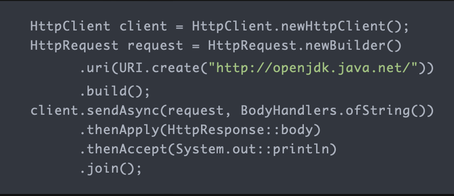
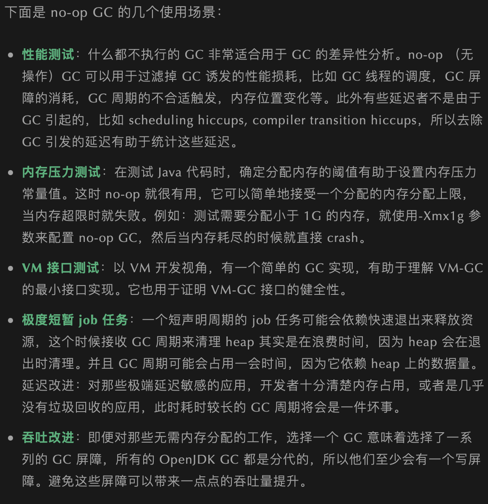
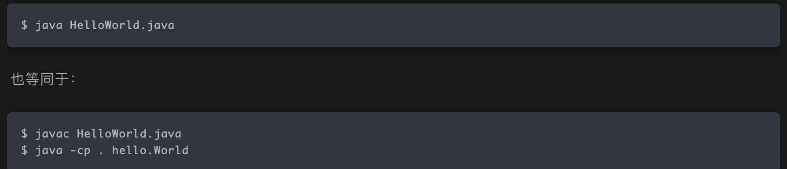
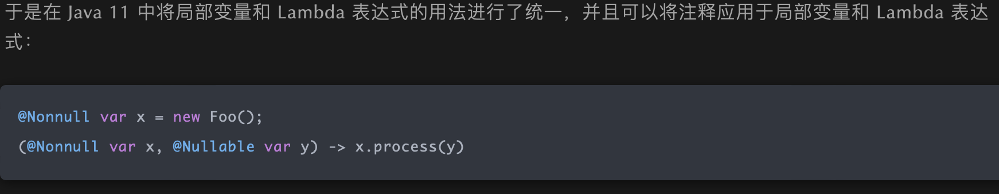
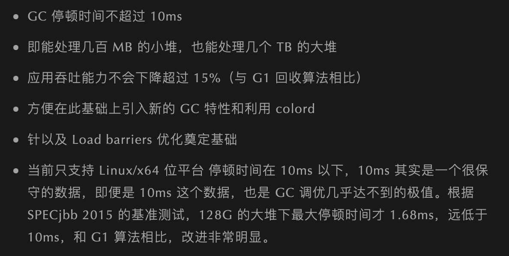

# Java8后的新增的特性

| 特性简介                  | 特性详情                                                     | Demo | 版本  |
| ------------------------- | ------------------------------------------------------------ | ---- | ----- |
| 模块系统                  | 模块是一个包的容器                                           |      | Java9 |
| REPL（JShell）            | 交互式编程环境                                               |      |       |
| HTTP2客户端               | HTTP/2标准是HTTP协议的最新版本，提供了新的HTTPClient API支持WebSocket和HTTP2流以及服务器推送特性 |      |       |
| 改进的Javadoc             | 支持API文档中的搜索                                          |      |       |
| 多版本兼容JAR包           | 创建仅在特定版本的Java环境中运行库程序选择使用的class版本    |      |       |
| 集合工厂方法              | List，Set和Map接口中，静态工厂方法可以创建这些集合的不可变实例 |      |       |
| 私有接口方法              | 在接口中使用private私有方法                                  |      |       |
| 进程API                   | 改进的API来控制管理操作系统进程，引入java.lang.ProcessHandle及其嵌套接口info来让开发者逃离因为获取一个本地进程的PID而不得不使用本地代码的问题 |      |       |
| 改进了Stream API          | 添加了一些方法                                               |      |       |
| 改进try-with-resources    | 如果已经有一个资源是final或者等效，可以直接使用，而不需要在语句中重新声明一个 |      |       |
| 改进的弃用注解@Deprecated | 可以额外标记JavaAPI状态，可以表示被标记的API将会被移除，或者已经破坏 |      |       |
| 改进的钻石操作符          | 匿名类可以使用                                               |      |       |
| 改进Optional类            | 添加了一些新的有用方法                                       |      |       |
| 多分辨率图像API           | 更加容易操作和展示不同分辨率的图像                           |      |       |
| 改进CompletableFutureAPI  | 异步机制可以在ProcessHandle.onExit退出时执行                 |      |       |
| 轻量级的JSON API          |                                                              |      |       |
| 响应式流API               |                                                              |      |       |

# JAVA 11-17

| 特性简介                               | 特性详情                                                     | Demo                                                         | 版本   |
| -------------------------------------- | ------------------------------------------------------------ | ------------------------------------------------------------ | ------ |
| 基于嵌套的访问控制                     | 这种改进是Java字节码级别的。引入了两个新的属性，NestMembers用来表示已知的静态成功，nest成员包含NestHost属性，标识他的宿主类 |                                                              | Java11 |
| HTTP Client升级                        | 包名由jdk.incubator.http改为java.net.http。标准化，且几乎被重写，完全支持异步非阻塞。在用户层请求发布者和响应发布者与底层套接字之间追踪数据流更容易了。这降低了复杂性，并最大程度上提高了 HTTP/1 和 HTTP/2 之间的重用的可能性。 |  | Java11 |
| Epsilon（低开销垃圾回收器）            | Epsilon 垃圾回收器的目标是开发一个控制内存分配，但是不执行任何实际的垃圾回收工作。它提供一个完全消极的 GC 实现，分配有限的内存资源，最大限度的降低内存占用和内存吞吐延迟时间。 |  | Java11 |
| 增强Java启动器                         | 能够运行单一文件的 Java 源代码                               |  | Java11 |
| 在 Lambda 表达式中使用局部变量类型推断 | Java 11 与 Java 10 的不同之处在于允许开发者在 Lambda 表达式中使用 var 进行参数声明。乍一看，这一举措似乎有点多余，因为在写代码过程中可以省略 Lambda 参数的类型，并通过类型推断确定它们。但是，添加上类型定义同时使用 @Nonnull 和 @Nullable 等类型注释还是很有用的，既能保持与局部变量的一致写法，也不丢失代码简洁。 |  | Java11 |
| 低开销的 Heap Profiling                | Java 11 中提供一种低开销的 Java 堆分配采样方法，能够得到堆分配的 Java 对象信息，并且能够通过 JVMTI 访问堆信息。 |                                                              | Java11 |
| 支持TLS1.3协议                         |                                                              |                                                              | Java11 |
| ZGC                                    | ZGC 是一个可伸缩的、低延迟的垃圾收集器                       |  | Java11 |
| 飞行记录器                             | 之前商业版JDK的一个分析工具，现在包含到公开代码库中所有人都可以使用 |                                                              | Java11 |
| Shenandoah                             | 一个低停顿垃圾收集器                                         |                                                              |        |

