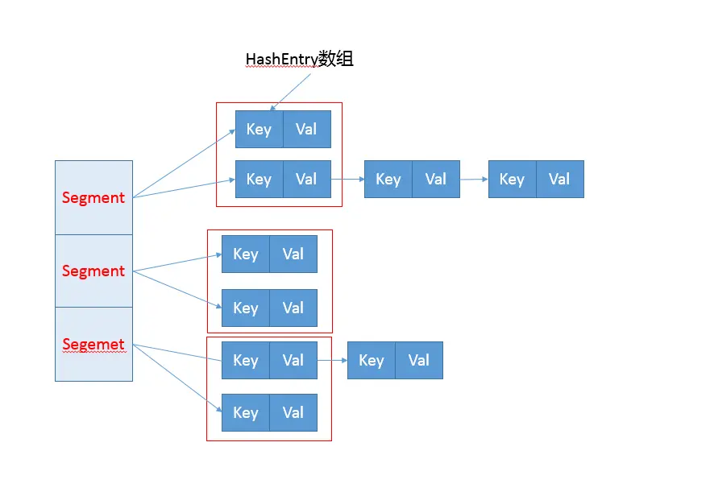

# ConcurrentHashMap

## 1 简介

### 1.1 早期：

-  分离锁：将内部进行分段，里面放HashEntry的数组，和HashMap类似，哈希相同的目录也是以链表形式存放。
- HashEntry内部使用volatile的value字段来保证可见性，也利用了不可变对象的机制以改进利用Unsafe提供的底层能力，比如volatile access，去直接完成部分操作，以最优化性能。毕竟Unsafe中的很多操作都是HVN intrinsic（JVM内部方法，大概就是优化很优化）优化过的



JDK7的get源码，get是读操作，因此锁其实一般

```java

public V get(Object key) {
        Segment<K,V> s; // manually integrate access methods to reduce overhead
        HashEntry<K,V>[] tab;
        int h = hash(key.hashCode());
       //利用位操作替换普通数学运算
       long u = (((h >>> segmentShift) & segmentMask) << SSHIFT) + SBASE;
        // 以Segment为单位，进行定位
        // 利用Unsafe直接进行volatile access
        if ((s = (Segment<K,V>)UNSAFE.getObjectVolatile(segments, u)) != null &&
            (tab = s.table) != null) {
           //省略
          }
        return null;
    }
```

JDK7的put操作，首先通过二次hash避免hash冲突，然后通过Unsafe调用方式，获取Segment进行线程安全的put操作

```java

 public V put(K key, V value) {
        Segment<K,V> s;
        if (value == null)
            throw new NullPointerException();
        // 二次哈希，以保证数据的分散性，避免哈希冲突
        int hash = hash(key.hashCode());
        int j = (hash >>> segmentShift) & segmentMask;
        if ((s = (Segment<K,V>)UNSAFE.getObject          // nonvolatile; recheck
             (segments, (j << SSHIFT) + SBASE)) == null) //  in ensureSegment
            s = ensureSegment(j);
        return s.put(key, hash, value, false);
    }


final V put(K key, int hash, V value, boolean onlyIfAbsent) {
            // scanAndLockForPut会去查找是否有key相同Node
            // 无论如何，确保获取锁
            HashEntry<K,V> node = tryLock() ? null :
                scanAndLockForPut(key, hash, value);
            V oldValue;
            try {
                HashEntry<K,V>[] tab = table;
                int index = (tab.length - 1) & hash;
                HashEntry<K,V> first = entryAt(tab, index);
                for (HashEntry<K,V> e = first;;) {
                    if (e != null) {
                        K k;
                        // 更新已有value...
                    }
                    else {
                        // 放置HashEntry到特定位置，如果超过阈值，进行rehash
                        // ...
                    }
                }
            } finally {
                unlock();
            }
            return oldValue;
        }

```

ConcurrentHashMap的扩容是以segment为单位的。

但是他的size方法就会因为并发put导致结果不准确，但是如果直接锁定就会变得昂贵。其实这个也是分离锁的一个副作用。其实分离锁也限制了Map的初始化等操作。这个情况下，ConcurrentHashMap通过重试来获取可靠值。如果没有监控到变化，就直接返回，不然获取锁进行操作。

### 1.2 Java8以及之后的版本

- 总体结构上，内部存储变成HashMap结构相似，同样的大的桶数组。内部也是一个个所谓的链表结构
- 内部仍然有Segment定义，但是仅仅是为了保证序列化时的兼容性，不再有任何结构上的用处
- 初始化操作大大简化，修改为lazy-load模式，这样避免初始化开销。
- 数据存储利用volatitle来保证可见性。
- 使用CAS等操作，在特定场景进行无锁兵法操作
- 使用Unsafe，LongAdder之类底层手段，进行极端情况下的优化


数据存储内部实现，key为final，标识生命周期内Key时不可能发生变化的，同时val和next都被声明为volatile保证其可见性。

put方法

```java

final V putVal(K key, V value, boolean onlyIfAbsent) { if (key == null || value == null) throw new NullPointerException();
    int hash = spread(key.hashCode());
    int binCount = 0;
    for (Node<K,V>[] tab = table;;) {
        Node<K,V> f; int n, i, fh; K fk; V fv;
      	//lazy-init
        if (tab == null || (n = tab.length) == 0)
            tab = initTable();
      	//tabAt 直接利用Unsafe的getObjectAcquire避免间接调用的开销。
        else if ((f = tabAt(tab, i = (n - 1) & hash)) == null) {
            // 利用CAS去进行无锁线程安全操作，如果bin是空的
            if (casTabAt(tab, i, null, new Node<K,V>(hash, key, value)))
                break; 
        }
        else if ((fh = f.hash) == MOVED)
            tab = helpTransfer(tab, f);
        else if (onlyIfAbsent // 不加锁，进行检查
                 && fh == hash
                 && ((fk = f.key) == key || (fk != null && key.equals(fk)))
                 && (fv = f.val) != null)
            return fv;
        else {
            V oldVal = null;
          	//被多次优化了，不必过于担心性能差异，相比RLock，可以减少内存消耗。
            synchronized (f) {
                   // 细粒度的同步修改操作... 
                }
            }
            // Bin超过阈值，进行树化
            if (binCount != 0) {
                if (binCount >= TREEIFY_THRESHOLD)
                    treeifyBin(tab, i);
                if (oldVal != null)
                    return oldVal;
                break;
            }
        }
    }
    addCount(1L, binCount);
    return null;
}


private final Node<K,V>[] initTable() {
    Node<K,V>[] tab; int sc;
    while ((tab = table) == null || tab.length == 0) {
        // 如果发现冲突，进行spin等待
        if ((sc = sizeCtl) < 0)
            Thread.yield(); 
        // CAS成功返回true，则进入真正的初始化逻辑
        else if (U.compareAndSetInt(this, SIZECTL, sc, -1)) {
            try {
                if ((tab = table) == null || tab.length == 0) {
                    int n = (sc > 0) ? sc : DEFAULT_CAPACITY;
                    @SuppressWarnings("unchecked")
                    Node<K,V>[] nt = (Node<K,V>[])new Node<?,?>[n];
                    table = tab = nt;
                    sc = n - (n >>> 2);
                }
            } finally {
                sizeCtl = sc;
            }
            break;
        }
    }
    return tab;
}


```

size()方法

如果不管其中与扩容有关的逻辑，addCount 方法记录 size 变化的过程可以分为两类情况，

counterCells 数组未初始化
a. CAS 一次 baseCount
b. 如果 CAS 失败，则调用 fullAddCount 方法

counterCells 数组已初始化
a. CAS 一次当前线程探针哈希到的数组元素
b. 如果 CAS 失败，则调用 fullAddCount 方法


**关于 counterCells 扩容：**
如果 CAS 数组元素连续失败两次，就会进行 counterCells 数组的扩容，直到达到机器的处理器数为止。
比如我的机器是双核四线程，真正能并行的线程数是 4，所以在我机器上 counterCells 初始化后，最多扩容一次。

```java
// 两种情况
// 1. counterCells 数组未初始化，在没有线程争用时，将 size 的变化写入此字段
// 2. 初始化 counterCells 数组时，没有获取到 cellsBusy 锁，会再次尝试将 size 的变化写入此字段
private transient volatile long baseCount;

// 用于同步 counterCells 数组结构修改的乐观锁资源
private transient volatile int cellsBusy;

// counterCells 数组一旦初始化，size 的变化将不再尝试写入 baseCount
// 可以将 size 的变化写入数组中的任意元素
// 可扩容，长度保持为 2 的幂
private transient volatile CounterCell[] counterCells;


/* ---------------- Counter support -------------- */

/**
     * A padded cell for distributing counts.  Adapted from LongAdder
     * and Striped64.  See their internal docs for explanation.
     */
@sun.misc.Contended static final class CounterCell {
  volatile long value;
  CounterCell(long x) { value = x; }
}

public int size() {
  long n = sumCount();
  return ((n < 0L) ? 0 :
          (n > (long)Integer.MAX_VALUE) ? Integer.MAX_VALUE :
          (int)n); // 将 n 裁剪到 [0, Integer.MAX_VALUE] 内
}

// 计算 baseCount 字段与所有 counterCells 数组的非空元素的和
final long sumCount() {
  CounterCell[] as = counterCells; CounterCell a;
  long sum = baseCount;
  if (as != null) {
    for (int i = 0; i < as.length; ++i) {
      if ((a = as[i]) != null)
        sum += a.value;
    }
  }
  return sum;
}
    
// 参数 x 表示键值对个数的变化值，如果为正，表示新增了元素，如果为负，表示删除了元素
private final void addCount(long x, int check) {
  CounterCell[] as; long b, s;
  // 如果 counterCells 为空，则直接尝试通过 CAS 将 x 累加到 baseCount 中
  if ((as = counterCells) != null ||
      !U.compareAndSwapLong(this, BASECOUNT, b = baseCount, s = b + x)) {
    // counterCells 非空
    // 或 counterCells 为空，但 CAS baseCount 失败都会来到这里
    CounterCell a; long v; int m;
    boolean uncontended = true; // CAS 数组元素时，有没有发生线程争用的标志
    // 如果当前线程探针哈希到的数组元素非空，则尝试将 x 累加到对应数组元素
    if (as == null || (m = as.length - 1) < 0 ||
        (a = as[ThreadLocalRandom.getProbe() & m]) == null ||
        !(uncontended =
          U.compareAndSwapLong(a, CELLVALUE, v = a.value, v + x))) {
      // counterCells 为空，或其长度小于1
      // 或当前线程探针哈希到的数组元素为空
      // 或当前线程探针哈希到的数组元素非空，但 CAS 数组元素失败
      // 都会调用 fullAddCount 方法来完成 x 的写入
      fullAddCount(x, uncontended);
      return; // 如果调用过 fullAddCount，则当前线程一定不会协助扩容
    }
    // 走到这说明，CAS 数组元素成功
    // 此时如果 check <= 1，也不协助可能会发生的扩容
    if (check <= 1)
      return;
    // 如果 check 大于 1，则计算当前 map 的 size，为判断是否需要扩容做准备
    s = sumCount();
  }
  // size 的变化已经写入完成
  // 后面如果 check >= 0，则判断当前的 size 是否会触发扩容
  if (check >= 0) {
    // 扩容相关的逻辑
    Node<K,V>[] tab, nt; int n, sc;
    while (s >= (long)(sc = sizeCtl) && (tab = table) != null &&
           (n = tab.length) < MAXIMUM_CAPACITY) {
      int rs = resizeStamp(n);
      if (sc < 0) {
        if ((sc >>> RESIZE_STAMP_SHIFT) != rs || sc == rs + 1 ||
            sc == rs + MAX_RESIZERS || (nt = nextTable) == null ||
            transferIndex <= 0)
          break;
        if (U.compareAndSwapInt(this, SIZECTL, sc, sc + 1))
          transfer(tab, nt);
      }
      else if (U.compareAndSwapInt(this, SIZECTL, sc,
                                   (rs << RESIZE_STAMP_SHIFT) + 2))
        transfer(tab, null);
      s = sumCount();
    }
  }
}


// 只被 addCount 方法调用
// 如果 counterCells 数组未初始化
// 或者线程哈希到的 counterCells 数组元素未初始化
// 或者 CAS 数组元素失败，都会调用此方法
private final void fullAddCount(long x, boolean wasUncontended) {
  int h;
  // 判断线程探针哈希值是否初始化
  if ((h = ThreadLocalRandom.getProbe()) == 0) {
    ThreadLocalRandom.localInit();      // force initialization
    h = ThreadLocalRandom.getProbe();
    wasUncontended = true; // 重新假设未发生争用
  }
  boolean collide = false;                // 是否要给 counterCells 扩容的标志
  for (;;) {
    CounterCell[] as; CounterCell a; int n; long v;
    if ((as = counterCells) != null && (n = as.length) > 0) {
      // 数组不为空且长度大于 0
      if ((a = as[(n - 1) & h]) == null) {
        // 尝试初始化线程探针哈希到的数组元素
        if (cellsBusy == 0) {            // Try to attach new Cell
          // 注意，这里已经把 x 放入对象
          CounterCell r = new CounterCell(x); // Optimistic create
          if (cellsBusy == 0 && // 准备初始化数组元素，要求 cellsBusy 为 0，并尝试将其置 1
              U.compareAndSwapInt(this, CELLSBUSY, 0, 1)) {
            // 获得 cellsBusy 锁
            boolean created = false;
            try {               // Recheck under lock
              CounterCell[] rs; int m, j;
              // 判断有没有被其它线程初始化
              if ((rs = counterCells) != null &&
                  (m = rs.length) > 0 &&
                  rs[j = (m - 1) & h] == null) {
                rs[j] = r;
                created = true;
              }
            } finally {
              cellsBusy = 0; // 释放 cellsBusy 锁
            }
            if (created) // 初始化元素成功，直接退出循环
              break;
            continue;           // Slot is now non-empty
          }
        }
        collide = false;
      }
      else if (!wasUncontended)       // CAS already known to fail
        wasUncontended = true;      // Continue after rehash（指的是更改当前线程的探针哈希值）
      // wasUncontended 为 true 执行到这
      // 尝试将 x 累加进数组元素
      else if (U.compareAndSwapLong(a, CELLVALUE, v = a.value, v + x))
        break;
      // CAS 失败
      // 判断 counterCells 是否正在扩容，或数组长度是否大于等于处理器数
      else if (counterCells != as || n >= NCPU)
        collide = false;            // At max size or stale
      // 如果数组没有在扩容，且数组长度小于处理器数
      // 此时，如果 collide 为 false，则把它变成 true
      // 在下一轮循环中，如果 CAS 数组元素继续失败，就会触发 counterCells 扩容
      else if (!collide)
        collide = true;
      // 如果 collide 为 true，则尝试给 counterCells 数组扩容
      else if (cellsBusy == 0 &&
               U.compareAndSwapInt(this, CELLSBUSY, 0, 1)) {
        try {
          if (counterCells == as) {// Expand table unless stale
            CounterCell[] rs = new CounterCell[n << 1];
            for (int i = 0; i < n; ++i)
              rs[i] = as[i];
            counterCells = rs;
          }
        } finally {
          cellsBusy = 0;
        }
        collide = false;
        continue;                   // Retry with expanded table
      }
      h = ThreadLocalRandom.advanceProbe(h); // 更改当前线程的探针哈希值
    }
    // counterCells 数组为空或长度为 0
    else if (cellsBusy == 0 && counterCells == as &&
             U.compareAndSwapInt(this, CELLSBUSY, 0, 1)) {
      // 获取 cellsBusy 锁
      boolean init = false;
      try {                           // Initialize table
        if (counterCells == as) {
          CounterCell[] rs = new CounterCell[2]; // 初始长度为 2
          rs[h & 1] = new CounterCell(x);
          counterCells = rs;
          init = true;
        }
      } finally {
        cellsBusy = 0;
      }
      if (init)
        break;
    }
    // counterCells 数组为空或长度为 0，并且获取 cellsBusy 锁失败
    // 则会再次尝试将 x 累加到 baseCount
    else if (U.compareAndSwapLong(this, BASECOUNT, v = baseCount, v + x))
      break;                          // Fall back on using base
  } // end for
}


```