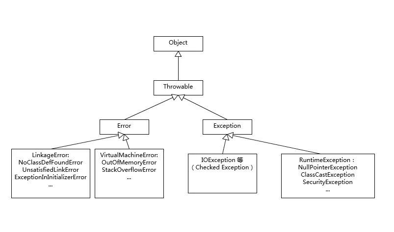

# Exception和Error的区别

| **ClassNotFoundException**                                   | **NoClassDefFoundError**                          |
| ------------------------------------------------------------ | ------------------------------------------------- |
| 从java.lang.Exception继承，是一个Exception类型               | 从java.lang.Error继承，是一个Error类型            |
| 当动态加载Class的时候找不到类会抛出该异常                    | 当编译成功以后执行过程中Class找不到导致抛出该错误 |
| 一般在执行Class.forName()、ClassLoader.loadClass()或ClassLoader.findSystemClass()的时候抛出 | 由JVM的运行时系统抛出                             |

当JVM在加载一个类的时候，如果这个类在编译时是可用的，但是在运行时找不到这个类的定义的时候，JVM就会抛出一个NoClassDefFoundError错误。比如当我们在new一个类的实例的时候，如果在运行是类找不到，则会抛出一个NoClassDefFoundError的错误。

当应用程序运行的过程中尝试使用类加载器去加载Class文件的时候，如果没有在classpath中查找到指定的类，就会抛出ClassNotFoundException。一般情况下，当我们使用Class.forName()或者ClassLoader.loadClass以及使用ClassLoader.findSystemClass()在运行时加载类的时候，如果类没有被找到，那么就会导致JVM抛出ClassNotFoundException。例子：我们先创建一个TempClass，然后编译以后，将TempClass生产的TempClass.class文件删除，然后执行程序。

