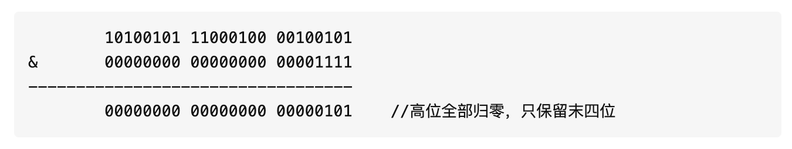
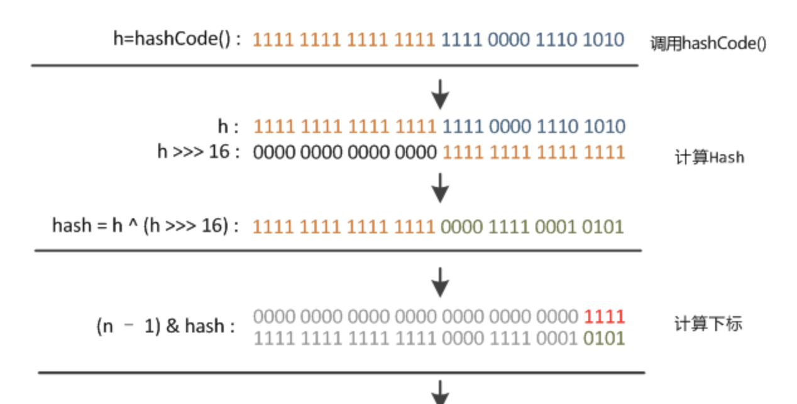

# HashMap

理论上hash值是个int的散列，如果直接用int的散列作为数组的下标考虑的取值范围过大了，前后甚至需要40亿的空间。然而众所周知hashmap初始化就只有16的长度，他的数组是完全无法放得下的，因此需要做相关操作获取对应的位置，这部分的运算在indexFor()中。

也很简单的，就是把散列值和数组长度做一个**"与"**操作，大概约等于截取后面的四位



```java
static int indexFor(int h, int length) {
  return h & (length - 1);
}
```


由此可见就算散列再怎么散理论上的值还是取后四位，那么如果hash没有做好的话，正好使后续几位按照规律重复的话，那么就会导致大量的数据积压到一起，被认为hash相等。

这时候就引入了“**扰动函数**”的概念。将hash右移16位正好是32的一半，这样混合了高位和低位的数据，会增大最后结果的随机性。理论上高位的信息也被变相的保留了下来（Java7扰动的方案不同）




源码解析resize()

```java
 final Node<K,V>[] resize() {
        Node<K,V>[] oldTab = table;
        int oldCap = (oldTab == null) ? 0 : oldTab.length;
        int oldThr = threshold;
        int newCap, newThr = 0;
        if (oldCap > 0) {
          //最大就不扩充
            if (oldCap >= MAXIMUM_CAPACITY) {
                threshold = Integer.MAX_VALUE;
                return oldTab;
            }
          //正常扩充 *2
            else if ((newCap = oldCap << 1) < MAXIMUM_CAPACITY &&
                     oldCap >= DEFAULT_INITIAL_CAPACITY)
                newThr = oldThr << 1; // double threshold
        }
        else if (oldThr > 0) // initial capacity was placed in threshold
            newCap = oldThr;
        else {               //默认扩充
            newCap = DEFAULT_INITIAL_CAPACITY;
            newThr = (int)(DEFAULT_LOAD_FACTOR * DEFAULT_INITIAL_CAPACITY);
        }
   			//计算新的resize上限
        if (newThr == 0) {
            float ft = (float)newCap * loadFactor;
            newThr = (newCap < MAXIMUM_CAPACITY && ft < (float)MAXIMUM_CAPACITY ?
                      (int)ft : Integer.MAX_VALUE);
        }
        threshold = newThr;
        @SuppressWarnings({"rawtypes","unchecked"})
            Node<K,V>[] newTab = (Node<K,V>[])new Node[newCap];
        table = newTab;
        if (oldTab != null) {
            for (int j = 0; j < oldCap; ++j) {
                Node<K,V> e;
                if ((e = oldTab[j]) != null) {
                    oldTab[j] = null;
                    if (e.next == null)
                      //单节点随便玩
                        newTab[e.hash & (newCap - 1)] = e;
                    else if (e instanceof TreeNode)
                      //修建树叶，将发生改变的，其实就是后续位置修改的数据筛掉，和下面的链表的相似
                        ((TreeNode<K,V>)e).split(this, newTab, j, oldCap);
                    else { // preserve order
                      //这个理论上是为没有发生改变的数据，即不需要移动位置只需筛检
                        Node<K,V> loHead = null, loTail = null;
                      //这个理论上是更改的数据，需要修改位置，其实就是增加一个oldCap的偏移量
                        Node<K,V> hiHead = null, hiTail = null;
                        Node<K,V> next;
                        do {
                            next = e.next;
                          //此处这个判断可以知道位置有没有发生变化，如果发生变化的话对应位会处于非0的情况
                          //（理论上其实只是增加了一位的hash数据取直，比方说16的空间，理论上hash取四位，32的空间取5位，对于数据来说仅仅是第五位发生改变，那么与16，即二进制码10000按位与的话，可以知道其第五位是0还是1，因此是0的话就是不会发生改变）
                            if ((e.hash & oldCap) == 0) {
                                if (loTail == null)
                                    loHead = e;
                                else
                                    loTail.next = e;
                                loTail = e;
                            }
                            else {
                                if (hiTail == null)
                                    hiHead = e;
                                else
                                    hiTail.next = e;
                                hiTail = e;
                            }
                        } while ((e = next) != null);
                      //其实这里已经形成了链表结构了，但是这个不可能形成树，毕竟本身是链表的就小于
                        if (loTail != null) {
                            loTail.next = null;
                            newTab[j] = loHead;
                        }
                        if (hiTail != null) {
                            hiTail.next = null;
                            newTab[j + oldCap] = hiHead;
                        }
                    }
                }
            }
        }
        return newTab;
    }
```


