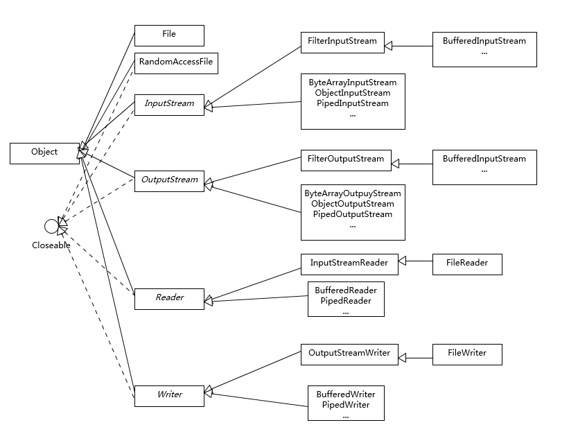
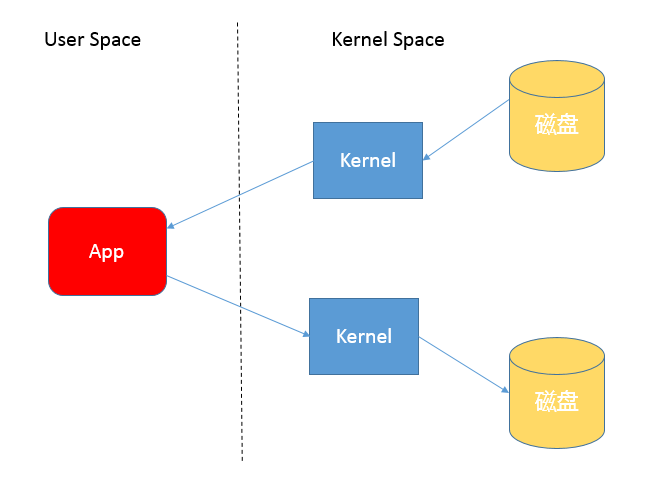
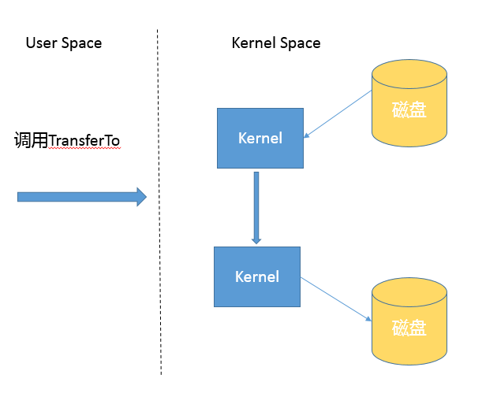

# IO（我兴致缺缺）

## 1 BIO



## 2 NIO

- Buffer，高效的数据容器，除了布尔类型，所有原始数据类型都有相应的 Buffer 实现。

- Channel，类似在 Linux 之类操作系统上看到的文件描述符，是 NIO 中被用来支持批量式 IO 操作的一种抽象。
  File 或者 Socket，通常被认为是比较高层次的抽象，而 Channel 则是更加操作系统底层的一种抽象，这也使得 NIO 得以充分利用现代操作系统底层机制，获得特定场景的性能优化，例如，DMA（Direct Memory Access）等。不同层次的抽象是相互关联的，我们可以通过 Socket 获取 Channel，反之亦然。
- Selector，是 NIO 实现多路复用的基础，它提供了一种高效的机制，可以检测到注册在 Selector 上的多个 Channel 中，是否有 Channel 处于就绪状态，进而实现了单线程对多 Channel 的高效管理。Selector 同样是基于底层操作系统机制，不同模式、不同版本都存在区别，例如，在最新的代码库里，相关实现如下：
  - Linux 上依赖于epoll，Windows 上 NIO2（AIO）模式则是依赖于iocp。
- Charset，提供 Unicode 字符串定义，NIO 也提供了相应的编解码器等，例如，通过下面的方式进行字符串到 ByteBuffer 的转换：

## 3 AIO

利用事件和回调，处理Accept和Read等操作。

## 4 文件复制

### 4.1 使用java.io库

```java
public static void copyFileByStream(File source, File dest) throws
        IOException {
    try (InputStream is = new FileInputStream(source);
         OutputStream os = new FileOutputStream(dest);){
        byte[] buffer = new byte[1024];
        int length;
        while ((length = is.read(buffer)) > 0) {
            os.write(buffer, 0, length);
        }
    }
 }

```

### 4.2 使用java.nio提供的方法

```java
public static void copyFileByChannel(File source, File dest) throws
        IOException {
    try (FileChannel sourceChannel = new FileInputStream(source)
            .getChannel();
         FileChannel targetChannel = new FileOutputStream(dest).getChannel
                 ();){
        for (long count = sourceChannel.size() ;count>0 ;) {
            long transferred = sourceChannel.transferTo(
                    sourceChannel.position(), count, targetChannel);            sourceChannel.position(sourceChannel.position() + transferred);
            count -= transferred;
        }
    }
 }

```

### 4.3 拷贝机制分析

使用输入输出流进行读写的时候，进行了多次的上下文切换，应用读取数据时，现在内核态将数据从磁盘读到内核缓存，再切换用户态将数据从内核缓存读取到用户缓存。写入步骤相反



基于NIO transferTo的实现方式，在Linux和Unix上，使用零拷贝技术，数据传输不需要用户态参与，省去了上下文切换的开销和不必要的内存拷贝，进而提高拷贝性能。在Socket发送中，也可以享受这种机制带来的性能和扩展性的提高。



### 4.4 Java IO/NIO源码结构

Java标准库也提供了文件拷贝方法（java.nio.file.Files.copy）

除了一个方法之外其他的copy都是走的字节流的InputStream.transfreTo()

```java

public static Path copy(Path source, Path target, CopyOption... options)
    throws IOException
 {
  //抽象类，实际逻辑存在于JDK内部实现，公共API是通过ServiceLoader机制加载一系列文件系统的实现然后提供服务。最后其实是本地技术实现的用户态拷贝，
    FileSystemProvider provider = provider(source);
    if (provider(target) == provider) {
        // same provider
        provider.copy(source, target, options);//这是本文分析的路径
    } else {
        // different providers
        CopyMoveHelper.copyToForeignTarget(source, target, options);
    }
    return target;
}
```

### 4.5 NIO Buffer

Buffer的基本属性

- capacity：数组的长度。
- position：操作的数据起始位置
- limit：操作的限额，读取或写入的时候意义上会有不同
- mark：记录上次position的位置。

### 4.6 Direct Buffer和垃圾收集

- Direct Buffer：Java提供堆内和堆外（Direct）Buffer，我们可以以它的allocate或者allocateDirect方法直接创建
- MappedByteBuffer：它将文件按照指定大小直接映射为内存区域，当程序访问这个内存区域时直接操作这块的文件数据，省去数据从内核空间向用户空间传输的损耗，可以使用FileChannel.map创建，本质上也是Direct Buffer。

优势（适用于长期使用，数据较大的场景）：

- Direct Buffer生命周期内内存地址都不会再发生改变，进而内核可以安全地对其进行访问，很多IO操作会很高效
- 减少了堆内对象存储的可能额外维护工作，访问效率提高。

```shell
-XX:MaxDirectMemorySize=512M
```

劣势：

- 大量垃圾收集过程中，都不会主动手机Direct Buffer。它的垃圾收集过程是机遇Cleaner和虚引用机制，其本身不是public类型，内部实现了一个Deallocator负责销毁的逻辑。对它的销毁往往要拖到full GC的时候，适用不当容易OOM	
  - 可以显示System.gc强制触发
  - 自己程序中调用释放方法（Netty， PlatformDependent0）

### 4.7 跟踪Direct Buffer

```shell
-XX:NativeMemoryTracking={summary|detail} #会导致性能JVM出现5-10%的下降
```

