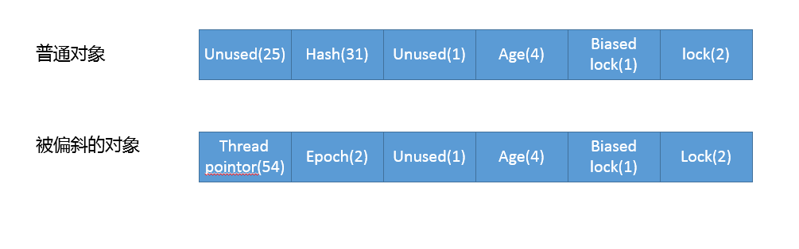

# synchronized和ReentrantLock

## synchronized

synchronized是Java内建的同步机制，所以也有人称其为Intrinsic Locking，他提供了互斥的语义和可见性，当一个线程已经获取当前锁时，其他试图获取的线程只能等待或者阻塞。在后续版本进行了较多的改进在低竞争的场景表现甚至优于ReentrantLock。

synchronized代码块是由一对monitorenter/monitorexit指令实现的，Monitor对象是同步的基本实现。

Java6前，Monitor的实现完全是依靠操作系统内部的互斥锁，因为需要进行用户态到内核态的切换，所以同步操作是一个无拆别的重量级操作。

现在的JVM进行了大刀阔斧的改进提供了三种不同的Monitor实现，也就是常说的：偏向锁，轻量级锁和重量级锁。

所以锁的升级降级，就是JVM优化synchronized运行机制。当JVM检测到不同的竞争状况时，会自动切换到适合的锁实现，这种就是锁的升级/降级

当没有竞争的时候，默认使用偏向锁，JVM就用CAS在对象头上的Mark Word部分设置线程ID，以表示这个对象偏向当前线程，所以这里还不是到真正的互斥锁。

如果另外的线程尝试锁定某个被偏向的对象，JVM就要撤销（行为很重，只有当存在较多不会真正竞争的块儿时才能明显改善）偏向锁，并切换到轻量锁实现，轻量锁依赖CAS操作MarkWord试图获取锁，如果重试成功就使用普通的轻量锁，否则就升级为中量锁。

偏向锁会延缓JIT预热的过程，所以很多性能测试时会显示关闭偏向锁。

```shell
-XX:-UseBiasedLocking # 是否开启偏向锁
```


锁降级发生在JVM进入安全点的时候，会检查是否存在闲置的Monitor，然后试图进行降级。



## ReentrantLock

ReentrantLock通常翻译为再入锁，是Java5提供的实现，语义与synchronized基本相同。通过调用lock()方法获取锁，代码书写灵活，能够实现很多synchronized无法做到的细节控制，比方说控制公平性利用定义条件等。

> 再入：当一个线程试图获取它已经获取的锁时，这个获取动作就自动成功，这是对锁获取粒度的一个概念，即锁的持有是以线程为单位而不是基于调用次数，Java锁实现强调再入性是为了和pthread进行区分。
>
> 公平性：在竞争场景中，会倾向于将锁赋予等待时间最久的线程。公平性是减少线程“饥饿”情况发生的一个办法。通用场景下，公平性未必有想象中的重要，Java默认的调度策略很少会导致“饥饿”发生。若要保证公平性肯定会引入额外开销导致吞吐量下降，一般只有确实需要的情况下才建议打开。

线程安全需要几个基本特性：

- 原子性：相关操作不会被其他线程干扰，一般通过同步机制实现
- 可见性：一个线程修改了某个共享变量，其状态能够立即被其他线程知晓，通常被解释为将线程本地状态反应到主内存上，volatile就是负责保证可见性的。
- 有序性：线程内是串行语义，避免指令重排。

