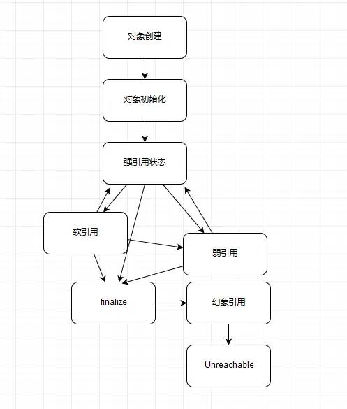

# 引用类型

- 强引用（“Strong” Reference），就是我们最常见的普通对象引用，只要还有强引用指向一个对象，就能表明对象还“活着”，垃圾收集器不会碰这种对象。对于一个普通的对象，如果没有其他的引用关系，只要超过了引用的作用域或者显式地将相应（强）引用赋值为 null，就是可以被垃圾收集的了，当然具体回收时机还是要看垃圾收集策略。

- 软引用（SoftReference），是一种相对强引用弱化一些的引用，可以让对象豁免一些垃圾收集，只有当 JVM 认为内存不足时，才会去试图回收软引用指向的对象。JVM 会确保在抛出 OutOfMemoryError 之前，清理软引用指向的对象。软引用通常用来实现内存敏感的缓存，如果还有空闲内存，就可以暂时保留缓存，当内存不足时清理掉，这样就保证了使用缓存的同时，不会耗尽内存。

- 弱引用（WeakReference）并不能使对象豁免垃圾收集，仅仅是提供一种访问在弱引用状态下对象的途径。这就可以用来构建一种没有特定约束的关系，比如，维护一种非强制性的映射关系，如果试图获取时对象还在，就使用它，否则重现实例化。它同样是很多缓存实现的选择。

- 幻象引用，有时候也翻译成虚引用，你不能通过它访问对象。幻象引用仅仅是提供了一种确保对象被 finalize 以后，做某些事情的机制，比如，通常用来做所谓的 Post-Mortem 清理机制，我在专栏上一讲中介绍的 Java 平台自身 Cleaner 机制等，也有人利用幻象引用监控对象的创建和销毁。

## 1. 对象可达性状态流转分析




- 强可达：当一个对象可以有一个或者多个线程可以不通过各种引用访问到的情况，如果我们创建一个对象，那么创建它的线程对它就是强可达的状态。
- 软可达：就我们只能通过软引用才能访问到对象的状态
- 弱可达：无法通过强引用或者软引用访问，只能通过弱引用时的状态。这是十分临近finalize状态的时机。当弱引用被清除就附和finalize的条件了。
- 幻象可达：finalize过了，只有幻象引用指向这个对象的时候
- 不可达，对象可以被清除了。

所有引用类型都是抽象类java.lang.Reference的子类，存在get()方法（幻象永远是null），如果对象没有销毁就可以将对象重新指向强引用，认为修改可达性状态。

检查弱引用指向对象是否被垃圾收集，也是判断是否有特定内存泄漏的一个思路。

## 2.引用队列（ReferenceQueue）的使用

在创建各种引用并关联到相关对象时，可以选择是否要关联引用队列，JVM会在特定时间将引用enqueue到队列里，可以通过队列中获取引用进行相关后续逻辑。尤其是幻想引用，get()只返回null，如果不指定引用队列的话基本没有意义。利用队列可以获取幻想引用进行后续处理逻辑。

## 3 显式地影响软引用垃圾收集

软引用通常会在最后一次引用后还能保持一段时间，默认值是根据堆剩余空间计算的（M bytes位单位），后续提供了参数**（-XX:SoftRefLRUPolicyMSPerMB）**  可以根据毫秒为单位设置。根据-Xmx的最大值计算

## 4 判断JVM引用情况

```shell
-XX:+PrintGCDetails -XX:+PrintGCTimeStamps -XX:+PrintReferenceGC ##Java9对垃圾收集日志进行了广泛的重构
```


# 5. Reachability Fence

按照Java语言规范，如果一个对象没有指向强引用。就附和垃圾收集的标准。有时候对象本身并没有强引用，但是他的部分属性还在被使用。所以需要一个方法，在没有强引用的情况下，通知JVM对象是在被使用的。

