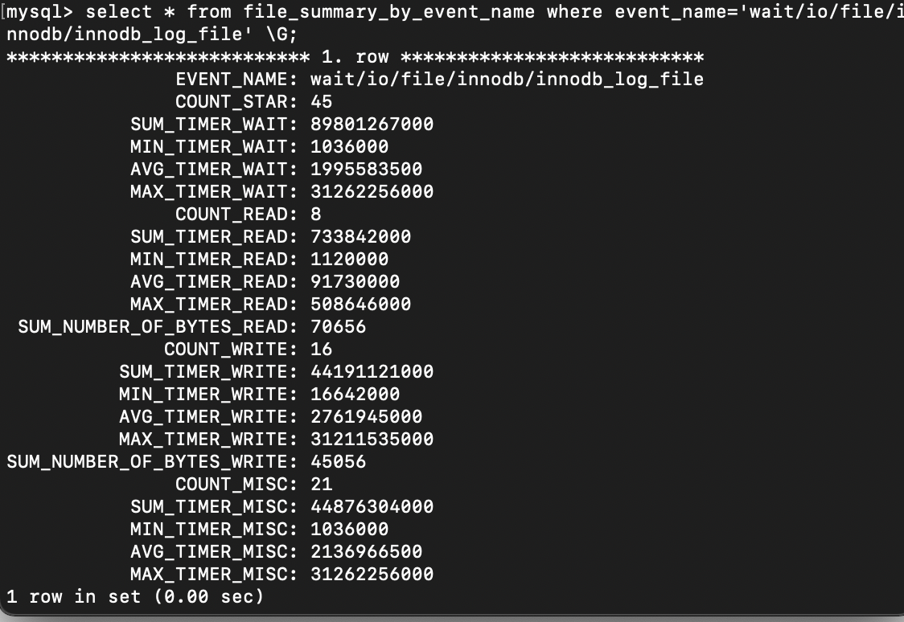

# MySQL的判活（是否出问题了）

主备切换有两种场景，一种是DBA主动切换， 一种是HA系统检测到主库出问题了由HA系统发起的切换。

## select 1 判断

实际上，select 1返回成功，只能说明这个库的进程还在，并不能说明主库没问题。

**innodb_thread_concurrency**可以控制InnoDB的并发线程上限。也就是说一旦并发线程数达到这个值，InnoDB在接受到请求时就会进入到等待状态，直到有线程退出。

> ps: InnoDB可以使用各种技术来限制操作系统并发执行线程的数量（因此大批量的请求可以在任意一个时间得到处理）。当InnoDB从用户会话收到一个新的请求，如果线程并发执行的数量达到预定义的限制，那么新的请求会睡眠一段时间后再次尝试。在睡眠后不能按计划执行的请求回被放入**FIFO队列**。但那些等待获取锁的线程则不会被记入并发线程的数量中。可以通过配置**innodb_thread_concurrency**来限制数量。当执行数量达到这个限制，额外的线程会被放到队列中，睡眠数微妙。这个可以由**innodb_thread_sleep_delay**来配置。
>
> 当线程数量有限时（innodb_thread_concurrency>0），InnoDB通过允许在执行单个SQL语句期间的多个请求进入InnoDB而不需要遵守设置的限制，从而减少上下文切换开销。由于SQL语句可能包含多个行操作，所以Inn oDB分配指定数量的"tickets"，允许以最少的开销重复排列线程。
>
> 当一个新的SQL语句开始，当前线程没有“tickets”时，他就必须遵守innodb_thread_concurrency参数设置。一旦这个线程有权进入InnoDB，他会被分配一个“tickets”。它可以通过这个“tickets”用于随后进入innodb执行行操作，如果“tickets”被使用完毕，该线程将会被驱逐。会被放入FIFO队列中等待。一旦这个线程再次有权进入InnoDB，“tickets”又会被重新分配，我们可以通过设置全局参数**inndb_concurrency_tickets**默认是5000。正在等待锁的线程，一旦锁可用，会被立即分配一个“tickets”

```markdown
这三个参数的配合使用就是这样的一个故事（看网上一个哥们写的，摘抄下来）

一个屋子内有一个头牌妓女叫Innodb, 大家都想接近她．

老鸨(MySQL)不可能允许那么多人同时进屋去，就限制每次只能进去几个（上下和手嘛．．），这个限制的名字就叫(innodb_thread_concurrency).

其他的人怎么办，只能在外面排成长队依次进入．同时老鸨说，大爷你们可以睡一会，这样就不用苦苦等待了．

这里老鸨就会个一段时间（innodb_thread_sleep_delay）叫醒一位大爷，以免睡不醒了．

老鸨也怕总是叫醒大爷不好交代，就看快到了再叫，老鸨自己发明了一个自适应的叫醒算法，能够尽量减少唤醒次数．

但是大爷会规定一个最长唤醒时间，就是必须在这样的时间（innodb_adaptive_max_sleep_delay）时唤醒我．

如此当有人从内部出来以后，等待的大爷(排在最前面的)就可以进入享受鱼水之欢了．

但是每位大爷能够支持的时间不一样，有的一分钟（quicker）,有的大爷需要几个小时．这样外面等待的大爷就会有意见，哎呀，怎么还不出来．

老鸨又想了一个办法，规定每个人不能在姑娘房里呆10分钟以上(innodb_concurrency_tickets), 有特别持久的人就需要在10分钟时出来，在继续排队(排在队尾)．

等到下一次轮到他再进行鱼水之欢．

人物对应：老鸨(MySQL), 大爷(threads), 姑娘(innodb)

如何优化innodb_concurrency_tickets，那就得看哪位大爷重要，比如宰相的儿子在这里等，那宰相的儿子又十分持久，最好就用多点时间（增大innodb_concurrency_tickets）

如果宰相的儿子不持久，那就用小时间快点排到他。
```


举个例子：如果这个参数当前设置为3，然后前面三条语句设置sleep(100)，这三个语句都属于执行状态。此时select 1 能执行成功，但是查询其他表（任意表）都会被堵住，因此这时候用select 1是检测不出问题的。

## 查表判断

为了能够检测InnoDB并发线程数过多导致的系统不可用情况，我们需要找一个访问InnoDB的场景。一般的做法是，在系统库（mysql库）创建一个表，比如命名为health_check，里面只放一行数据，然后定期执行。

使用这个方案，我们可以检测出由于并发线程过多导致的数据库不可用的情况。

但是，对于更新事务而言，更新事务要写binlog，一旦binlog的磁盘空间占用率达到100%，那么所有更新语句和事务提交的commit语句会被堵住。但是，系统当前还是可以正常读数据的。

## 更新判断

通过更新字段去确认当前数据库是否磁盘占用率被打满。但是主库A和主库B都用相同的更新命令，就可能出现行冲突，可能会导致主备同步停止。那么这个表必须存在多行记录防止之间更新不产生冲突。且主库和备库的server_id必须不同的情况下能够保证主备库各自的检测命令不会发生冲突。

但是，通过更新判断其实会有IO资源分配的问题。所有检测逻辑都有一个超时时间N，执行一条update语句，超过N秒后还不返回，就认为系统不可用。

那么如果现在一个日志盘的IO利用率已经是100%，整个系统响应非常慢，已经需要做主备切换了。但是IO利用率100%表示系统的IO是在工作的，每个请求都有机会获得IO资源。而我们的检测使用的update命令，需要的资源很少，所以可能在拿到IO资源的时候就可以提交成功，并且在超时N秒未到达钱就返回给了检测系统。此时检测系统得到的是系统正常的结果，

这是因为我们所有上述的方法都是基于外部检测的。外部检测天然就有一个问题，就是随机性。外部检测都需要定时论询。所以有可能发生系统已经出问题了，但是需要等下一个检测发起执行语句的时候我们才能发现问题。这有可能会导致切换慢的问题

## 内部统计

MySQL5.6版本以后提供的performance_schema库在file_summary_by_event_name表里统计了每次IO请求的时间。

以redolog举例，where event_name='wait/io/file/innodb/innodb_log_file'



有三组数据

- 第一组5列是所有IO类型的统计。其中，COUNT_STAR是所有IO的总次数，接下来四列是具体的统计项，单位是皮秒。
- 第二组6列是读操作的统计，SUM_NUMBER_OF_BYTES_READ表示总共从redolog读了多少个字节
- 第三组6列是些操作。
- 第四组是对其他类型的统计。在redolog中可以认为他们是对fsync的统计。

当然这种统计也是消费资源的。如果打开所有的项目，性能大概会降低10%左右。可以用过执行sql语句打开redolog的时间监控

```mysql
mysql> update setup_instruments set ENABLED='YES', Timed='YES' where name like '%wait/io/file/innodb/innodb_log_file%';
```

这时候就可以通过判断这个IO数据来确认数据库是否出问题了。

需要确认的，每个改进的方案，都是会增加额外损耗的。要根据业务实际情况去做权衡。


