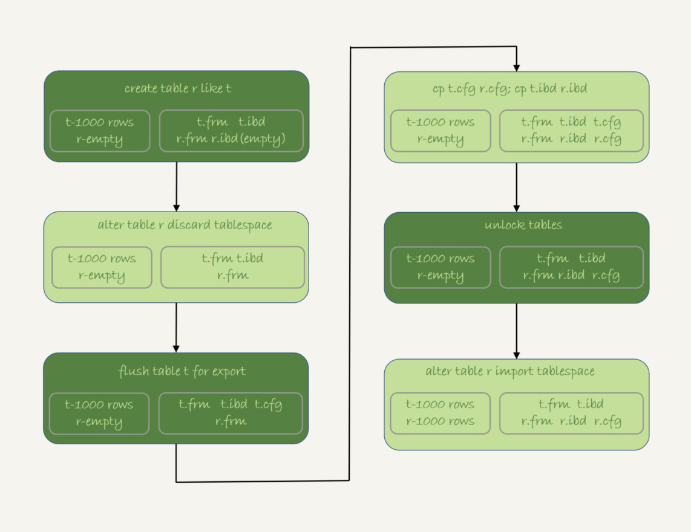

# Insert语句的锁

其实，Insert语句是个很轻量的操作。但是，这个仅仅是对于“普通的insert语句”才有效。也就是说，还有些insert语句是属于“特殊情况”的，在执行过程中需要给其他资源加锁，或者无法在申请到自增id以后就立马释放自增锁。

## insert ...select 语句

在RR级别下，binlog_format=statement时执行insert B...select A语句时，需要对表A（select的表）所有行（需要访问的资源）和间隙加锁。

如果没有锁的情况下，可能发生，在执行insert B select A操作时， A插入了一条数据，但是由于RR级别下，事务视图中A插入的数据不可见，因此在主库中执行情况是符合预期的， 但是在statement的binlog下，会出现插入A，之后insert B的情况，那么会把这条新的记录插入到B，这样就会发生数据不一致的问题。

## insert 循环写入

如果出现insert B ... select B limit 1的情况，会创建一个临时表，会将B的数据读出来放到临时表，再从临时表读取数据，写回表B。可以参考查询具体扫描行数多了多少

```mysql
mysql> show status like '%Innodb_rows_read%'
```

这个语句其实是扫描了整个表B，并且会给索引上加上共享的next-key lock。所以这个语句执行期间，其他事物都不能在这个表上插入数据。对于这个语句执行为什么需要临时表，原因是这类一边遍历数据，一边更新数据的情况，如果读出来的数据直接写回原表，就可能在遍历过程中，读到刚刚插入的记录，新插入的记录如果参与计算逻辑，就和语义不符。

可以考虑使用内存临时表进行优化

## Insert 唯一键冲突

在RR下出现了唯一索引重复问题，会导致其他相关的insert语句陷入阻塞。

即发生唯一键冲突的时候，并不只是简单地报错返回，还在冲突的索引上加了锁。会加上一个next-key lock。


## 复制一张表

为了避免对原表加读锁， 最稳妥的方案是先将外部数据写到外部文件，然后在写回目标表。

### mysqldump

```mysql
mysql> mysqldump -h$host -P$port -u$user --add-locks=0 --no-create-info --single-transaction  --set-gtid-purged=OFF db1 t --where="a>900" --result-file=/client_tmp/t.sql
```

- --single-transaction：在导出数据的时候不需要对表加表锁，而是使用START TRANSACTION WITH CONSISTENT SNAPSHOT方法
- --add-locks：0表示在输出的文件结果里，不增加“LOCK TABLES t WRITE”
- --no-create-info：表示不需要导出表结构
- --set-gtid-purged：off表示不输出和GTID相关的信息
- --result-file：指定输出文件的路径，client表示生成的文件在客户机上

### 导出csv文件

```mysql
mysql>select * from db1.t where a>900 into outfile '/server_tmp/t.csv';
```

1. 这条语句会将结果保存在服务端。如果执行命令的客户端和MySQL服务端不在同一个机器上，客户端机器的临时目录下不会生成t.csv文件。
2. into outfile 指定了文件的生成位置，这个位置必须受参数**secure_file_priv**的限制
   1. 如果设置为empty，表示不限制文件生成的位置，这是不安全的设置；
   2. 如果设置为一个表示路径的字符串，就要求生成的文件只能放在这个指定的目录，或者它的子目录；
   3. 如果设置为NULL，就表示禁止在这个MySQL实例上执行这个语句操作
3. 这条命令不会覆盖文件，如果文件存在就会因为有同名文件的存在而报错
4. 生成的文本文件中，原则上一个数据行对应文本文件的一行，但是如果字段中包含换行符，在生成的文本中也会有换行符。不过会在前面加上转义符，这样就可以跟字段之间、数据行之间的分隔符区分开。

```mysql
mysql>load data infile '/server_tmp/t.csv' into table db2.t;
```

如果binlog格式为statement的话，对于备库这条语句的执行逻辑是这样的：

1. 主库执行完成后，将/server_temp/t.csv文件的内容直接写到binlog文件中。
2. 往binlog文件中写入load data local infile ....
3. 把这个binlog日志传到备库
4. 备库的apply线程在执行事务日志的时候：
   1. 先将binlog中t .csv文件的内容读出来，写入本地临时目录/tmp/SQL_LOAD_MB-1-0中；
   2. 再执行load data语句，往备库的插入和主库一样的数据。

load data有两种用法：

1. 不加local，是读取服务端的文件，这个文件不许在**secure_file_priv**指定的目录或子目录下
2. 加local，读取的是客户端的文件，只要mysql客户端有访问这个文件的权限即可。

select..into outfile方法不会生成表结构文件。

mysqldump提供了一个--table参数，可以同时导出表结构定义文件和csv数据文件。

```mysql
mysql>mysqldump -h$host -P$port -u$user ---single-transaction  --set-gtid-purged=OFF db1 t --where="a>900" --tab=$secure_file_priv
```

### 物理拷贝方法

不能直接把表的.frm和.ibd文件拷贝的对应数据库的目录下。因为除了这两个物理文件外，还需要在数据字典中注册。直接拷贝这两个文件的话，因为数据字典中没有db2.t这个表，系统是不会识别和接受它们的。

在MySQL5.6引入了可传输表空间的方法，可以通过导出+导入表空间的方式，实现物理拷贝表的功能。

假设我们现在的目标是在db1库下，复制一个跟表t相同的表r，具体的执行步骤如下：

1. 执行create table r like t，创建一个相同表结构的空表
2. 执行alter table r discard tablespace，这时候r.ibd文件会被删除。
3. 执行flush table t for export，这时候db1目录下会生成一个t.cfg文件
4. 在db1目录执行cp t.cfg r.cfg;cp t.ibd r.ibd;这两个命令。
5. 执行unlock tables，这时候t.cfg文件会被删除；
6. 执行alter table r inport tablespace，将这个r.ibd文件作为表r的新的表空间，由于这个文件的数据内容和t.ibd是相同的，所以表r中就有了和表t相同的数据。

在拷贝的过程中，有一些注意点

1. 在第三步执行完后，db1.t整个表处于只读状态，知道执行unlock table 命令后才释放读锁
2. 在执行import tablespace的时候，为了让文件里的表空间id和数据字典中的一只，会修改r.ibd的表空间id。而这个表空间id存在于每一个数据页中。因此，如果是一个很大的文件，每个数据页都需要修改，所以这个import语句执行是需要一定时间的。相比逻辑导入这个import时间还是比较短的。
3. 



