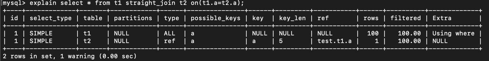
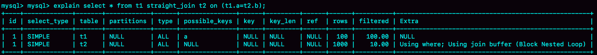
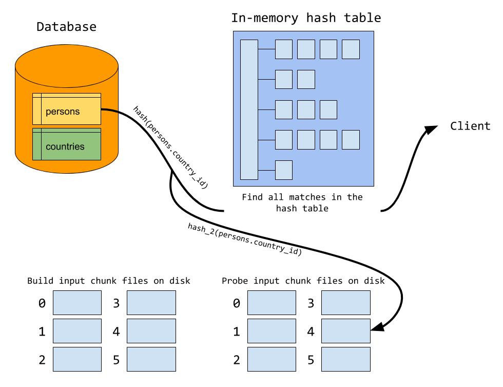

# join的使用问题

1. DBA不让使用join，使用join有什么问题呢；
2. 如果有两个大小不同的表做join，应该有用哪个表做驱动呢？

## 举例量化分析使用Join的问题

创建两张表，这两个表都有一个主键索引id和一个索引a，字段b上无索引。往t2插入1000行数据，t1插入100行数据。

### Index Nested-Loop Join

#### 使用join

```mysql
mysql># 如果直接使用join，MySQL优化器可能会选择t1或t2作为驱动表，这样会影响分析SQL语句的执行过程，因此使用straight_join让MySQL使用固定的连接方式执行查询，这样优化器只会按照我们指定的方式去join，这个语句中，t1是驱动表，t2是被驱动表。
mysql>select * from t1 straight_join t2 on (t1.a=t2.a);
```

explain的结果



可以看到，在这条语句里，被驱动表t2的字段上a有索引， join的过程中用上了这个索引，因此这个执行过程是这样的

1. 从t1中读取一行数据R；
2. 从数据行R中取出a字段到表t2中去找；
3. 取出t2中满足条件的行，跟R组成一行，作为结果集的一部分；
4. 重复1-3，知道t1的末尾循环结束。

这个过程是先遍历表t1，然后根据从表t1中取出的每行数据中的a值，去表t2中查找满足条件的记录。在形式上，有点类似程序中的嵌套查询，并且可以用上被驱动表的索引，所以叫做“Index Nested-Loop Join”，简称NLJ。

这个流程中，对驱动表t1全表扫描，也就是100行，对t1的每一行都根据a字段去t2查找，走的是树搜索，由于构造的数据一一对应因此每次搜索的过程也是只有一行，总数也是100行，最后总扫描数200行。

#### 不使用join

用单表查询，根据上面语句的需求。

1. 执行select * from t1， 查出表t1的所有数据，100行；
2. 循环便利100行数据：
   1. 从每一行R取出字段a的值$R.a
   2. 执行select * from t2 where a=$R.a
   3. 把返回的结果和R构成结果集的一行

这个过程也是扫描了200行，但是总共执行了101次语句，比join多了100次交互，而且客户端还要自己拼接SQL语句和结果。显然不如直接join。

## 怎么选择驱动表

这个join语句执行中，驱动表是走全表扫描，被驱动表示走树搜索。

假设被驱动表的行数是M。每次在被驱动表查一行数据，要先搜索索引a，再锁搜主键索引。每次搜索一棵树近似复杂度是以2为底的M的对数，所以在被驱动表上查一行的时间复杂度是 2*log2M。那么假设驱动表的行数是N，执行过程就要扫描驱动表N行，然后对于每一行，到被驱动表上匹配一次，因此整个执行过程近似复杂度为N + N\*2\*log2M。这样看来N对扫描行术的影响更大。所以应该让小表来做驱动表。

> N扩大1000倍的话，扫描行数会扩大1000倍， M扩大1000倍的话，扫描行数扩大不到10倍

#### 小结

在**可以使用被驱动表的索引**下

1. 使用join语句，性别比强行拆成多个单表执行SQL语句的性能要好；
2. 如果使用join语句，需要让小表作驱动表。

## 再次举例量化分析不能使用被驱动表的索引的情况下

### Simple Nested-Loop Join

```mysql
mysql>select * from t1 straight_join t2 on (t1.a=t2.b);
```

由于表t2的字段b上没有索引，因此再用之前的执行流程时，每次到t2去匹配的时候，就要做一次全表扫描。

那么这个SQL请求就要扫描t2多达100次，总共扫描100*1000=10w，如果t1和t2很大的话，那就显得太笨重了，因此引入了一个新的算法。

### Block Nested-Loop Join

#### Join Buffer足够大

被驱动表上没有可用的索引，算法的流程是这样的：

1. 把表t1的数据读入线程内存join_buffer中，由于我们这个语句中写的是select *， 因此整个表t1都会被放入内存。
2. 扫描表t2，表t2的每一行取出来，和join_buffer中的数据做对比，满足join条件的，作为结果集的一部分返回。



> 注意，MySQL8.0之后引入了hashjoin，这个会更换为hashjoin

可以看到，这个过程对t1和t2都做了一次全表扫描，总的扫描行数是1100，由于join_buffer是以无需数组的方式组织的，因此对t2中的每一行都要做100次判断，在内存中的判断次数也是： 100\*1000

所以从时间复杂度上来说，这个算法和Simple Nested-Loop Join差不多，但是这个是内存操作，速度上会快很多，性能也更好。

这种情况下，应该选用什么表作为驱动表呢。

假设小表的行数是N，大表的行数M，那么算法中，总扫描行数是M+N，内存中判断次数是N\*M，因此调换两个算式的MN没有区别，因此驱动表其实无所谓。

#### Join Buffer不够大

join_buffer的大小是由参数**join_buffer_size**设定的，默认值是256K。如果放不下表1的所有数据话，策略就是分段放。

1. 扫描表t1，顺序读取数据行放入join_buffer中，放完第88行join_buffer满了；
2. 扫描表t2，把t2中的每一行取出来，跟join_buffer中的数据对比，满足join条件的，作为结果集的一部分返回
3. 清空join_buffer
4. 继续扫描t1，顺序读取最后12行数据，再继续执行2.

假设驱动表的数据行数是N，需要分K段才能完成算法流程，被驱动表的数据行数是M。

> 这里的K不是常数，会随着N变大而变大，因此可以把K表示为A*N，A在（0，1）间

因此这个算法的执行过程中会变更为扫描函数是N+A\*N\*M，内存判断是N\*M。这样的情况下N小一点，整个算式的结果会更小。

因此应该让小表当驱动表。

但是如果N固定的时候，那么join_buffer就会变成主要的影响因素，所以也有说join语句很慢就把**join_buffer_size**改大。

### Hash Join（MySQL8.0.18后）

#### Join Buffer足够大

1. （构建阶段）对参与join表中**占用空间小的**那个表（驱动表，优化器会选择占用空间较小的作为驱动表）的join字段进行hash计算，计算后放入内存中hash table的相应位置，所有行都存放到hash table之后，构建完成。
2. （探测阶段）对表中每行的join进行hash计算，拿到内存hash table中查找匹配，扫描匹配时间也是恒定的

#### Join Buffer不够大

1. （构建阶段）如果内存满了，会把表中剩余的数据写到磁盘上，不会写入一个文件，会分成多个，会保证每个块的文件的大小都是适合可用内存的，写入哪块文件也是通过hash计算join字段决定的。<u>hash_2(join字段)</u>能直接指引到对应的文件。
2. （探测阶段）还是会走一遍和之前一样的流程，扫描每一行和内存中hashtable进行匹配。



## 回答问题

- 能不能使用join语句
  - 如果可以使用Index Nested-Loop Join算法，就是被驱动表上的索引可用，其实没有问题
  - 如果使用Block Nested-Loop Join算法，扫描行数就会很多，尤其大表上的join操作，可能会扫描被驱动表多次，占用大量的系统资源。这样的join尽量不要用。可以看explain里面extra字段里面有没有Block Nested Loop字样。
- 如果要使用join，应选择大表驱动还是小表驱动
  - 小表（计算参与join的各个字段的总数据量，数据量小的才是小表，即行为N列宽度为M的时候， 看N\*M的大小）

