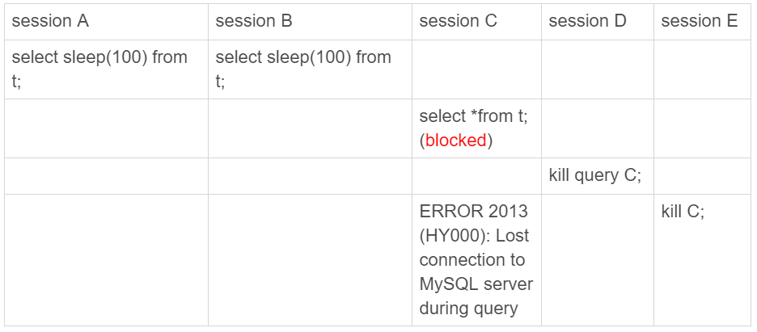

# 语句Kill不掉

MySQL中有两个kill命令

- kill query + 线程id，表示终止这个线程正在执行的语句

- kill connection + 线程id，这里 connection可缺省，表示断开这个线程的连接，当然如果这个线程有语句正在执行，也实现停止正在执行的语句的。

但是有时候存在使用了kill命令，却没能断开这个链接的情况，但是使用show processlist命令，这条语句的Command列显示的是Killed。

在大多数情况下，kill query/connection命令是有效的。比如，执行一个查询的过程中，发现执行时间太久，要放弃继续查询，这时我们就可以用kill query命令，终止这条查询语句。

> 语句处于锁等待的时候，直接使用kill命令也是有效的。

[MySQL的锁](../do_it_by_myself/MySQL的锁.md)中说到，在对一个表进行增删改查操作时，会在表上加MDL读锁。虽然语句可能因为锁等待被blocked了，但是还是会持有一个MDL锁。如果线程被kill了就直接终止，那么MDL锁就没机会释放了。

因此很明显，kill不是马上停止的意思，而是通知执行线程，这个语句已经不需要继续执行，可以开始“执行停止的逻辑”了。

> linux的kill命令也是类似这种， kill -N pid并不是让进程直接停止，而是给进程发一个信号，然后进程处理这个信号，进入终止逻辑，只是对MySQL的kill命令来说，不需要穿信号量参数，只有“停止”这个命令。

实际上执行kill query xx时，MySQL里处理kill命令的线程做了两件事

- 把xx的运行状态改成THD:KILL_QUERY（将变量killed赋值为THD:KILL_QUERY）;
- 给sessionXX发一个信号（如果这时候sessionXX处于锁等待状态，不知道状态变化还是会继续等待，发一个信号能够让xx退出等待，来处理这个状态）

## kill query无效例子（MySQL8.0.21未能复现）

环境：设置innodb_thread_concurrency=2

1. session C由于并发数被堵住了
2. 在session D执行kill query C没有效果（MySQL8.0后有效果，未能复现）
3. session E执行kill connection 命令，session C才断开。但是其实在processlist中还是killed状态，即还在执行中。

### kill后为什么语句没有退出呢

实现上，等待行锁的时候，使用的是pthread_cond_timedwait函数，这个等待状态可以被唤醒。但是，这个例子里，c线程等待逻辑是这样的：每10ms判断一下是否能进入InnoDB执行，如果不行，就调用nanosleep函数进入sleep状态。

即，虽然c线程的状态已经被设置为了KILL_QUERY，但是在这个等待进入InnoDB的循环过程中，并没有判断线程的状态，因此根本不会进入终止逻辑阶段。

但是E执行kill connection命令时，会将c线程状态设置为KILL_CONNECTION,然后关闭c线程的网络连接，所以C会收到提示。但是对于show processlist中为什么限制killed呢，这个是因为如果线程状态是KILL_CONNECTION时，会将Command列设置为killed。

跟这种情况相同的，还有由于IO压力过大，读写IO的函数一直没法返回，导致不能及时判断线程的状态。

## kill无效的另一种情况，终止逻辑耗时较长

1. 超大事务执行期间被kill。这时候，回滚操作需要对事务执行期间生成的所有新数据版本做回收操作，耗时很长。
2. 大查询回滚。如果查询过程中生成了比较大的临时文件，加上此时文件系统压力大，删除临时文件可能需要等待IO资源，导致耗时较长。
3. DDL命令执行到最后阶段，如果被kill，需要删除中间过程的临时文件，也可能受IO资源影响耗时较久。

