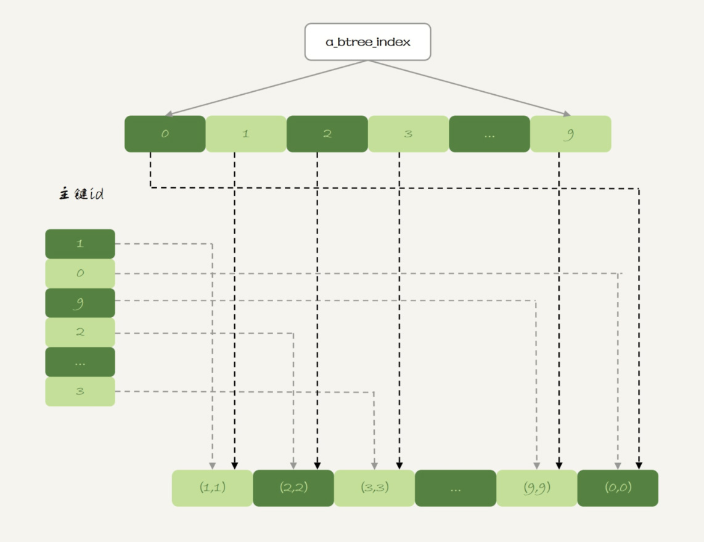

# MySQL的Memory表

## 1. 内存表的数据组织结构

有一个好玩的现象，一个InnoDB表和一个Memory表，同时写入1-9，0，在InnoDB中返回的结果是0-9，在Memory返回的结果是1-9，0。

出现这个区别的原因在于这两个引擎主键索引的组织方式不同。

- （索引组织表）InnoDB表数据就放在主键索引树上，主键索引是B+树，主键索引的值是有序存储的，执行select * 的时候，就会按照叶子结点从左到右扫描，因此得到的结果0是第一行。
- （堆组织表）Memory的数据和索引是分开的，内存表的数据部分以数组的方式单独存放，而主键id索引里，存的是每个数据的位置，主键id是hash索引，索引上的key不是有序的。select * 的时候走的是全表扫描，也就是顺序扫描这个数组，因此0就是最后一个被读到，并放入数据集的数据。

Memory和InnoDB的典型不同

|                            | InnoDB                               | Memory                                                       |
| -------------------------- | ------------------------------------ | ------------------------------------------------------------ |
| 数据存放                   | 有序存放                             | 写入顺序存放（不绝对，会有插入的情况）                       |
| 数据文件有空洞时插入新数据 | 固定位置插入                         | 找到空位插入（如果中间一条记录被删除，新的记录会顶替他的位置插到中间） |
| 数据位置变化               | 修改主键索引                         | 修改所有索引                                                 |
| 查询                       | 主键索引1次查找，普通索引2次（回表） | 全部索引都是1次，所有地位相同                                |
| 数据类型                   | 支持变长数据类型                     | 不支持Blob和Text，定义了varchar(N)实际上也是char(N)，即固定长度字符串存储，因此内存表每行数据长度相同 |

考虑到以上条件，如果对Memory表进行范围查询，是用不上主键索引的，需要走全表扫描。

## 2. hash索引和BTree索引

```mysql
mysql>alter table t1 add index a_btree_index using btree (id);
```



其实对于内存表也是支持B-Tree索引的，如果使用B-Tree锁的话返回的结果和InnoDB的结果就相同了。

## 3. 生产环境不推荐使用内存表

### 3.1 锁粒度问题

内存表不支持行锁，只支持表锁。因此一张表只要有更新，会堵住所有在这个表的读写操作。这里的表锁和MDL锁不同，但是都是表级的锁。

与行锁比较，表锁对并发访问的支持不够好。所以，内存表的锁粒度问题，决定了他在处理并发事务的时候，性能也不会很友好。

### 3.2 数据持久性问题

数据全部存放在内存中，是内存表的优势也是劣势，数据库重启的时候，内存表会被清空。

M-S架构下，业务正常访问主库，从库由于某些原因重启，内存表被清空，客户端发送一条update语句，修改内存表的数据行，备库的应用程序就会报错。

双M结构下。由于MySQL知道重启后，内存表的数据会丢失，担心主库重启后出现主备不一致，MySQL在实现上在数据库重启后，往binlog里面写入一行delete from 内存表名，那么备库的binlog传到主库中，直接删掉了主库内存表。

### 3.3 内存表不支持事务

如题

## 4. 用内存表比较好的场景

[Join](../bug_你有我也有/Join的使用问题.md)中的优化场景，内存临时表刚好可以无视内存表的两个不足

- 临时表不会被其他线程访问，没有并发性的问题
- 临时避重启后也是需要删除的，清空数据这个问题不存在
- 备库的临时表也不会影响主库的用户线程

[Join](../bug_你有我也有/Join的使用问题.md)中使用了innodb引擎的内存表用来做数据的临时中转表，如果使用了Memory引擎的内存临时表的话，可以

- 不需要写磁盘，往临时表写数据的速度更快
- 被驱动表使用hash索引，查找的速度比B-Tree索引快
- [Join](../bug_你有我也有/Join的使用问题.md)场景中的数据较少，占用内存有限


