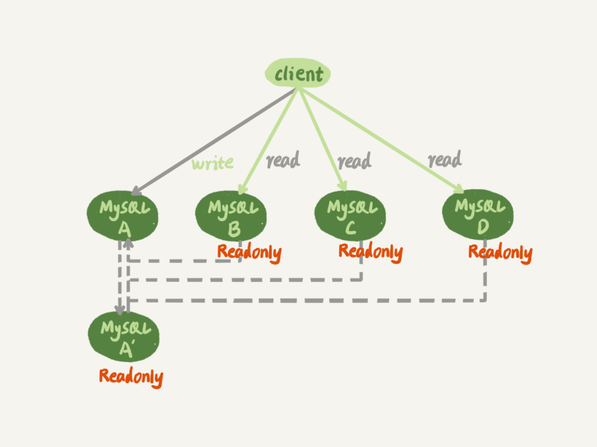
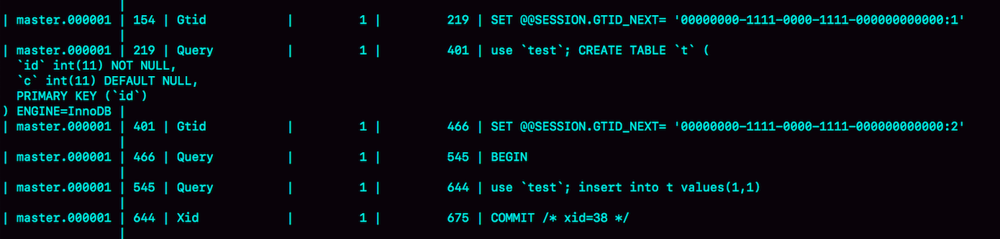

# MySQL的主从库问题



图中A和A'互为主备关系， BCD则是从库，主库负责所有的写入和一部分读，其他的读请求由从库分担。

## 那么对于上图，如果A挂了呢

对于正常的主备切换流程（详情见<font color=red>主备一致</font>）,一主多从结构在切换完成后，A‘会成为新的主库，从库BCD也要改接到A’，那么这个BCD重新指向的过程，是怎么切换的呢

### 基于位点的主备切换

#### 切换B为A‘的从库的时候，需要执行一条change master命令

```mysql
CHANGE MASTER TO
# 主库ip
MASTER_HOST=$host_name
# 主库端口
MASTER_PORT=$host_port
# 主库用户名
MASTER_USER=$user_name
# 主库密码
MASTER_PASSWORD=$password
# 主库的文件名
MASTER_LOG_FILE=$master_log_name
# 主库文件开始同步的位置
MASTER_LOG_POS=$master_log_pos
```

那么如果B要设置为A‘的主库，就要执行这个change master指令，但是不可避免的要设置位点的两个参数，即所谓的<u>同步位点，也就是对应主库的文件名和日志偏移量</u>。

原来B是A的从库，记录的也就是A的位点。但是相同的日志，A的位点和A‘的位点是不同的，因此B在切换的时候，就需要先经过“找同步位点”这个逻辑。但是这个位点很难精确取到，一般仅能获取到一个大概位置。大概获取的步骤是这样的

1. 等待A‘完成所有的relay log
2. 在A’上执行show master status命令，得到当前A‘最新的File和Position
3. 取原主库A故障的时刻T
4. 用mysqlbinlog工具解析A’的File，得到T时刻的位点

```mysql
mysqlbinlog File --stop-datetime=T --start-datetime=T
```

返回的值，end_log_pos后面的值，表示A'这个实例，在T时刻写入新的binlog的位置。然后，我们就可以把这个值作为$master_log_pos，用在节点B的change master命令里。

但是这个值不精确。举个例子，在T这个时刻，A已经执行完了一个insert语句插入了一行数据R，并将binlog传给了A‘和B，传完后瞬间挂了。那么这时候系统的状态会变成这样

- 在B上，由于同步了binlog，R这一行已经存在
- 在新主库A’上，R也存在，日志是写在T这个位置之后的
- 我们从B上执行change master命令，指向A‘的File文件的T时刻的位置，会把这个插入R的数据的binlog再次到B上去执行。<font color=red>那么这时候会发生主键冲突从而停止同步</font>

因此，通常情况下，我们切换任务的时候，要先主动跳过这些错误来规避同步被中断的问题

- 主动跳过一个事务，当然切换过程中，可能不止会重复执行一个事务，因此<u>我们需要从B接到A‘的时候，持续观察。每次碰到这些错误就停下来，执行一次跳过命令，直到不再出现停下来的情况，一次来跳过所有的事务</u>

```mysql
set global sql_slave_skip_counter=1
start slave
```

- 通过设置**slave_skip_errors**参数，直接设置跳过指定的错误。设置为“1032，1062”，这样中间碰到两个错误直接跳过
  - 1062错误是插入数据唯一键冲突
  - 1032错误是删除数据时找不到行。

当然这个事基于我们清楚在主备切换的过程中，直接跳过这两个错误是无损的，所以才可以这么设置这个参数，等到主从间的同步关系建立完成，并且稳定一段时间后，需要把这个参数设置为空，以免出了主从数据不一致的时候直接跳过。

### 基于GTID（Global Transaction Identifier）的主备切换

MySQL5.6版本引入了GTID解决了基于位点主备切换的复杂操作问题

GTID是全局事务ID，是一个事务在提交的时候生成的，是这个事务的唯一标识。他的组成方式是server_uuid:gno

- server_uuid：是一个实例第一次启动的时候自动生成的，是一个全局唯一的值
- gno：是一个整数，初始值是1，每次提交事务的时候分配给这个事务，并加1，<u>官方对这个值是使用transation_id，但是考虑到这个翻译的结果是事务id，但是事务id是在事务执行过程中分配的，如果事务回滚了，事务id也会递增，而gno是在事务提交的时候才会分配，因此GTID往往是连续的，因此换成其他方式用作理解。</u>

GTID启动，在启动MySQL加上参数**gtid_mode**=on和**enforce_gtid_consistency**=on就可以了

在GTID模式下，每个事务都会跟一个GTID一一对应。GTID有两种生成方式，使用哪种方式取决于session变量gtid_next的值

- 如果gtid_next=automatic，代表使用默认值。MySQL会把server_uuid:gno分配给这个事务。
  1. 记录binlog的时候，先记录一行@@SESSION.GTID_NEXT='server_uuid:gno'；
  2. 把这个GTID加入本实例的GTID集合。
- 如果gtid_next是一个指定的GTID的值，比如通过set gtid_next='current_gtid'指定为current_gtid，那么存在两种可能
  1. 如果current_gtid已经存在于实例的GTID集合中，那么接下来执行的这个事务会被系统直接忽略
  2. 如果current_gtid没有存在于实例的GTID集合中，就将这个current_gtid分配给接下来要执行的事务。也就是说系统不需要给这个事务生成新的GTID，因此gno也不用加1。

一个current_gtid只能给一个事务使用。这个事务提交后，如果要执行下一个事务，就要执行set命令，将gtid_next设置为另一个gtid或者automatic。

每个MySQL实例都维护了一个GTID集合。用来对应这个实例执行过的所有事务。

```mysql
CREATE TABLE `t` (
  `id` int(11) NOT NULL,
  `c` int(11) DEFAULT NULL,
  PRIMARY KEY (`id`)
) ENGINE=InnoDB;

insert into t values(1,1);
```



这个执行后的事务的begin前是有一条SET @@SESSION.GTID_NEXT命令的。此时如果该实例有从库，那么将CREATE TABLE和insert语句同步过去的时候，会先执行这两个SET命令，这样被加入从库GTID集合的就是这两个GTID

那么假设该实例是另外一个实例的从库，并且在另一个实例中执行了上面的insert语句且这个在实例中的GTID是“x x x x:10”。

那么该实例作为从库，就要同步这个事务来执行，很明显会出现主键冲突，导致该实例同步线程停止。<u>那么可以提交一个空事务将这个GTID提交到该实例的GTID集合中，并且在事务提交后主动恢复GTID的默认分配行为</u>，那么如果遇到了这个GTID标注的语句时会自动跳过，即跳过这句insert方法

```mysql
set gtid_next='x x x x:10'
begin;
commit;
set gtid_next=automatic;
start slave;
```

可以通过show master status查看GTID_set。

#### 主备切换

在GTID模式下，备库b要设置为新主库A‘的从库语法如下

```mysql
CHANGE MASTER TO 
MASTER_HOST=$host_name 
MASTER_PORT=$port 
MASTER_USER=$user_name 
MASTER_PASSWORD=$password 
# 主库的文件名
#MASTER_LOG_FILE=$master_log_name
# 主库文件开始同步的位置
#MASTER_LOG_POS=$master_log_pos
# 表示主备关系使用的是GTID协议
master_auto_position=1 
```

这时候在B上执行start slave命令， binlog是这么取的

1. 实例B指定主库A‘，基于主备协议建立连接
2. 实例B发送GTID集合set_b给A‘
3. 实例A’计算set_a和set_b的差集，即存在于set_a但是不存在set_b的GTID集合，判断本地A‘是否包含了这个差集需要的所有binlog事务
   1. 如果不包含，表示已经被A'删除，直接返回错误；
   2. 如果确认全部包含，A‘从自己的binlog文件里面，找出第一个不在set_b的事务，发给B
4. 从这个事务开始，往后读文件，按顺序发给B执行

> ps:在基于GTID的主备关系里，系统认为只要建立主备关系，就必须保证主库发给备库的日志是完整的，所以，主库不存在从库需要的日志，主库就会拒绝发送日志给从库。<font color=red>此处主库来判断完整性，基于位点的协议由备库决定，备库指定哪个位点，主库就发送，不做日志完整性判断</font>

#### 好玩的应用点

- 在互为主备的情况下，如果此时希望在备库中执行一个OnlineDDL，为了不影响主库（binlog互传的情况，不考虑备库不写binlog的情况，这种情况没有这种现象）。在备库执行的OnlineDDL会跟着binlog同步到主库中，这样就无法达成在备库中试验的手段。
  1. 先在主库停止slave，停止接收备库传来的binlog日志（stop slave）
  2. 在备库中执行DDL语句，不用关闭binlog，binlog不会传到主库
  3. 执行完成后，查出这个DDL语句对应的GTID，记为x x x x:gno
  4. 到实例上提交这个GTID的空日志操作，然后恢复gtid_next=automatic，之后开启slave服务，这样的话从库执行的这个语句主库会默认已经执行从而为了规避错误主动跳过。
  5. 切换主备库，重复1-4即可
- 如果一个新的从库接上主库，需要的binlog已经没有了，那怎么做呢
  1. 如果业务允许主从不一致的情况，那么可以在主库上先执行show global variables like 'gtid_purged'，得到主库已经删除的GTID集合，然后在从库执行reset master， 在执行set global gtid_purged='刚刚查到的'，最后执行start slave，就会从主库现存的binlog开始同步。binlog丢失的那部分，数据在从库上就可能会有丢失，造成主从不一致
  2. 如果需要主从一致的话，还是通过重新搭建从库来做比较好。
  3. 如果有其他的从库保留有全量的binlog的话，可以把新的从库接到保留了全量binlog的从库，追上日志后，有需要再接回主库
  4. 如果binlog有备份的话，可以现在从库上应用缺失的binlog，然后在执行start slave
- MySQL可以根据binlog文件头部的Previous_gtids快速定位binlog里面的GTID位置。