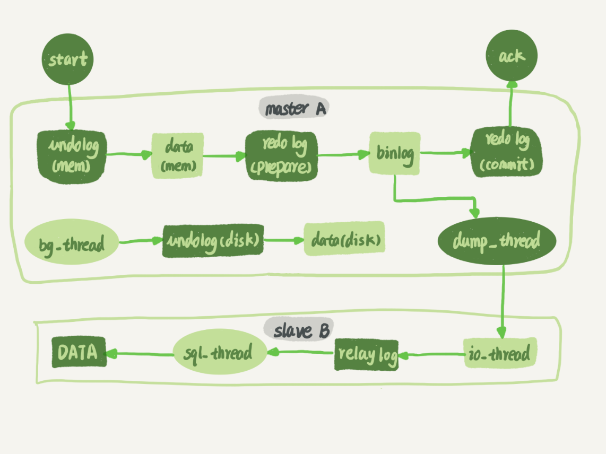

# MySQL的主备一致

首先要明确，主备一致主要是因为binlog

一般把备库设置为readonly状态来判断节点的角色。虽然设置为只读，但是这里的设置对超级权限用户是无效的，而用于同步更新的线程，就拥有超级权限。



上图就是主库A和备库B之前的同步逻辑。

1. 在备库B上通过change master命令，设置主库A的IP，端口，用户名，密码以及从哪个位置开始请求binlog，这个位置包括文件名和日志偏移量。
2. 在备库B上执行start slave命令，这时候备库会启动两个线程，即IO-thread和sql-thread，其中io-thread用于和主库建立连接
3. 主库A校验完用户名、密码后，开始按照备库B传过来的位置，从本地读取binlog，发给B
4. 备库B拿到binlog后，写到本地文件，称为中转日志（relay log）
5. sql-thread读取中专日志，解析出日志中的命令并执行

后来引入了多线程复制方案，sql-thread演化为了多个线程

## binlog的三种格式对比

- statement：记录真实执行的语句，包括切库，事务开始和结束（这样能保证日志传到备库去执行的时候，不论当前工作线程在哪个数据库，都能够正确更新）最后一行是事务的commit 里面记录了xid

  - 由于主备数据库的数据可能会有不一致的情况，因此在执行有一些命令的时候，得到的效果可能会和主库有出入，例如执行delete语句的时候携带了limit，这样就会导致命令是unsafe的，当然也有可能由于索引使用有差异导致得到的接口会有区别。这样被认为是有风险的

- row：删除了statement中执行SQL原文的位置，换成了两个event

  - Table_Map event： 接下来操作的是表是test库的t表

  - Delete_rows event：定义删除的行为

    但是row方式的binlog我们是没办法看到详细信息的，需要借助mysqlbinlog工具,startposition参数定义解析日志的起始位置，vv可以把内容都解析出来

    ```mysql
    mysqlbinlog  -vv data/master.000001 --start-position=8900;
    ```

    **binlog_row_image**的默认配置是FULL，因此event中包含了操作行的所有字段的值，如果这个设置为MINIMAL，只会记录必要的信息，可能是id或者别的

    因此当binlog使用row格式的时候，binlog里面记录了真实删除行的主键id，当binlog传到备库去的时候，就肯定会删除id=4的行。就不会有主备删除不同行的问题。

- mixed： 
  - 因为statement格式的binlog可能会导致主备不一致
  - 但是用row 有很占空间，如果一个delete删掉10w行数据，那么row就会把10w条数据写道binlog中，消耗IO资源影响执行速度
  - 然后MySQL就取了个这种方法，就是mixed的binlog，如果MySQL判断这个主句可能会导致主备不一致，那么使用row，不然的话使用statement格式，因此又具备了statement格式的有点，同时避免了数据不一致的风险。

当然对于更多的场景其实把binlog设置为row是由很大好处的。至少有一个可以直接看出来的好处：**恢复数据**

- 即使执行的是delete语句，row格式的binlog也会把删掉的数据整行信息保存起来，那么可以把binlog中记录的delete语句转成insert，直接插回去尽可以恢复了。
- insert语句，row下binlog会记录所有字段信息，直接把insert转为delete删除掉即可
- 如果执行的是update语句的话，binlog会记录修改前和修改后的整行数据，如果误执行了update，只需要把这两个event对调执行即可

mixed格式的小计：如果插入语句使用了now函数，statement会在执行这句语句前set timestamp=xxxx，保证下面now函数和主库相同

## 循环复制的问题

正常情况下主备的数据是一致的，但是生厂上用的比较多的是双M结构。互为主备关系，在切换的时候就可以不用在修改主备关系。

但是由于binlog在双节点可能都会生成（**log_slave_updates**为on，表示备库执行relay log后生成binlog）。那如果binlog互相传递，那么很有可能导致循环执行这个更新语句，虽然可能数据最终不会有所改变，但是这个问题是切实存在的。

- 规定两个库的serviceid不同，相同不可为主备
- 备库接到binlog并重放的过程中，生成与原binlog的serverid相同的binlog
- 每个库在收到自己主库发来的日志时，先判断serviceid，相同则丢弃