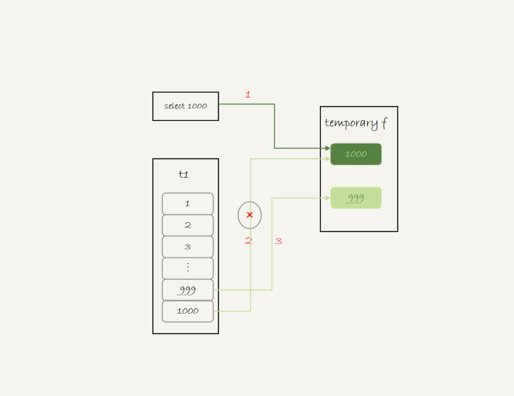

# MySQL的内部临时表

[order By](MySQL的orderBy.md)和[Join](../bug_你有我也有/Join的使用问题.md)中有说到sort buffer、内存临时表、join buffer。这三个数据结构都是用来存放语句执行过程中的中间数据，以辅助SQL语句执行。排序用到了sort buffer，join用了join buffer。

## Union

Union语义为获取两个字查询的并集，即两个结果集加起来，重复的行只保留一行。

```mysql
mysql>(select 1000 as f) union (select id from t1 order by id desc limit 2);
```

操作流程（t1的id只有1000，999两个值）：

1. 创建一个内存临时表，这个临时表缀有一个整形字段f，并且f是主键字段。
2. 执行第一个子查询，得到1000这个值，并存入临时表中。
3. 执行第二个子查询
   1. 拿到第一行id=1000，试图插入临时表中。但是由于1000这个值已经存在于临时表了，违反了唯一性约束，插入失败，继续执行；
   2. 取到第二行id=999，成功插入。
4. 从临时表按行取出数据，返回结果，并删除临时表，结果中包含两行数据是1000，999



内存表临时起到了暂存数据的作用，计算过程中用上了临时主键id的唯一性约束，实现了union的定义。

unionall没有去重的语义，如果替换的话，执行的时候依次执行子查询，得到的结果直接作为结果集的一部分，发送给客户端，因此不需要临时表。

## group by

```mysql
mysql>select id%10 as m, count(*) as c from t1 group by m;
```

使用explain可以在Extra中看到using了三个值

- Using index， 表示这个语句用到了覆盖索引，不需要回表
- Using temporary， 表示使用了临时表
- Using filesort， 表示需要排序（<u>MySQL8.0之后不会有默认排序</u>）

执行流程为：

1. 创建内存临时表，表里有两个字段m和c，主键是m
2. 扫描t1的普通索引，依次取出叶子结点上的id值，计算id%10的结果，记为x；
   1. 如果临时表没有主键为x的行，就插入一个记录（x,1）;
   2. 如果表中有主键为x的行，将c+1
3. 遍历完成，按照字段m排序，得到的结果返回客户端。

如果不需要对结果排序可以在SQL末尾加order by null。

## group by 优化

### 1.索引

不论使用内存临时表还是磁盘临时表，group by 逻辑都需要构造一个带唯一索引的表，执行代价是比较高的，如果表的数据量比较大，group by语句执行就会很慢。

那么如果输入的数据是有序的，那么计算group by的时候，就只需要从左到右，顺序扫描，依次累加。例如当碰到了第一个1的时候，就知道累计了X个0，结果集第一行就是（0，X）

这样的数据结构，可以使用InnoDB的索引来满足。

在MySQL5.7版本支持了 generated column机制，用来实现列数据的关联更新。可以创建一个列z，在z列上创建一个索引（5.6以及之前的版本可以创建普通列和索引来解决这个问题）

```mysql
mysql>alter table t1 add column z int generated always as(id % 100), add index(z);
```

这样的话z里面的数据就可以替代id%10来触发有序索引对group by的优化了

> 在MySQL8.0版本中测试，如果添加这个字段后，对于之后group by id % 100的相关操作都会走新增的索引z


### 2.直接排序

如果碰上不适合创建索引的场景，还是要老老实实做排序的。那么这个时候group by要怎么优化呢？

如果我们已知这个group by语句放到临时表上的数据量特别大，我们可以放弃MySQL的策略（先放到内存临时表，插入一部分数据后，发现内存临时表不够用了再转成磁盘临时表），直接通过加入SQL_BIG_RESULT这个提示（hint）告诉优化器，这个语句涉及的数据量很大，请直接用磁盘临时表。优化器因为磁盘临时表是B+树存储，存储效率不如数组，那么从磁盘空间考虑，会直接使用数组存储。

```mysql
mysql>select SQL_BIG_RESULT id%100 as m, count(*) as c from t1 group by m;
```

执行流程

1. 初始化sort_buffer，确定放入一个整形字段，记为m
2. 扫描表t1的普通索引，将id%100的值存入sort_buffer中；
3. 扫描完成后，对sort_buffer的字段m做排序
4. 排序后就得到了一个有序数组

然后按照索引优化的方式获取数据，从explain中可以看到没有使用临时表了（没有using temporary）

> 这里有一个很有趣的知识点，
>
> - order by null的不排序是在group by后的排序操作就不执行了，但是对于磁盘临时表，是直接使用优化的类似索引的结果，这个从一开始就是已经做了排序的，因此得到的groupby操作后的结果集其实也是排序过的。、
> - 内存表和InnoDB表的索引方式不同，[MySQL的Memory引擎](MySQL的Memory引擎.md)

## 整理

MySQL什么使用会使用内部临时表

- 如果语句执行过程可以一边读数据，一边直接得到结果，是不需要额外内存的，否则就需要额外的内存，来保存中间的结果。
- join_buffer是无需数组，sort_buffer是有序数组，临时表是二维表结构
- 如果执行逻辑需要用到二维表特性，就回优先考虑使用临时表，例如union需要用到唯一索引约束，group by还需要用到另外一个字段来累积计数。