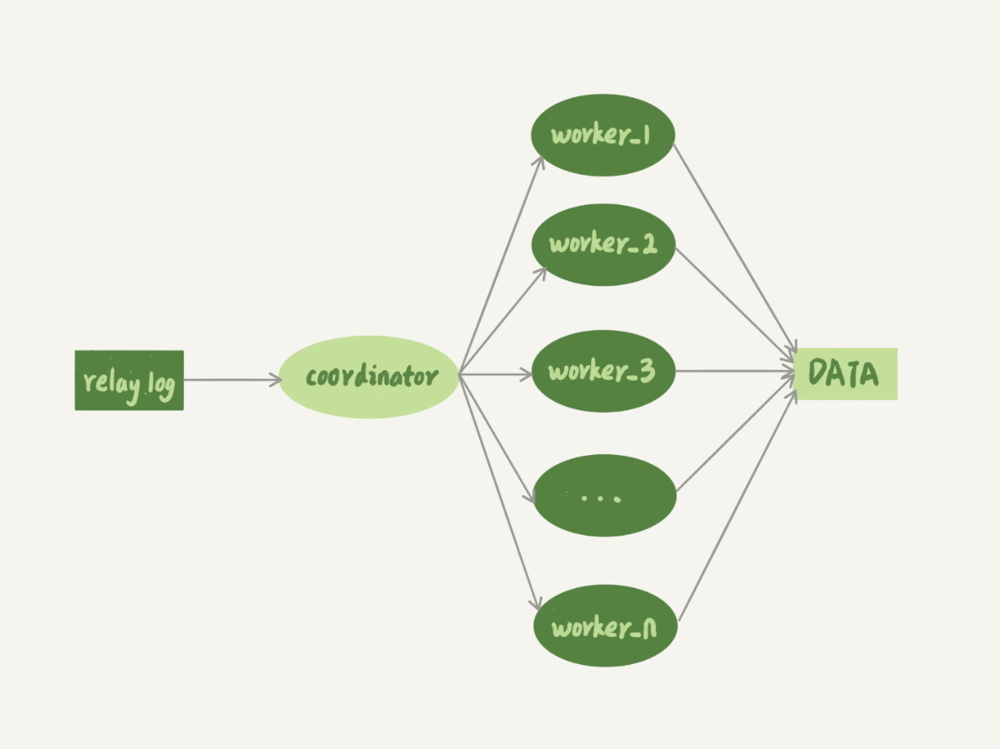
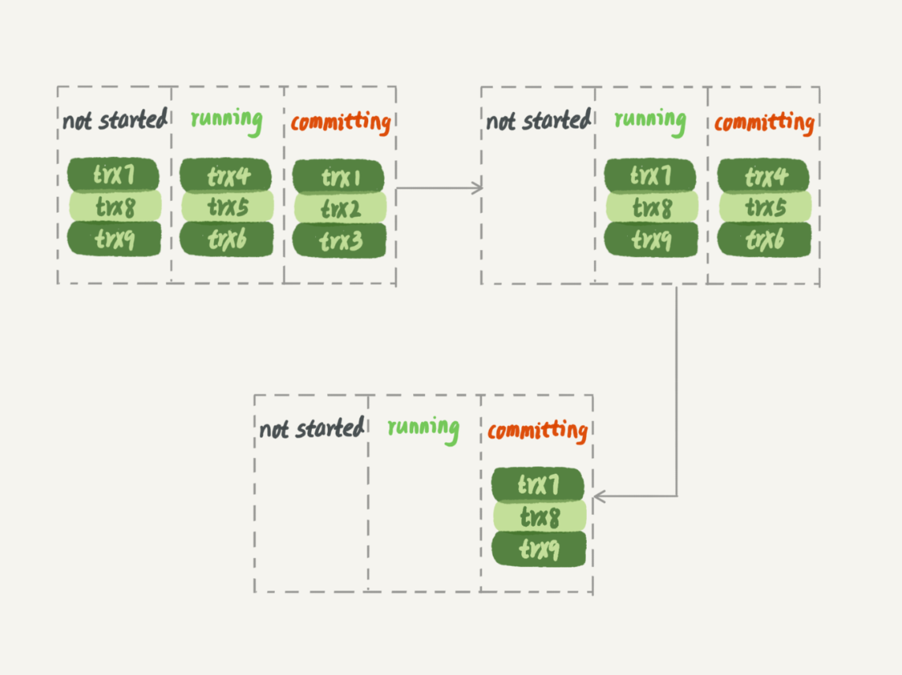
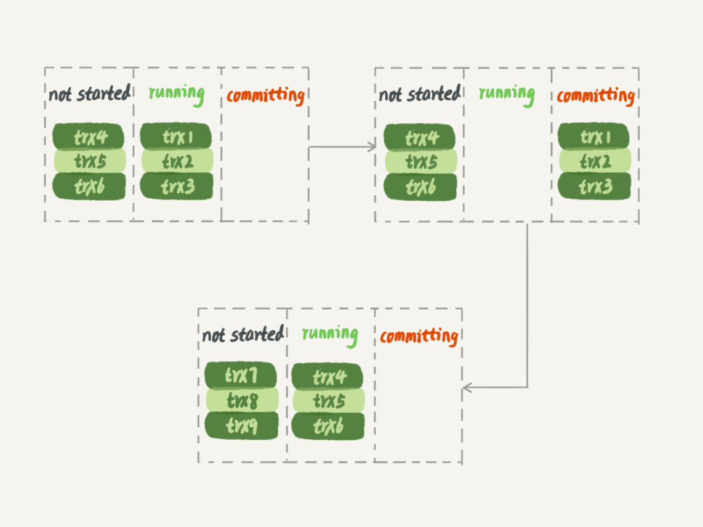

# MySQL的备库并行复制

如果备库执行日志的速度持续低于主库日志生成的速度，那么这个延迟就有可能成了小时级别，对于一个压力持续比较高的主库来说，备库很可能永远都追不上主库的执行节奏

说到主备的并行复制能力，其实主要归于两个流程（流程图可参照 **MySQL的主备一致**）

- 客户端写入到主库：主要影响并发的原因就是锁了。由于InnoDB引擎支持行锁，所以除了所有兵法事务都在更新同一行的这种极端场景外，它对业务并发度的支持很友好的
- 备库上sql_thread执行中转日志，在5.6版本之前，只支持单线程复制，因此在主库并发高，TPS高的情况下，很容易导致备库应用日志不够快，导致主备延迟。

## 在这种背景下逐渐演化的多线程复制

### 首先先提供一些想法

图中，coordinator就是原来的备库用来更新数据的sql_thread，这里用来读取中转日志和分发日志。多个worker线程用来更新数据。这些worker可以参照使用一半的核心数，留部分性能用于提供读查询。

需要注意的是：

- 事务被分给了worker以后，不同的worker是独立执行的，这时候由于CPU的调度策略，是无法**顺序**的执行事务的。那如果这两句sql正好更新的是同一行， 即意味着，同一行上的两个事务。在主库和备库的执行顺序相反，这非常容易导致主备不一致。
- 同一事务的多条更新语句，也是不能分给不同的worker执行的，这个考虑到落在备库的查询语句上，如果同一事务被多个worker处理，意味着一个事务被拆解为多个事务，考虑到事务的隔离性来说，会出现获取到更新一半的结果的问题。

由此：在分发线程coordinator分发的时候，必须满足一些要求

- 不能造成更新覆盖，需要更新同一行的数据必须被分发到同一个worker中。
- 同一个事务不能被拆开，必须放在同一个worker中。

#### 按表分发的策略

如果两个事务更新不同的表，他们就可以并行，因为数据是存储在表里的，所以按表分发，可以保证两个worker不会更新同一行。当然如果有跨表的事务，还是要放在一起进行考虑的。

每个worker线程对应一个hash表，用来保存当前正在这个worker的执行队列的事务所设计的表，hash表的key应该是“库名.表名”，value是个数字，表示队列中有多少个事务修改这个表。

当有事务分配给worker的时候，涉及的表会加入对应的hash表，worker执行完，hash表去掉对应key或者删除相关value

应该有的分配规则

- 事务T要修改表t1，而worker1队列中有事务在修改表t1，事务T和队列中的某个事物需要修改同一个表的数据，这种情况我们说他们是冲突的。
- 如果事物T同时也和worker2产生了冲突，coordinator就进行等待。
- 在执行一段时间后，事务T冲突的worker只有worker1了，直接分配给worker1。
- coordinator继续下一个中转日志

这个方案在多个表负载均匀的场景中的应用效果会比较好，但是如果是热点表的时候，所有更新事务都涉及到某一个表的时候，所有事务被分配到同一个worker中，就变成单线程复制了。

#### 按行分发的策略

大致上雷同于按表分发，但是hash中的key添加了行号/主键用于区分。

**相比按表并行分发策略，按行并行策略再决定线程分发的时候，需要消耗更多的计算资源，并行度大于按表分发**

按照按行分发的策略有两个问题

- 耗费内存。如果要删除100w数据，这时候hash值就要记录100w个
- 耗费CPU。解析binlog，计算hash值，对于大事务来说，成本还是比较高

为了规避这些问题，可以设置一个阈值，单个事务如果超过行数阈值，就退化为单线程模式

1. coordinator暂时hold住这个事务
2. 等待所有的worker都执行完成，变成空队列。
3. coordinator直接执行这个事务
4. 恢复并行模式

对于这两个方案，其实有一定的约束条件，必须在这种情况下，这两种方案才可使用。

1. 要能够从binlog里面解析出表名、主键值和唯一索引的值。也就是说，主库的binlog格式必须是row，statment无法提供主键和唯一索引的值
2. 表必须有主键，参照上一条，因为要解析出来
3. 不能有外键，表上如果有外键，级联更新的行不会记录在binlog中，这样冲突检测就不准确。

### MySQL 5.6并行复制策略

5.6提供粒度是库的并行策略。即决定分发策略的hash表里，key就是数据库名。

并且这个策略的并行效果，取决于压力模型。如果主库上有多个DB，并且每个DB的压力均衡，使用这个策略的效果会比较好

1. 构建hash的时候会很快，而且正常状态下一个实例上DB不会很多，不会构建多个key的情况
2. 不要求binlog的格式，因为库名在statement格式下也容易获取。

但是，如果主库的表放在同一个DB的话，这个策略基本上就没有效果了，如果不同DB的热点不同，也起不了并行的效果。

### MariaDB的并行复制策略

在**MySQL的binlog和redolog的优化**文章中，redolog使用了组提交优化，而MariaDB的并行复制策略利用的就是这个特性。

1. 能在同一组提交的事务，一定不回修改同一行
2. 主库上可以并行执行的事务，备库上一定也可以并行执行的

实际上MariaDB是这么做的

1. 在一组里面一起提交的事务，有一个相同的commit_id，下一个就是commit_id+1
2. commit_id直接写到binlog里面
3. 传到备库应用的时候，相同的commit_id的事务分发到多个worker执行
4. 这一组全部执行完成之后，coordinator再去取下一批

##### 主库

##### 备库

在备库执行的时候，第一组事务完全执行后，第二组事务才能开始执行，这样系统的吞吐量就不够。

并且，这个方案很容易被大事务拖后腿，如果trx2是个超大事务，那么在trx1和trx3执行完后，必须等待trx2执行完成下一组才能执行。

### MySQL 5.7的并行复制策略

官方5.7版本提供类似MariaDB的功能，由参数**slave-parallel-type**来控制并行复制策略

- 配置为DATABASE，表示使用5.6的按库并行
- 配置为LOGICAL_CLOCK，表示的就是类似MariaDB的策略。不过MySQL5.7这个策略，针对并行度做了优化。
  - 同时处于prepare状态的事务，在备库执行时是可以并行的
  - 处于prepare状态的事务，与处于commit状态的事务之间，在备库执行的时候也可以并行的

在5.7并行复制策略中，使用binglog组提交的配置参数，可以用来制造更多的同时处于prepare的事务，增加了备库复制的并行度。

- **binlog_group_commit_sync_delay**：延迟多少秒调用fsync
- **binlog_group_commit_sync_no_delay_count**：累计多少次调用fsync

### MySQL 5.7.22的并行复制策略

添加了一个新的并行复制策略，给予WRITESET的并行复制。

相应添加一个参数**binlog-transaction-dependency-tracking**，用来控制是否启用新策略。

- COMMIT_ORDER，表示使用5.7的并行策略
- WRITESET，表示的是对于事务涉及更新的每一行，计算这一行的hash值，组成集合writeset，如果两个事务没有操作相同的行，他们的writeset没有交集，就可以并行
- WRITESET_SESSION，在WRITESET基础上多了一个约束，即在主库上同一个线程先后执行的两个数据，在备库执行的时候，要保证先后的先后顺序

其实这个和之前介绍的行分发策略类似，但是官方的这种实现有一些优点

- writeset是在主库生成后直接写入binlog的，这样备库执行的时候，不需要解析binlog内容，节省了计算量
- 不需要把整个事务的binlog都扫一才能决定发到哪个worker更省内存
- 由于备库的分发策略不依赖于binlog，因此binlog不限制格式。

当然对于<u>表上没主键</u>和<u>外键约束</u>的场景，WRITESET策略也没法并行，会暂时退化成单线程模型

### 问题

如果主库是单线程压力模式，那么从库追主库的过程，**binlog-transaction-dependency-tracking**应该选用什么参数

- COMMIT_ORDER：由于主库是压力模式，每个事务的commit_id都是不用的，那么设置为这个模式，从库也是单线程执行。
- WRITESET_SESSION：备库在应用日志的时候，同一个线程的日志必须与主库执行的先后顺序相同，主库单线程压力下也会退化成单线程复制模式
- WRITESET