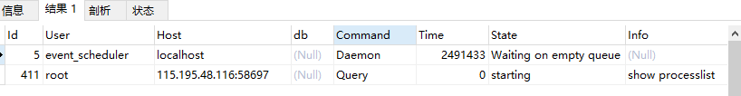

# MySQL的查询


- server层

  - 连接器：负责和用户建立连接

    - 输入连接命令

      ```shell
      mysql -h$ip -p$port -u$user -p
      ```

    - 在交互对话说输入密码(不推荐密码直接跟在-p后，尤其是生产环境)

    - TCP握手

    - 连接器验证身份

      - 如果用户名和密码不对，会受到一个“Access denied for user”的错误，然后客户端结束实行

      - 如果验证密码认证通过，连接器会到权限表查出对应的权限（此权限会缓存，之后连接判断逻辑，全都依赖当前获取到的权限，因此在连接后修改的权限，不会应用新的权限设置）

      - 连接后，如果没有后续的动作，这个连接就处于空闲态，可以通过命令查看，在Command列显示Sleep的这行，就是空闲连接，如果客户端太长没有动静，连接器就会断开，此时间由参数wait_timeout控制，默认8h

        ```mysql
        show processlist
        ```

        

      - 连接被断开后会发送错误提醒“Lost connection to MySQL server during query”，之后查询就需要重连了。

      - 长连接是指连接成功后，客户端有持续的请求，则使用同一个连接。短链接反之。建立连接通常比较复杂，尽量采取减少连接的动作，尽量使用长连接。

        - 优点：减少服务器建立连接的复杂操作开销
        - 缺点：长连接占用内存较快，<font color="red">因为MySQL执行过程中使用的内存是管理在连接对象里的，这些资源会在连接被断开的时候才释放，因此长连接累积下来，会导致内存占用过大，被系统kill，通常看起来是MySQL重启。</font>针对这个问题，可以考虑
          - 定时断开连接重连
          - MySQL5.7以上支持mysql_reset_connection来初始化连接资源

  - 查询缓存（此功能在MySQL8.0后被删除）

    - 拿到查询请求后，去查询缓存查看是否执行过这条语句，之前的语句结果会以KV的形式存在内存中，如果能找到对应的K，则直接返回。不需要执行后面复杂的操作，直接返回结果。

      - 缓存的失效非常频繁，尤其对于一个更新压力大的数据库，缓存命中率很低，因为只要表更新，对应的缓存会全部清空。<font color="blue">除非你的业务就是一张静态表，很长时间更新一次，才适用缓存</font>

      - 缓存的按需使用方式，可以将query_cache_type设置为DEMAND，对于默认的SQL语句不使用查询缓存，如果要查询缓存的语句，可以用SQL_CACHE显式指定

        ```mysql
        select SQL_CACHE * from T
        ```

  - 分析器（知你所然）

    - 词法分析
      - 输入的是多个字符串和空格组成的一个SQL语句，MySQL需要识别其代表什么。比方说将T识别为“表名T”,将字段ID识别为“表名ID”
    - 语法分析
      - 判断当前输入的SQL语句是否满足MySQL语法，如果语句不对，会受到“you have an error in you SQL syntax”错误提醒（一般错误会提示第一个出现错误的位置）

  - 优化器（知你所以然）

    - 如果当前语句涉及的表里面有多个索引的时候，决定使用哪个索引;或者有多表联的时候，决定表的连接顺序

      ```mysql
      select * from T t1 join B b1 using(ID) where t1.a = 1 and b1.b = 2
      ```

      - 既可以从表t1中先获取a=1的记录的ID，再根据ID关联到b1，再判断b是否等于2
      - 也可以从表b1中获取b=2的记录的ID，跟据ID关联到t1，在判断a是否等于1

    - 完成后，指定下来语句的执行方案，进入执行器阶段

  - 执行器（然）

    - 判断当前用户对表是否有查询权限，没有的话会返回没有权限的错误<font color="red">（在工程实现上，如果没有命中缓存，会在查询缓存返回结果的时候，做权限验证，查询也会在优化器之前调用precheck验证权限）</font>
    - 对应表引擎定义->使用引擎提供的接口
      - 如果表中对应字段没有索引，那么执行器会执行
        - 调用InnoDB引擎获取这表的第一行，判断字段是否相等，不是则跳过，是就存储入结果集
        - 调用引擎接口取下一行，重复1
        - 将遍历后所有满足条件的行作为结果集返回给客户端
      - 如果有索引
        - 调用“取满足条件的第一行”
        - 循环1
    - <font color="blue">可以在数据库的慢查询日志中看到一个rows_examined字段，表示这个语句执行过程中扫描了多少行，这个值就是引擎获取数据行的时候累加的，但是这个值并不精确，(某些场景下)由于执行器调用一次，其实引擎内部扫描了多行</font>

- 存储引擎层（InnoDB(5.5版本后的默认存储), MyISAM,Memory）

  - 数据存储
  - 数据提取

# 零零散散的一些内容

- 权限的检查不再优化器之前做呢（能减少一部分的优化浪费的性能）
  - 有些时候，SQL语句操作的表不是SQL字面上的那些，如果涉及到了触发器，得在执行器阶段才能确定，优化器阶段是无能为力的
- 对于没有权限的用户，查询错误的语句，为什么返回的不是语句的错误（考虑到语句鉴权是在执行器/优化器（precheck），错误是在分析器）
  - 出于安全方面的考虑，如果用户没有查看表的权限，如果告诉其字段不对，那给与的信息过多了

- 形象
  - 分析器：“您需要在公司里面找一张头发是黑色的桌子？桌子没有头发啊！臣妾做不到”
  - 优化器：“要我在A B两个办公室找张三和李四啊？那我应该先去B办公室找李四，然后请李四帮我去A办公室找张三，因为B办公室比较近且李四知道张三具体工位在哪”
  - 执行器：“好了，找人的计划方案定了，开始行动吧，走你！糟糕，刚门卫大哥说了，我没有权限进B办公室”

