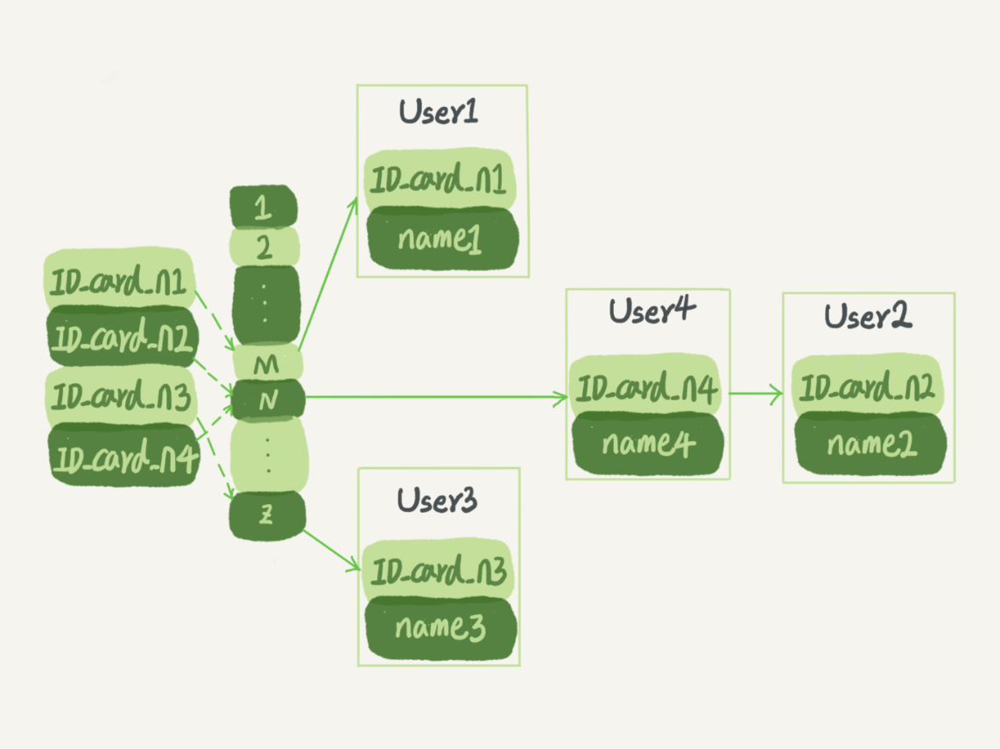

# MySQL的索引

## 常见模型

- 哈希表：用键值KV存储数据的结构，我们只要输入带查找的键K，就可以找对对应的V。用一个哈希函数把K换算成一个确定的位置，然后把value放在数组的这个位置。K换算后出现同一个值，会在对应位置拉出一张链表。**哈希这种结构适用于只有等值查询的场景**，一般用于内存引擎缓存等。

  

- 有序数组：在等值查询和范围查询的场景中的性能非常优秀。如果数组按照递增的顺序保存，那么如果要查一条数据就能使用二分法快速得到，时间复杂度是O(log(N))，但是在需要更新数据的时候比较麻烦，往中间插入一条记录必须得挪动后面所有的记录，成本太高。因此**只适用静态存储引擎**。

  

- 二叉搜索树：每个节点的左儿子小于父节点，父节点小于右儿子，这种查询方式其实类似于二分法，因此时间复杂度是O(log(N))。

  - 由于索引不止存在内存中，还写在磁盘上因此其实实际上不应用二叉树，如果使用二叉树，单独访问一个行可能需要树高(n)*每次使用的时间，这样会导致查询过慢。
  - 为了使查询尽量少的读磁盘，必须让查询过程访问尽量少的数据块，因此不使用二叉树，使用N叉树，N取决于数据块的大小。
  - 以InnoDB的一个整数字段索引为例，N差不多是1200，树高4的时候，就可以存储1200的立方即17亿了。考虑树根的数据块总是在内存中的，那么一个10亿行的表上的索引，查询一个值仅需访问3次磁盘。当然树的第二层很大几率也在内存中，那么磁盘访问次数更少了

## InnoDB的索引模型

在InnoDB中，表都是根据主键顺序以索引的形式存放的，这种存储方式的表成为索引组织表。又因为InnoDB使用了B+树索引模型，所以数据都是存储在B+树中的。

索引分为两种类型

- 主键索引：叶子节点存储的是整行数据。在InnoDB里，主键索引也被称为聚簇索引
- 非主键索引：叶子节点是主键的值，InnoDB中，非主键索引也被称为二级索引

因此如果根据主键查询，只要搜索ID这棵B+树，如果根据普通索引查询方式，则需要先搜索普通索引树，得到ID为500，然后再到ID索引树搜索一次，这个叫做**回表**。基于非主键索引的查询需要多扫描一颗索引树，因此我们在应用中应该尽量使用主键查询。

### 索引的维护

为了维护索引有序性，在插入新值的时候必须要做必要的维护，如果新插入的值隶属于中间，那需要在中间插入一条新的记录，逻辑上挪动后面的数据，空出位置。如果后面的数据页已经满了，那么根据B+树的算法，需要申请一个新的数据页，然后挪动部分数据过去。这个过程称为**页分裂**。这样会<u>导致性能受到影响</u>。除了性能外，页分裂操作还<u>影响页的利用率</u>。原本放在一页的数据，分到两个页中。整体空间利用率降低大约50%。当然有分裂就有合并，当相邻两个页由于删除了数据，利用率很低的时候，会将数据页做合并。合并的过程，可以认为是分裂过程的逆过程。

### 自增主键

自增主键的插入数据模式，正符合了我们前面提到的递增插入的场景。每次插入一条新记录，都是追加操作，都不涉及挪动其他记录，也不会触发叶子节点的分裂。

如果使用业务逻辑的字段做主键，往往不能保证有序插入，这样写数据成本相对较高。

由于每个非主键索引的叶子节点上都是主键的值，如果用身份证号做主键，那么每个二级索引的叶子节点占约20个字节，如果用整型只需要4个，长整型8个。显然主键长度越小，普通索引叶子节点越小，普通索引占用空间越小。

> PS:KV场景使用业务字段直接做主键也是适合的

