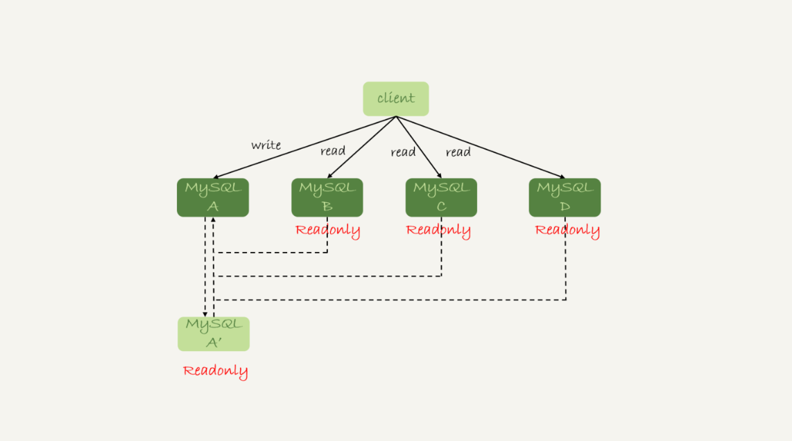
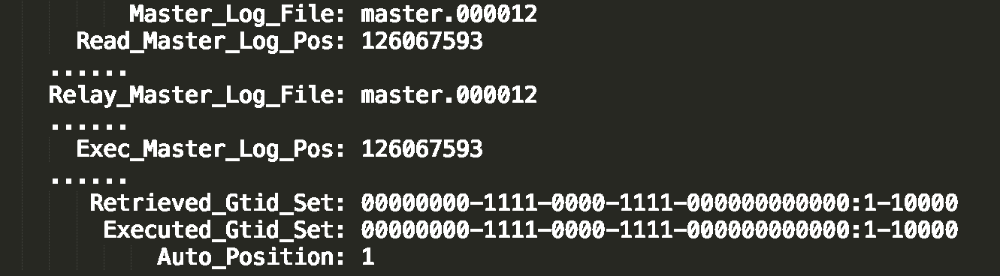

# MySQL的读写分离

## 基本架构



读写分离主要就是分摊主库的压力。图上是一个最基本的读写分离的架构，client主动做负载均衡。这种模式下会把数据库的连接信息放在客户链接层。即由客户端选择后端数据库进行查询。

由基本架构额外延伸出在MySQL和客户端添加一个中间代理层proxy，客户端连接proxy，proxy根据请求类型和上下文决定请求的分发路由。

- 客户端直连方案，由于少了proxy转发，查询性能略优，整体结构简单，排查问题方便。但是这种方案由于要了解后端部署细节，所以在出现主备切换，库迁移等操作的时候，客户端都会感知到，并且需要调整数据库连接信息。一般使用这样的架构一定会伴随一个负责管理后端的组见，尽量让业务端只专注于业务逻辑开发。
- 带proxy的架构，对客户端友好，客户端不需要关注后端细节，链接维护，后端信息维护等工作，都会由proxy完成。但是这样对后端维护团队要求会更高。且。proxy也要有高可用架构，因此带proxy的架构整体相对比较复杂。

## 业务上的“过期读”

由于主从可能存在延迟，客户端执行完一个更新事物后马上发起查询，如果查询选择的是从库的话，就有可能读到刚刚的事务更新之前的状态。

解决这个问题当前有几种方案

### 强制走主库方案

将查询做分类，一般我们可以把查询分成两种

- 对于必须要拿到最新结果的请求，强制发送的主库上，比如卖家发布商品以后，马上返回主页面，看商品是否发布成功，那么这个请求就要拿到最新的。
- 对于可以读到旧数据的请求，将其发到从库上。买家逛商铺页面，就算晚几秒看到最新发布的商品，也是可以接受的。这种请求就可以走从库。

但是如果遇到所有查询都不能是过期读的需求，例如金融相关的业务对实时要求极高，根本不允许有过期读的问题存在。这时候智能放弃读写分离，所有读写压力在主库，等于放弃了扩展性。

### Sleep方案

主库更新后，读从库之前先sleep一下。类似执行一条select sleep（1）命令。大多数情况下主备延迟在1s之内，做个sleep很有可能能够拿到最新的数据，这个方案会是个不错的想法。

以卖家发布商品为例，商品发布后，直接把客户端输入的内容作为“新的商品”显示在页面上，而不是真正去数据库做查询，那么卖家可以通过这个显示来确认产品一经发布成功了，等候后续卖家在刷新页面，其实已经过了一段时间，也就达成了sleep的目的。

即这个方案解决了类似场景下过期读的问题。但是从严格意义上来说，这个方案存在的问题就是不精确。

- 如果这个查询请求本来等0.5s就可以在库里拿到正确结果，也会等1s
- 如果延迟超过1s，还是会出现过期读

### 判断主备无延时方案

#### 判断seconds_behind_master是否等于0

这个单位是s，可以通过这个的时间判断当前是否已经完成了同步操作。但是由于这个属性的单位是s，因此也存在一定意义上的精度问题。

#### 对比点位确保主备无延迟



- Master_Log_File和Read_Master_Log_Pos，表示的是读到的主库的最新位点
- Relay_Master_Log_File和Exec_Master_Log_Pos，表示的是备库执行的最新位点。

如果主库的位点和备库的位点完全相等，就表示接受的日志已经同步完成。

#### 对比GTID集合确保主备无延迟

- Auto_Position=1， 表示这对主备关系使用了GTID协议。
- Retrieved_Gtid_Set，是备库收到的所有日志的GTID集合。
- Executed_Gtid_Set，是备库所有已执行的GTID集合。

#### 总结和缺陷

当然，后续的两种方案的准确度的确远远大于判断seconds_behind_master是否0.

虽然精确度大于sleep方案，但是还是没有达到精确的程度。

1. 主库执行完成，写入binlog，并反馈给客户端
2. binlog被从库发送给备库，备库收到
3. 在备库执行binlog完成。

这个方案判断的主备无延时的逻辑，是“备库收到的日志都执行完成了”。但是在binlog主备之间状态的分析中，不难看出还有一部分日志，处于客户端已经收到提交确认，而备库还没收到日志的状态。

即主库上已经完成了t1,t2,t3的事务，t1和t2已经传到从库，并且执行完，t3主库上执行完成，并且返回了客户端，但是还没有传到从库中。即在正好停留在2步骤中。这时候从库从binlog中获取的位点/GTID都已经同步完了，即已经处于所谓的“无延时”状态。但是这时候差从库还是查不到t3的

### 配合semi-sync方案

解决上面判断主备无延时方案，binlog未发送导致从库认为自身已经同步完毕的精确度问题。需要引入半同步复制。也就是semi-sync replication。

semi-sync做了这样的设计：

1. 事务提交的时候，主库把binlog发给从库
2. 从库收到binlog以后，发回给主库一个ack，表示收到了。
3. 主库收到这个ack以后，才能给客户端返回事务完成的确认。

因此如果启用了semi-sync后，表示所有给客户端发送过确认的事务，都确保了备库已经收到了这个日志。

> ps：如果主库掉电，binlog还来不及发给从库，如果是普通的异步复制模式，就可能会丢失。但是semi-sync就可以解决这个问题

这样，在启用semi-sync后，就可以用主备无延时方案避免过期读了。

<font color=red>但是</font>

通过semi-sync的方案，仅对一主一备的场景成立的。在一主多从的场景中，主库就等到一个从库的ack就开始给客户端返回确认。这样如果查询的数据库正好不是发送ack的从库，同样会导致过期读的问题。

且如果在业务更新的高分起，主库的点位和GTID更新很快，这个等值可能回长时间不一致，很有可能导致从库长时间无法响应查询请求的问题。

因此可能存在两个问题

- 一主多从的情况下，在某些从库执行查询请求会存在过期读的现象。
- 在持续延迟的情况下，可能会出现过度等待的问题。

### 等主库位点方案

```mysql
# 从库中执行， file和pos是主库上的文件名和位置，timeout表示超时单位s
select master_pos_wait(file, pos[, timeout]);
```

这个命令正常返回一个M，表示命令开始执行，到应用了这个表示的binlog位置执行了多少事务，也有可能返回一些其他结果

1. 如果执行期间，备库同步线程发生异常，返回NULL
2. 如果等待超过N秒，返回-1
3. 如果刚开始执行的时候，就发现已经执行过这个位置了，就返回0

由此可以通过这个命令判断，如果返回值>=0的话，就表示这个已经执行了，可以在从库中查询。

### 等GTID方案

```mysql
# 等待知道这个库执行的事务包含传入的gtid_set，返回0，超时返回1
 select wait_for_executed_gtid_set(gtid_set, 1);
```

执行的具体流程如下。在MySQL 5.7.6后，允许在执行完更新事务后，把这个事务的GTID返回给客户端。这个等GTID的方案就可以减少一次查询。

1. trx1 事务更新完成后，从返回包直接获取这个事务的 GTID，记为 gtid1；
2. 选定一个从库执行查询语句；
3. 在从库上执行 select wait_for_executed_gtid_set(gtid1, 1)；
4. 如果返回值是 0，则在这个从库执行查询语句；
5. 否则，到主库执行查询语句。

可以通过将**session_track_gtids** 设置为OWN_GTID，然后通过API接口mysql_session_track_get_first从返回包解析出GTID的值即可