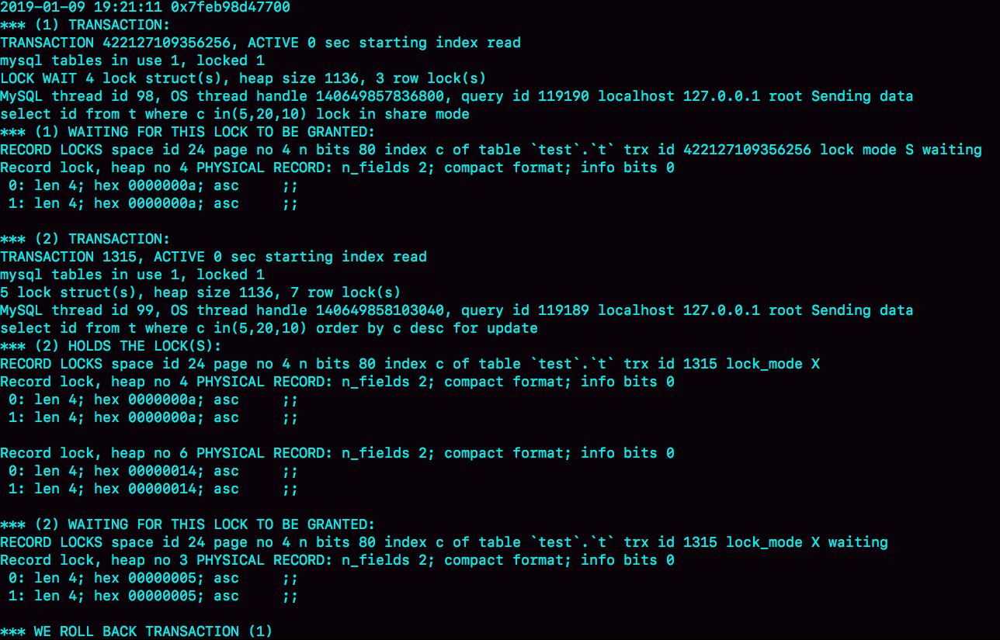

# MySQL的锁

针对并发访问的时候，数据库需要合理的控制资源的访问规则。因此用到了锁

## 全局锁

对整个数据库实例加锁。

MySQL提供了一个加全局读锁的方法，命令为Flush tables with read lock(FTWRL)。该命令会使整个库处于只读状态。数据更新语句，数据定义语句和更新类事务的提交语句会被阻塞。

使用场景：做全局逻辑备份。

让整库都只读，会导致

- 如果再主库上备份，那么在备份期间都不能执行更新，业务基本停摆；
- 如果在从库上备份，那么备份期间从库不能执行主库同步过来的binlog，导致主从数据延迟

如果不添加类似全局锁这样的机制，会导致在备份过程中的**数据时间**不一致，这会导致部分数据时间高于其他时间，例如我买了东西，付了钱，而付钱的库备份了而买东西的库备份的早了一些，没有备份到这条数据。那么如果备份恢复的话，会导致付了钱但是却没有购买记录。

**事务隔离**中有**可重复读**这个类型，在**可重复读**状态下，同一个事务查询到的数据从头到尾都是一致的。

因此可以在可重复读隔离级别下开启一个事务。

> 官方自带的逻辑备份工具是musqldump，当mysqldump使用参数-single-transaction的时候，导数据会启动一个事务确保拿到一致性视图，MVCC的支持下，数据可以正常更新，该方式仅对支持事务的引擎有效(MyISAM不支持，仅能使用FTWRL)

当然想要全库只读，也可以使用set global readonly = true的方式，但是不推荐这种方式：

- 有些系统中，readonly的值被用来做其他逻辑，比方说判断主备库。因此如果修改global变量影响面较大
- 异常处理机制上有差异。FTWRL命令后由于客户端发生异常断开，那么MySQL会自动释放这个全局锁，整个库可以恢复为正常更新态。但是如果将整个库设置readonly后，客户端发生异常，数据库依旧保持readonly态，导致整个库长期不可写
- readonly对super无效

## 表级锁

### 表锁

lock tables 限制别的线程读写同时也限制本线程接下来的操作对象

```mysql
	lock tables ... read/write
```

> PS:read和write锁类似Java中的读写锁，如果获取到了读锁，写操作会阻塞，如果获取了写锁，读写操作都会阻塞

在没有更细粒度的锁时，表锁是最常用的控制并发的方式

### 元数据锁（MDL，5.5后）

> M **DML** D **DDL**主要是解决这俩的冲突

MDL主要是修改结构的时候使用的锁为了<u>防止修改结构的时候别的线程正在查询或者添加数据</u>

MDL不需要显示使用，在访问一个表的时候会自动加上。他能保证读写的准确性。

当对于一个表做增删改查操作的时候，加MDL读锁，当对表结构进行变更操作的时候加MDL写锁

- 读锁之间不互斥，因此多个线程对一张表增删改查不会出现问题
- 读写锁之间，写锁之间是互斥的，用来保证表结构操作的安全性，所以，如果有两个线程同时要给同一张表添加字段，需要等待另一个执行完后才能执行。

*给一个表加字段，或者修改字段，或者加索引，需要扫描全表的数据*

事务中的MDL锁，在语句执行开始时申请，但是语句结束后不会马上释放，而是会等到整个事务提交后再释放。

那么如何安全的给表添加字段呢

- 首先解决长事务，事务不提交，一直霸占MDL锁。查询当前执行中的事务，kill掉或者暂停

但是如果是热点表的话，刚刚kill掉新的请求就来了，考虑到这种请求，其实在alter table中设定等待时间，在等待时间中能拿到MDL锁最好，没拿到也不会阻塞后面的业务语句。

> PS:MariaDB合并了AliSQL的功能,支持DDL的NOWAIT/WAIT n的语法

```mariadb
ALTER TABLE xx WAIT N add column ..
ALTER TABLE xx NOWAIT add column ..
```

> PS 5.6后推出的onlineddl
>
> 1. 拿MDL写锁
> 2. DDL执行准备
> 3. 降级成MDL读锁
> 4. DDL核心执行（耗时长）
> 5. 升级成MDL写锁
> 6. DDL提交
> 7. 释放MDL锁

### 问题

当备库使用-single-transaction做逻辑备份的时候，如果从主库的binlog传来一个DDL语句会怎么样

```mysql
Q1: SET SESSION TRANSACTION ISOLATION LEVEL REPEATABLE READ;
Q2: START TRANSACTION WITH CONSISTENT SNAPSHOT;
Q3: SAVEPOINT sp;
/*时刻1*/
Q4: SHOW create table t1;
/*时刻2*/
Q5: SELECT * FROM t1
/*时刻3*/
Q6: ROLLBACK TO SAVEPOINT sp;
/*时刻4*/
```

1. 确定RR隔离级别，再次设置一次RR隔离界别
2. 使用WITH CONSISTENT SNAPSHOT获取一致性试图
3. 设置一个保存点
4. show create是为了拿到表结构
5. 正式导数据
6. 回滚到SAVEPOINT sp从而释放t1的MDL锁

### 回答：

1. 在**4阶段**前到达，没有影响，备份拿到的是DDL后的表结构
2. 在**时刻2**到达，则表结构被改过，5执行的时候，报Table definition has changed，plz retry transaction，dump中止
3. 在**时刻2**和**时刻3**之间到达，dump占着t1的MDL读锁，binlog被主色，主从延迟，直至Q6完成
4. 从**时刻4**开始，等于**时刻3**

## 行锁

行锁由引擎层自己实现的，对于没有行锁的引擎只能使用表锁，同一张表任何时刻都只有一个更新在执行，这样会影响业务并发度。

InnoDB行级锁是通过锁索引记录实现的，因此如果**update的列没有建立索引，值update一条记录也会锁定整个表**

在InnoDB事务中，行锁是在需要的时候才被加上的，但是并不是在不需要了就立刻释放的，而是要等到十五结束后才释放，即两阶段锁协议。

> |->对于这个设定：如果事务中需要锁多个行，要把尽可能造成锁冲突，最可能<font color=red>**影响并发度的锁尽量往后放**</font>


### 共享锁和排他锁

#### 共享锁 lock in share mode

允许不同事务之前共享加锁读取，但不允许其他事务修改或者加入排他锁

如果有修改必须等待一个事务提交完成，才可以执行，容易出现死锁

即如果一个select 后加入了共享锁，在其他线程修改该行记录的时候，该查询阻塞，直到其他线程放弃写锁，但是如果其他线程也是select后加共享锁的状态，两者都能正常执行

- 允许其他事务也增加共享锁读取
- 不允许其他事务增加增加排他锁for update
- 当事务同时增加共享锁的时候，事务的更新必须等待先执行的事务commit后才行，同时并发太大可能会造成死锁

#### 排他锁 for update

当一个事务加入排他锁的时候，不允许其他事务加共享锁或者排他锁读取，更加不允许其他事务修改加锁的行


## 死锁和死锁监测

当并发系统中不同线程出现循环资源依赖，涉及的线程都在等别的线程释放资源时，就会导致这几个线程都进入无限等待的状态，这叫死锁。

由于InnoDB使用了行锁，那么在两个事务交叉使用资源的时候就有可能发生死锁。

- 即事务A修改了行1后在修改行2，事务B修改了行2后修改行1，两个事务同时执行，那么在事务A修改了行1后就获取了行1的行锁，事务B在修改行2后就获取了行2的行锁，由于事务b获取了行2的行锁，但是事务B等待行1的锁无法提交完成释放行2锁，一直占着行2锁等待行1锁，而事务A一直占着行1锁等待行2锁，由此造成了**死锁**。出现**死锁**后，有两种策略

  - 直接进入等待，直到超时。这个超时时间可以通过参数*innodb_lock_wait_timeout*来设置，参数默认50s，意味着出现思索后。第一个线程要经过50s后才会超时退出，其他线程才可能执行。但是如果设置成一个很小的值，那么出现死锁的时候的确可以很快离开，但是如果是简单的锁等待呢，也会因为超时过久被关闭，因此如果设置的值过小，会导致很多误伤。

  - 发起死锁监测，发现死锁后，主动回滚死锁链条中的某一事务，让其他事务得以继续执行。将参数*innodb-deadlock-detect*设置为on，表示开启（会消耗大量CPU资源-----每个新来的被堵住的线程，都要判断会不会由于自己的加入陷入死锁，这是一个时间复杂度O(n^2)的操作。假如1000个并发线程同时更新同一行，那么操作就是100w量级的，虽然最终可能是没有死锁，但是这期间消耗的大量资源是亏损的）

    - 那么如何解决热点数据更新导致的性能问题呢

      - 确定这个业务一定不会出现死锁，可以临时关闭死锁检测。有一定风险，因为在<u>业务设置中死锁不是一个严重错误</u>，如果出现就回滚，再进行重试一般没问题了，对业务来说是**无损**的。而关闭死锁监测可能会导致大量的超时，这是业务**有损**的

      - 客户端控制并发，同一行同时最多只有10个线程再更新，那么死锁监测的成本大大降低，就不会出现这个问题。但是对于一个MySQL数据库来说，可能会有比较多的客户端，假设一个应用有200个客户端，那么即使控制在5，也有可能达到1000

      - > 因此，对于这个并发控制，需要做在数据库服务端。当然也可以通过中间件来控制流量。

      - 把一行做成逻辑上的多行，对于本来一条记录，可以通过分散这条记录来做疏化工作，类似负载均衡的概念，用随机取行来分化同时对一行的压力，使冲突概率变成原来的1/10，减少锁等待个数。当然这也有业务上的问题，需要后期特殊处理

### 死锁怎么看

出现死锁后，执行show engine innodb status命令可以得到一部分输出。有一节LATESTDETECTED DEADLOCK，这个就是记录最后一次死锁信息



1. 这个结果分成三部分：
   1. TRANSACTION，是第一个事务的信息
   2. TRANSACTION，是第二个事务的信息。
   3. WE ROLL BACK TRANSACTION(1)，是最终的处理结果，表示回滚了第一个事务。
2. 第一个事务的信息中：
   1. WAITING FOR THIS LOCK TO BE GRANTED,表示的是这个事务在等待的锁信息；
   2. index c of table "test"."t"，说明在等的是表t的索引c上面的锁
   3. lock mode S waiting 表示这个语句要自己加一个读锁，当前的状态是等待中；
   4. Record lock 说明这是一个记录锁；
   5. n_fields 2表示这个记录是2列，也就是字段c和主键字段id
   6. 0:len 4; hex 0000000a; asc ;;是第一个字段，也就是c，值是十六进制a，也就是10
   7. 1:len 4; hex 0000000a; asc ;;是第二个字段，主键id，值是10
   8. asc表示，接下来要打印出值里面的“可打印字符”，但10不是可打印字符，就显示空格
   9. 第一个事务信息只显示出了灯锁的状态，在等待（c=10,id=10）这一行的锁。
   10. 当然这里看不到当前占用锁的状态，由于发生了死锁那么表示每个线程本身都携带锁的，可以从第二个事务中推导出来
3. 第二个事务的信息：
   1. “HOLDS THE LOCK(S)”用来限制这个事务持有那些锁；
   2. index c of table "test"."t"表示锁是在表t的索引c上；
   3. hex 0000000a 和 hex 00000014表示这个事务持有c=10和c=20这两个记录锁；
   4. WAITING FOR THIS LOCK TO BE GRANTED，表示在等（c=5,id=5）的这个记录锁；

[事务隔离和锁的关系](MySQL的事务隔离和锁的关系.md)中讲述间隙锁的时候的第二个例子是本次文章的参照

得到了结论：发生死锁的时刻，for update这条语句占用的资源更多，回滚成本更大，所以InnoDB选择了回滚成本更小的lock in

share mode语句来回滚。

