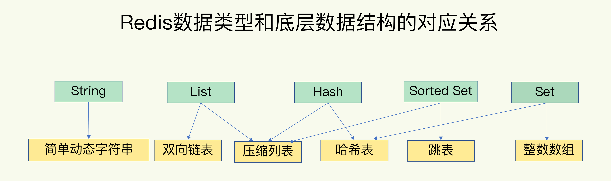
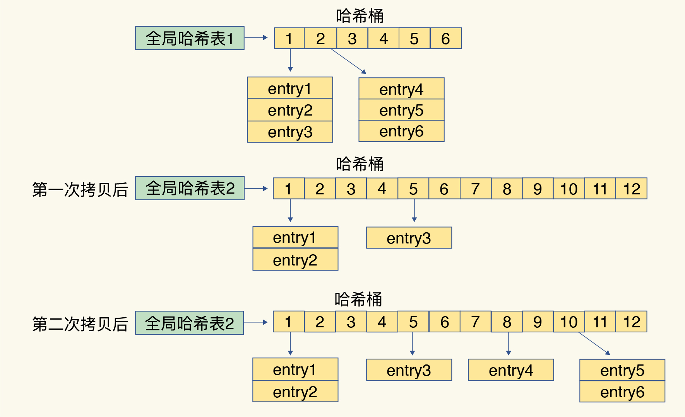
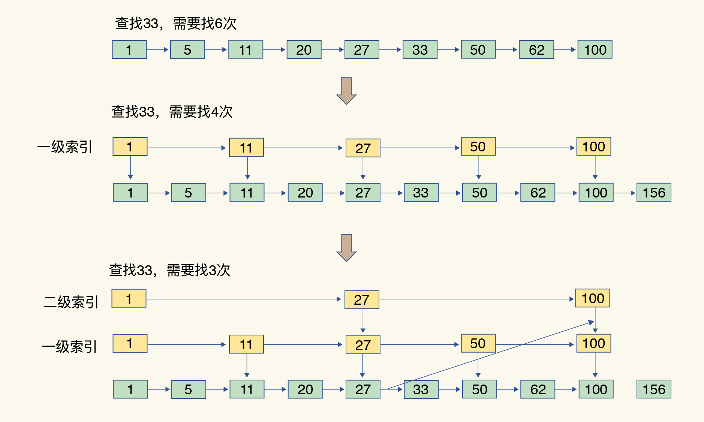

# 1.Redis数据结构

## 1.1 Redis的快：

1. Redis是内存数据库，内存的访问速度本来就很快

2. Redis数据结构问题，键值对是按一定的数据结构来组织的，操作键值对最终就是对数据结构进行增删改查操作，所以高效的数据结构是Redis快速处理数据的基础。

   



### 1.1.1 Redis键值对

Redis使用了一个hash表（其实就是一个数组，数组的每个元素称为一个hash桶）来保存所有键值对。

hash桶中的元素保存的不是值本身，而是指向具体值的指针，所以不管是String还是集合类型，hash桶的元素都是指向他们的指针。

> hash表的最好好处能让我们用O(1)的时间复杂度来快速查找到键值对--我们只需要计算键的hash值，就可以知道它对应的hash桶位置，访问对应的entry元素。（实现上应该是通过一个偏移量来保证的）

hash桶的个数通常要少于key的数量，会有一部分的key的hash值对应到了同一个hash桶中，这就是所谓的发生了hash冲突，也就是两个key的hash值和hash桶计算对应关系的时候，正好落在了同一个hash桶中。**Redis通过链式hash的方式来解决这个问题，即同一个hash桶中的多个元素用一个链表来保存，他们之间用指针连接。**这个链也叫做hash冲突链。

如果hash表写入的数据越来越多，可能产生的hash冲突也会越来越多，这样可能会导致某些hash冲突链过长，从而导致这个链上的元素查询耗时长，效率降低。Redis会对hash表进行rehash操作，增加现有的hash桶数量，让逐渐增多的entry元素能在更多的痛之间分散保存，减少单个桶中的元素数量。

#### 1.1.1.1 Redis rehash操作

Redis默认使用了两个全局hash表，当一开始插入数据时，默认使用hash表1，此时hash表没有被分配空间，随着数据逐步增多，Redis开始执行rehash。

1. 给hash表2分配更大的空间
2. 把hash表1中的数据重新映射并拷贝到hash表2中
3. 释放hash表1的空间

第二步涉及到大量的数据拷贝，如果一次性把hash表1的数据都迁移完，会造成Redis线程阻塞，无法服务其他请求，于是Redis采用了**渐进性rehash**。

即把步骤2放大：Redis正常处理客户端请求时，每一个请求都从hash表1中的**第一个**索引位置开始，顺带将这个索引位置上所有的entries拷贝到hash表2中；处理下一个请求时，再顺带拷贝hash表1中下一个索引位置的entries。（其实等于将redis rehash的过程平均分摊到了多次处理请求的过程中，避免了耗时操作）

> rehash执行时除了根据键值对的操作来进行数据迁移，Redis本身会有个定时任务在执行rehash，如果没有键值对操作时，这个定时任务会周期性的搬移数据到新的hash表中



1. rehashing中，如果出现访问操作：

```c
for (table = 0; table <= 1; table++) {
        idx = h & d->ht[table].sizemask;
        he = d->ht[table].table[idx];
        while(he) {
            if (key==he->key || dictCompareKeys(d, key, he->key))
                return he;
            he = he->next;
        }
        if (!dictIsRehashing(d)) return NULL;   //根据这一句判断是否需要在 1 号哈希表中查找。
    }
```

2. rehashing中，如果出现scan操作：

   如果Redis此时正在rehashing，那么会遍历h1和h2，然后通过一定（暂时没看明白//todo）算法实现对h1和h2的兼容

3. rehashing中，如果出现增删改操作：

   一律走h2

### 1.1.2 Redis集合数据操作

#### 1.1.2.1 压缩列表

类似数组，数组中每个元素都对应保存一个数据。但是压缩列表在表头有三个字段zlbytes,zltail,zllen，分别表示列表长度，列表尾的偏移量和列表中的entry个数；压缩列表在表尾还有一个zlend，表示列表结束。

因此如果要定位第一个元素和最后一个元素，可以通过表头的三个字段的内容直接定位，复杂度O(1)，但是其他元素只能逐个查询，就是O(n)。

#### 1.1.2.2 跳表

有序列表只能逐一查找元素，导致操作起来非常缓慢，跳表在链表的基础上，增加了多级索引，通过对索引位置的几个跳转，实现数据的路快速定位。类似于Btree。



#### 1.1.2.3 常见操作复杂度

- 单元素操作，一般Hash的数据结构都是O(1)
- 范围操作，一般是集合类型中的遍历操作，可以返回集合中的所有数据，一般复杂度是O(n)
- 统计操作，O(1)
- 某些数据结构的特殊记录，比方说压缩列表和双向列表都会记录表头和表尾的偏移量，所以add很快O(1)

### 1.1.3 补充

- 为什么要用整数数组和压缩列表呢，这两种数据结构在时间复杂度中没有很大优势
  - 内存利用率，数组和压缩列表都是非常紧凑的数据结构，比链表占用的内容更少。redis是内存数据库，要做尽可能的优化。
  - 数组对CPU高速缓存支持更友好，因此Redis在集合数据元素较少的情况下，默认采用内存紧凑排序的方式存储，同时利用CPU高速缓存不会降低访问速度，当数据元素超过指定阈值，避免复杂度过高转为hash和跳表。