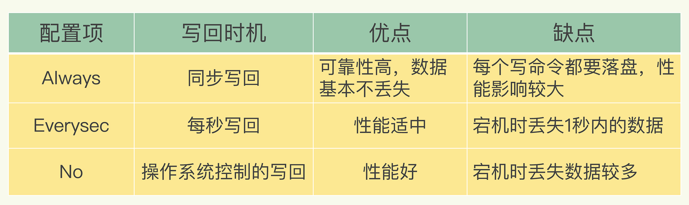
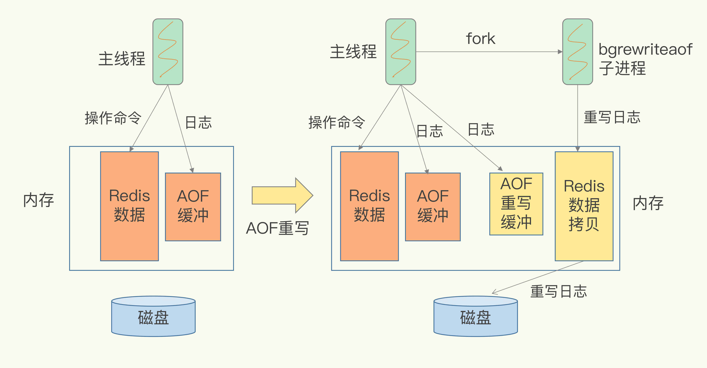

# 2.Redis AOF

在Redis服务器宕机后，需要恢复缓存数据，很容易想到的解决方案是从后端数据库恢复，但是这样不可避免的需要频繁的访问数据库，会给数据库带来巨大的压力；这些数据从慢速数据库中读取，性能肯定比不上Redis中读取，会导致使用这些数据的应用程序响应变慢。

# 2.1 AOF日志实现

### 2.1.1 优点

AOF是写后日志，和数据库WAL写前日志有一定区别，AOF是Redis先执行命令，把数据写入内存，然后再记录日志。

为了避免额外的检查开销，Redis在向AOF里面记录日志的时候，并不会先去对这些命令进行语法检查，因此先记日志再执行命令的话，日志中就可能记录了错误的命令，Redis在使用日志恢复数据的时候，就可能会出错。写后日志只有系统执行成功，才会被记录到日志中，可以避免出现记录错误命令的情况。并且，命令执行后才记录日志，所以不会阻塞当前的写操作。

### 2.1.2 缺点

当然写后日志会出现，执行完命令还没来得及记日志就宕机了，命令和相应数据丢失的风险。如果作为缓存的话可以从后端数据库重新读取数据，但是如果是用作数据库的话，就可能会导致数据无法恢复。

AOF虽然避免了对当前命令的阻塞，但是可能会给下个操作带来阻塞风险，因为AOF日志也是在主线程中执行的，如果日志文件写入磁盘的时候，写压力大会导致写盘很慢，进而导致后续的操作也无法执行了。

### 2.1.3 写回策略

- Always： 同步写回
- Everysec： 每秒写回，先把日志写到AOF文件的内存缓冲区，每隔一秒写入磁盘
- No：操作系统控制写回，执行完把日志写到AOF文件的内存缓冲区，由系统决定写回时间

### 2.1.4 AOF文件过大

#### 2.1.4.1 AOF文件过大可能带来的性能问题

- 文件系统本身对文件大小有限制，无法保存过大的文件
- 文件太大，之后往里面追加命令记录的话，效率会变低
- 如果发生宕机，AOF文件中记录的命令被重新执行，用于故障恢复，如果日志文件太大，恢复过程会非常缓慢，这会影响redis的正常使用

#### 2.1.4.2 AOF过大重写

AOF重写机制就是重写时，Redis根据数据库的现状创建一个新的AOF文件，即读取数据库中的所有键值对，然后对每个键值对用一条命令记录他的写入。这样需要恢复的时候，只要重新执行这个新的命令就可以了。

#### 2.1.4.3 AOF重写方式

AOF日志重写和主线程写回不同，重写过程是由后台子进程bgrewriteaof来完成的，这也是为了避免阻塞主进程，导致数据库性能下降。

##### 2.1.4.3.1 一个拷贝

每次执行重写的时候，主线程fork出后台的bgrewriteaof子进程。此时，fork会把主线程的内存拷贝一份给bgrewriteaof子进程，这里面就包含了数据库的最新数据，然后bgrewriteaof就可以在不影响主进程的情况下，逐一把拷贝的数据写成操作，计入重写日志

##### 2.1.4.3.2 两处日志

主线程未阻塞，仍然可以处理新来的操作，如果有写操作，第一处日志就是指正在使用的AOF日志，Redis会把这个操作写到它的缓冲区，那么即使宕机了，这个操作仍然是齐全的。

第二处日志是新的AOF重写日志，这操作也会被写到重写日志的缓冲区，重写日志也不会丢失最新的操作，等待拷贝数据的所有操作记录重写完成后，重写日志记录的最新操作也会写入新的AOF文件，这时候完成替代。

