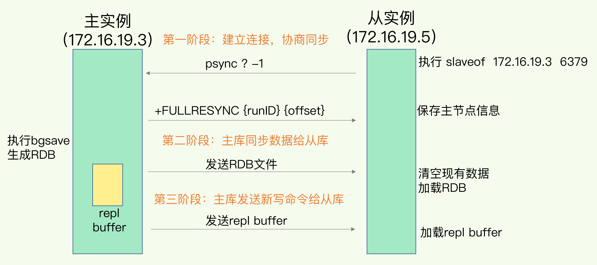

# 4.Redis的主从

Redis提供了主从库模式，以保证数据副本的一致，主从库之间采用的是读写分离的方式。

- 读操作：主库，从库都可以接受
- 写操作：主库执行，主库同步操作给从库

## 4.1 主从的第一次同步

启动多个Redis实例时，相关之间可以通过replicaof（Redis 5.0之前用slaveof）形成主从关系，然后按照三个阶段完成数据的第一次同步。

1. 主从建立连接、协商同步的过程，为全量复制做准备。从库和主库建立起连接，并告诉主库即将进行同步，主库确认回复后，主从库间就可以开始同步了
   1. 从库给主库发送psync命令，标识进行数据同步，主库根据这个命令启动复制，psync包含主库的runID和复制进度offset两个参数
      - runID，是每个Redis实例启动时会自动生成的一个随机ID，用来唯一标记这个实例，当从库和主库第一次复制时，因为不知道主库的runID，所以这个是？
      - offset，此时设置为-1，标识第一次复制
   2. 主库收到psync命令，会用FULLRESYNC响应命令，带上主库runID和主库目前的复制进度offset，返回给从库。从库收到响应后，会记录下这两个参数。（FULLRESYNC响应表示第一次复制采用的全量复制，该主库会把当前所有的数据都复制给从库）
2. 主库将所有数据同步给从库。从库收到数据后，在本地完成数据加载。这个过程依赖于内存快照生成的RDB文件。
   - 主库执行bgsave命令，生成rdb文件，将文件发给从库，从库接收到rdb文件，先清空当前数据库，然后加载rdb文件。
   - 主库同步从库的过程中，主库不会被阻塞，仍然可以正常接收请求。但是这些请求中的写操作并没有记录到刚刚生成的RDB文件中。为了保证主从库的数据一致性，主库会在内存中用专门的replication buffer记录RDB文件生成后收到的所有写操作。
3. 主库会把第二阶段执行过程中新收到的写命令，在发送给从库。
   1. 主库完成RDB文件发送后，就会把此时replication buffer中的修改发给从库，从库执行，这样主从同步了。

## 4.2 主从级联模式

主从库第一次数据同步的过程中，对于主库来说需要完成两个耗时的操作：生成RD和传输RDB。

如果从库数量很多，并且都要和主库全量复制的话，就会导致主库忙于fork子进程生成RDB文件，进行数据全量同步，这个fork操作会阻塞主线程处理正常请求。且传输RDB会占用主库的网络带宽同样会造成主库的资源压力。

可以通过主从从的模式将主库生成RDB和传输RDB的压力，以级联的方式分散到从库上。即在部署主从集群的时候，可以手动选择一个从库用于级联其他的从库，然后再选择一些从库，与这个从库建立主从关系。

这样从库就知道，在进行同步时，不用再和主库进行交互了，只要和级联的从库进行进行写操作同步就行了

一旦主库完成了全量复制，它们之间就会一致维护一个网络连接，主库会通过这个连接将后续陆续收到的命令操作再同步给从库，这个过程也称为基于**长连接的命令传播**

## 4.3 主从网络断后回复

### 4.3.1 Redis 2.8 之前

主从库发生了网络闪断，从库会和主库进行一次全量复制

### 4.3.2 Redis 2.8 以后

网络断了后，主从库会采用增量复制的方式继续同步。

当主从库断连后，主库会把断连期间收到的写命令写入replication buffer，同时会把这些操作命令也写入到repl_backlog_buffer这个缓冲区（这个动作在从库连接后会自动执行，不是断开后触发的）。

> repl_backlog_buffer是一个环形缓冲区，主库会记录自己写到的位置，从库则会记录已经读到的位置。

刚开始的时候主库和从库的写读位置在一起，都是起始位置，随着主库不断接收新的写操作，他在缓冲区的写位置会逐步偏离起始位置，通常用偏移量来解释，对于主库来说，对于的偏移量就是master_repl_offset。主库接受的新写操作越多，值越大。

从库在复制完写操作命令后，它在缓冲区的读位置也开始逐步偏移刚才的位置，从库已复制的偏移量slave_repl_offset也在不断增加。正常情况下，两个量几乎相等。

> 因为repl_backlog_buffer是个环形缓冲区，所以在缓冲区写满后，主库会继续写入，此时就会覆盖之前写入的操作，如果从库读取速度比较慢，就有可能导致还未读取的操作被主库新写的操作覆盖了，这会导致主从库之间的数据不一致。（如果发生这种情况，从库会和主库之间进行全量复制）可以调整**repl_backlog_size**这个参数(缓冲空间大小=主库写入命令速度\*操作大小-主从库间网络传输命令速度\*操作大小，实际应用中考虑突发请求压力，可能会将这个缓冲空间扩大一倍)

### 4.3.3 名词释义

#### 4.3.3.1 repl_blocklog_buffer

为了从库断开后，如果找到主从差异数据而设计的环形缓冲区，从而避免全量同步带来的性能开销。如果从库断开时间太久，环形缓冲区被主库的写命令覆盖了。那么从库连上主库后只能进行一次全量同步，因此这个值应该配置的尽量大一些

#### 4.3.3.2 replication buffer（公用）

Redis和客户端通信也好，和从库通信也好，Redis都需要给分配一个内存buffer进行数据交互，客户端是一个client，从库也是一个client，我们每个client连上Redis后，Redis都会分配一个client buffer，所有数据交互都是通过这个buffer进行的：Redis先把这个数据写到这个buffer中，然后把buffer中的数据发给client socket中再通过网络发送出去，这样就完成了数据交互。所以主从在增量同步时，从库作为一个client，也会分配一个buffer，只不过这个buffer专门用来传播用户的写命令到从库，从而保证主从数据一致，通常叫做replication buffer。

如果出现某些原因导致从库处理的非常慢，那么这个buffer就会持续增涨，消耗大量的内存资源甚至导致OOM，Redis提供了**client-output-buffer-limit**限制大小，如果超过限制，强行断开这个client连接，也就是从库处理慢导致主库内存buffer的积压达到限制后，主库会强制断开从库的连接，此时主从复制会中断，中断后从库继续发起复制请求，可能会导致恶性循环，引起复制风暴。

