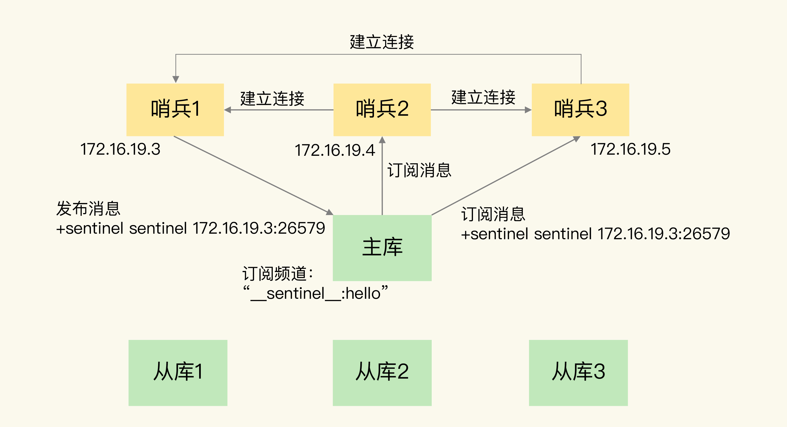

# 5.Redis-哨兵

主库挂了，就要运行一个新主库，例如把一个从库换成主库，那么就需要确定三个问题：

1. 主库是否真的挂了
2. 该选择哪个从库作为主库
3. 怎么把新主库相关信息通知从库和客户端

引入哨兵机制，在Redis主从集群中，哨兵会判断主从复制模式下故障转移的这三个问题。

## 5.1 哨兵的基本流程

### 5.1.1 监控

哨兵进程在运行时，会周期性地给所有主从库发送ping命令，检测是否仍然在线运行。如果从库没有在规定时间响应哨兵的ping命令，哨兵会标记它下线。同时主库如果没有在规定时间响应哨兵的PING命令，哨兵也会判断主库下线，然后开始自动切换主库的流程。

#### 5.1.1.1 主观下线

哨兵进程会使用PING命令检测它自己和主从库的网络连接情况，用来判断实例的状态。如果这时候从库或主库对PING的命令响应超时，那么哨兵就先把它标记为“主观下线”

如果是从库，就是简单标记“主观下线”，因为从库下线一般影响不大，集群对外服务不会间断。

如果是主库，哨兵不能简单地把它标记为“主观下线”，开启主从切换。因为很有可能存在哨兵误判，其实主库并没有故障。可是一旦启动了主从切换，后续的选主和通知操作都会带来额外的计算和通信开销。

#### 5.1.1.2 主观下线误判

误判一般会发生在集群压力较大、网络拥塞，或者主库本身压力比较大的情况。

因此通常采用多实例组成的集群模式进行部署，这也被称为哨兵集群，引入多个哨兵实例一起来判断，就可以避免单个哨兵因为自身网络状态不好，而导致主库下线的情况，多个哨兵的网络同时不稳定的概率较小，由它们一起决策，误判率也能降低。

#### 5.1.1.3 客观下线

大多数哨兵实例，都判断主库“主管下线”了，主库才会被标记“客观下线”，这也是表明主库下线成为一个事实了。这个大多数（一般是大于一半实例，也可以指定）

### 5.1.2 选主

主库挂了，哨兵就会从很多个从库里，按照一定规则选择一个从库实例，把它作为新的主库。

#### 5.1.2.1 筛选+打分


选主时，出了要检查从库的当前在线状态，还要判断它之前的网络连接状态，如果从库总是和主库断连，而且断连次数超过一定的阈值，那么表示这个从库的网络状态并不是太好，就可以直接筛掉。

使用配置项**down-after-milliseconds** * 10，**down-after-milliseconds** 是认定主库断连的最大连接超时时间，如果在**down-after-milliseconds** 内，主从节点都没有通过网络联系上，就可以认为主从节点断连了，如果超过10次，就说明这个从库网络不好，不适合作为主库。

###### 5.1.2.1.1 打分

1. 优先级最高的从库得分高：
   - 通过**slave-priority**配置项，给不同的从库设置不同优先级，如果有两个从库，它们的内存不同，那么可以手动给内存大的实例设置一个高优先级，那么选主的时候哨兵会给优先级高的从库打高分，如果有一个从库优先级高，那么他就是新主库了，只有优先级都相同的情况下进行第二轮打分
2. 和旧主库同步程度最接近的从库得分高：
   - 主从库在命令传播的时候，会用master_repl_offset记录当前最新写操作在re p l_backlog_buffer中的位置，而从库通过slave_repl_offset这个值记录当前的复制进度。
   - 选择slave_repl_offset最接近master_repl_offset的从库作为新的主库
3. ID号小的从库得分高
   - 在优先级和复制进度都相同的情况下，ID号最小的从库得分最高，被选择为新主库。

### 5.1.3 通知

哨兵会把新主库的连接信息发送给其他主库，让他们执行replicaof命令，和新主库简历连接，并进行数据复制，同时哨兵会把新主库的连接信息通知给客户端，让它们把请求操作发送新主库上。

## 5.2 哨兵集群

```shell
sentinel monitor <master-name> <ip> <redis-port> <quorum> 
```

在配置哨兵的时候，只需要设置主库的IP和端口，不需要配置其他哨兵

### 5.2.1 基于pub/sub机制的哨兵集群组成

哨兵只要和主库建立起了连接，就可以在主库上发布消息了。比方说发布自己的连接信息。同时，他也可以从主库上订阅消息，获取其他哨兵发布的连接信息。当多个哨兵实例都在主库上做了发布和订阅操作后，他们就可以有一份完整的路由。

> 除了哨兵，我们自己写的应用程序也可以通过Redis进行消息的发布和订阅，为了区分不同应用的消息，Redis会以频道的形式，对这些消息进行分门别类的管理。其实频道就是消息的类别，只有订阅同一个频道的应用，才能通过发布的消息进行消息交换。

从主库集群中，主库有一个名为“\_\_sentinel\_\_:hello”的频道，不同哨兵就是用过它来相互发现，实现相互通信的。



### 5.2.2 哨兵获取从库IP和端口

哨兵向主库发送INFO命令，主库收到命令后会把从库列表返回给哨兵，接着哨兵就可以根据从库列表中的连接信息，与每个从库建立连接，并在这个连接上持续地对从库进行监控。


### 5.2.3 基于pub/sub机制的客户端事件通知

本质上说，哨兵就是一个运行在特定模式下的Redis实例，只不过他并不服务请求操作，只是完成监控、选主、通知的任务。所以每个哨兵其实也是提供pub/sub机制的，客户端可以从哨兵订阅消息。哨兵提供的消息订阅频道比较多，不同频道包含了主从库切换过程中的不同关键事件。


订阅步骤：

1. 客户端读取哨兵的配置文件，获取哨兵的地址和端口，和哨兵建立网络连接。
2. 执行命令，订阅相关事件 SUBSCRIBE +odown/订阅所有事件 PSUBSCRIBE *

当哨兵将新主库选择出来后，客户端就可以看到相关事件，推送的新主库的IP地址和端口信息就会有了

```shell
switch-master <master name> <oldip> <oldport> <newip> <newport>
```

### 5.2.4 选择哨兵执行主从切换

任何一个实例只要自身判断主库“主观下线”后，就会给其他实例发送is-master-down-by-addr命令，其他实例会根据自己和主库的连接情况做出Y/N的响应。

哨兵获得了仲裁所需的赞成票数后，就会标记主库为“客观下线”。可这所需的赞成票数是通过哨兵配置文件的**quorum**配置设定的。

哨兵给其他哨兵发送命令，表明希望由自己来执行主从切换，并且让其他哨兵投票，最终执行主从切换的哨兵成为Leader，这个过程就是“Leader选举”。

- 拿到半数以上的赞成票
- 拿到的票数大于哨兵配置文件的**quorum**值

达成以上条件就可以成为Leader

