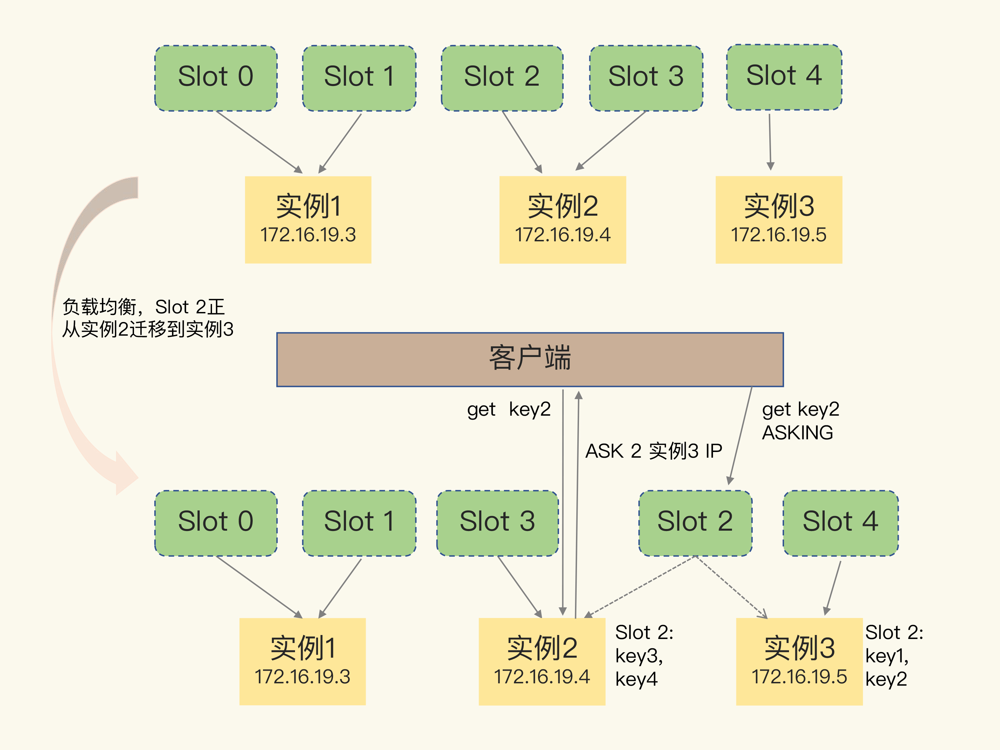

# 6.Redis-切片集群

切片集群（分片集群）指启动多个Redis实例组成一个集群，然后按照一定的规则，把收到的数据分成多份，每份用一个实例来保存。


这样的话，在切片实例中，数据量就小了很多，fork子进程一般不会给主线程带来较长时间的阻塞。

为了保存大量数据，使用大内存云主机和切片集群两种方法。实际上，这两种方法分别对应Redis应对数据量增多的两种方案

- 纵向扩展：升级单个Redis实例的资源配置，包括增加内存容量，增加磁盘容量，使用更高配置的CPU
  - 实施起来简单，直接
  - 使用RDB持久化时，数据量增加，需要的内存也会增加，主线程fork子进程的时候可能会阻塞，如果不要求持久化保存Redis数据，那么，纵向扩展是个不错的选择
  - 会受到硬件和成本的限制，
- 横向扩展：横向增加当前Redis实例的个数。将一个8G的改成两个4G的
  - 面向百万，千万的用户规模时，横向扩展的Redis切片集群是个比较好的选择。

## 6.1 数据切片和实例的对应分布关系

从3.0开始，官方提供了一个Redis Cluster的方案，用于实现切片集群。

Redis Cluster方案使用哈希槽（Hash Slot）来处理数据和实例之间的映射关系，在这个方案中，一个切片集群共有16384个哈希槽，类似于数据分区，每个键值对都会根据它的key被映射到一个哈希槽中。

> 根据键值对的key按照CRC16算法计算一个16bit的值，然后对16384取模，结果就表示一个哈希槽

在部署Redis Cluster方案时，可以使用cluster create命令创建集群，此时Redis会自动把这些槽平均分布在集群实例上，例如，如果集群中有N个实例，那么每个集群的槽数就是16384/N个。

也可以使用cluster meet命令手动建立实例间的连接，形成集群，再使用cluster ad dslots命令，指定每个实例上的哈希槽个数。

> 在手动分配哈希槽时，需要把16384个槽都分配完，否则Redis集群无法正常工作。

```shell
redis-cli -h 172.16.19.3 –p 6379 cluster addslots 0,1
redis-cli -h 172.16.19.4 –p 6379 cluster addslots 2,3
redis-cli -h 172.16.19.5 –p 6379 cluster addslots 4
```

## 6.2 客户端定位数据

客户端和集群建立连接后，实例就会把哈希槽的分配信息发给客户端，但是在集群刚刚创建的时候，每个实例只知道自己被分配了哪些哈希槽，是不知道其他实例的哈希槽信息的。

Redis实例会把自己的哈希槽信息发给和它相连接的其他实例，来完成哈希槽分配信息的扩散。当实例之间相互连接后，每个实例就有所有哈希槽的映射关系了。

客户端收到哈希槽信息后，会把哈希槽信息缓存在本地，客户端发起请求后会先计算哈希槽给对应实例发送请求。

## 6.3 哈希槽变更

- 在集群中，实例有增加或删除，Redis需要重新分配哈希槽
- 为了负载均衡，Redis需要把哈希槽在所有实例上重新分布一遍。

实例之间可以通过相互传递消息，获得最新的哈希槽分配信息。

Redis Cluster提供了一种重定向机制，当客户端把一个键值对的操作请求发给一个实例的时候，这个实例没有对应的哈希槽，那么实例会给客户端返回MOVED命令响应结果。结果中包含新实例的访问地址。

```shell
GET hello:key
(error) MOVED 13320 172.16.19.5:6379
```


虽然重定向机制能解决一部分的问题，但是如果Slot中数据较多，那么就有可能导致数据还没迁移完成。在这种情况下客户端会收到一个ASK报错信息

```shell
GET hello:key
(error) ASK 13320 172.16.19.5:6379
```

> ASK命令表示：
>
> - slot还在迁移中
> - ASK命令把客户端所请求数据的最新实例地址发送给客户端，客户端需要发送ASKING命令给新的实例，然后才能发送操作命令
> - 和MOVED命令不同，ASK命令不会更新客户端缓存的哈希槽分配信息，因此如果客户端再次请求slot的数据，还是会给原先的实例发送请求，ASK作用只是让客户端能给新实例发送一次请求，MOVED表示本地缓存改变，后续请求都发送至新实例

那么这个时候，需要先给这个实例发送一个ASKING命令，表示这个实例允许执行客户端接下来发送的命令，然后，客户端再向这个实例发送GET命令，以读取数据。



## 6.4 key使用CRC分槽的原因

1. 整个集群存储key的数量是无法预估的，key非常多的时候，如果存储每个key对应的实例映射关系，这个映射表会非常大，无论存储在服务端或客户端都会占用非常大的内存空间。
2. RedisCluster采用无中心化的模式，客户端在某个节点访问一个key，如果key不在这个节点上，这个节点需要纠正客户端路由到正确节点的能力（MOVED），这就需要节点掌握整个集群的路有关系，如果存储的是key和实例的关系，那么节点交换信息的量级会变得非常庞大，消耗更多的网络资源，而且就算交换完成，每个节点也需要额外存储其他节点的路由表，造成内存占用过大的情况。
3. 当集群在扩容，缩容，数据均衡时，节点之间会发生数据迁移，迁移时需要修改每个 key的映射关系，维护成本过高。
4. 在中间加一层哈希槽，可以把数据和节点解偶。客户端只需要关心key映射到了哪个哈希槽，然后通过映射表找到节点，CPU消耗减少，可以让数据分布的更均匀，映射表也变得很小，利于服务端和客户端保存，节点之间交换信息也更加轻量
5. 当集群在扩容，缩容，数据均衡时，节点之间操作例如数据迁移，都以哈希槽为基本单位进行操作，简化了节点扩容，缩容的难度，利于集群的维护和管理。

