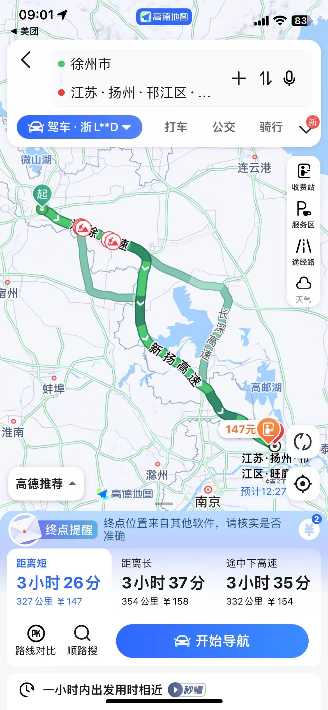

# 出去玩之（泰州，徐州，扬州）

## day 01 泰州

1. 早上7点于舟山娜娜家出发抵达泰州宾馆

| 宾馆名称 | 宾馆价格（人均/元）          | 链接                                                         | 缩略图                                                       |
| -------- | ---------------------------- | ------------------------------------------------------------ | ------------------------------------------------------------ |
| 途客     | 不含早（房价205，人均102.5） | 途客中国轻居酒店(泰州万达万象城店)  http://dpurl.cn/jWKVS2Bz |  |

2. 路程预计

| 路程预计         | 价格预计（百公里7L计算） | 图示                                                         |
| ---------------- | ------------------------ | ------------------------------------------------------------ |
| 445+55（误差值） | 7\*5*8.7/4约等于**77**   |  |

3. 抵达后预计景点

| 景点                                     | 图示                                                         | 路程                  | 票价            |
| ---------------------------------------- | ------------------------------------------------------------ | --------------------- | --------------- |
| 李中水上森林公园                         |  | 85公里*2，1小时的路程 | 85/人（带竹筏） |
| 溱湖国家湿地公（可以一起玩附近有个古镇） |                         | 36公里*2，48分左右    | 70（加船90）/人 |

4. 回酒店干饭睡觉

## day 02 徐州

1. 早上预计8-9点起床出发去徐州

| 宾馆名称                     | 宾馆价格（人均/元） | 链接                                                   | 缩略图                                                       |
| ---------------------------- | ------------------- | ------------------------------------------------------ | ------------------------------------------------------------ |
| 溪月梧桐酒店(徐州吾悦广场店) | 328/164             | 溪月梧桐酒店(徐州吾悦广场店)  http://dpurl.cn/2zXuGXiz |  |

2. 路程

| 路程预计       | 价格预计（百公里7L计算） | 图示                                                         |
| -------------- | ------------------------ | ------------------------------------------------------------ |
| 395+25（误差） | 4.2\*7*8.7/4约等于**64** |  |
| 385+25(误差)   | 4.1\*7*8.7/4约等于**63** |  |

3. 景点（表示可以游览一个景点，景点未定，**个人对古墓很感兴趣**）

4. 晚饭夜宵略

## day 03 徐州-扬州

1. 9点起出发
2. 景点（表示可以游览一个景点，景点未定，这个景点尽量靠下走，离扬州近一点）
3. 中饭略
4. 预计下午2-3点出发到扬州的酒店

| 宾馆名称       | 宾馆价格（人均/元） | 链接                                                         | 缩略图                                                       | 路程           | 路程价格                 | 路程示意图                                                   |
| -------------- | ------------------- | ------------------------------------------------------------ | ------------------------------------------------------------ | -------------- | ------------------------ | ------------------------------------------------------------ |
| 也不知道啥名字 | 638/4=159.5         | 市中心3居室交通便利离瘦西湖景区2公里 来看看美团民宿这个房源 每日价格：¥798 整套房子 可住4人  http://dpurl.cn/giQIe2Lz |  | 327+23（误差） | 3.5\*7*8.7/4约等于**54** |  |

5. 酒店办理入住后，打车去瘦西湖看夜景

6. 看完干夜宵

## day 04 扬州-舟山

1. 早上吃个很有名的早饭，听说扬州也有早饭文化。
2. 可以考虑去个什么景点的（懒得研究，略）
3. 吃个中饭，溜溜弯消消食

4. 预计1-2点出发，回舟山，路程如下

| 路程预计         | 价格预计（百公里7L计算） | 图示                                                         |
| ---------------- | ------------------------ | ------------------------------------------------------------ |
| 485+55（误差值） | 7\*5.4*8.7/4约等于**83** |  |

## 章末 理论上统计来回花销

毛估估每个人1800吧