# 系统架构设计师

## 1 计算机组成与体系结构

### 1.1 计算机系统组成

#### 1.1.1 计算机硬件组成

硬件是设备实体，冯诺伊曼计算机结构上以**运算器**为中心，现在转向**存储器**为核心

- 控制器(主机->CPU)：统一控制指挥并控制计算机各部件协调工作的中心部件
  - 程序计算器PC：存储下一条执行指令的地址
  - 指令寄存器IR：存储即将执行的指令
  - 指令译码器ID：对指令中的操作码字段进行分析解释
  - 时序部件：时序控制信号
- 运算器(主机->CPU)：ALU，在控制器控制下完成算术运算和逻辑运算。
  - 算数逻辑单元ALU：数据的算数运算和逻辑运算。
  - 累加寄存器AC：为ALU提供工作区暂存数据
  - 数据缓冲寄存器DR：写内存时暂存指令或数据
  - 状态条件寄存器PSW：存状态标志与控制标识(争议：也可归于控制器)
- 主存储器(主机)：存储现场操作的信息和中间结果，包括机器指令和数据
- 辅助存储器(外设)：外存/辅存。存储需要长期保存的各种信息
- 输入设备
- 输出设备

#### 1.1.2 计算机系统结构的分类

电子管->晶体管->集成电路（中小规模，大规模，超大规模，甚大规模，极大规模）

世界上最高水平的单片集成电路芯片上容纳的元器件已经达到**80多亿**个。

1）存储程序的概念：冯诺伊曼1946.6提出。

- 计算机（硬件）应由运算器、存储器、控制器、输入和输出设备这五个基本部件组成
- 计算机内部使用二进制来表示指令和数据
- 将程序和原始数据存入存储器中，然后启动计算机工作。这就是存储程序的基本含义

**存储程序控制**概念的提出和实现时冯诺伊曼对计算机界的最大贡献。这种计算机叫做冯诺伊曼计算机。但存在存储器访问的瓶颈。对于突破这种瓶颈的计算机叫做非冯诺伊曼型计算机（数据驱动的数据流计算机，需求驱动的规约计算机，模式匹配驱动的智能计算机）

2）Flynn分类

根据指令流，数据流的多倍性特征分类。

- 指令流：机器执行的指令序列
- 数据流：指令流调用的数据序列。包括输入数据和中间结果。不包括输出数据。

2*2，将计算机系统分成4类

- 单指令流单数据流；SISD，传统顺序执行的单处理器计算机。其指令部件每次只对一条指令进行译码，只对一个操作部件分配数据
- 单指令流多数据流：SIMD，以并行处理机（矩阵处理机）为代表，并行处理机包括多个重复的处理单元，由单一指令部件控制，按照统一指令流的要求为他们分配各自不同所需的不同数据
- 多指令流单数据流：MISD，具有N个处理单位，按N条不同指令的要求对同一数据流及其中间结果进行不同的处理。一个处理单元的输出又作为另一个处理单元的输入。这类系统较少，可参照流水线理解，也有文献称流水线计算机是MIMD
- 多指令流多数据流：MIMD，能实现作业、任务、指令等各级全面并行的多机系统。如多核处理器，多处理机属于MIMD

#### 1.1.3 复杂指令集系统和精简指令集系统

指令优化设计又两个截然相反的方向

- 增强指令的功能，设置一些功能复杂的指令，把一些原来由软件实现的常用的功能改用指令系统来实现（仿佛是造轮子？）。这种计算机系统被称为复杂指令系统计算机（CISC）
  - 指令数量众多，通常有100-250条
  - 使用频率相差悬殊，最长使用简单的指令仅占指令总数的20%出现了80%，大部分复杂指令很少使用（典型的二八原则啊）
  - 支持很多寻址方式，支持的通常为5-20种
  - 变长的指令，指令长度不规定。增加指令译码电路的复杂性
  - 指令可以对主存单元的数据直接进行处理。执行速度较慢
  - 微程序控制为主。CISC指令系统复杂，很难用硬布线逻辑（组合逻辑）电路实现控制器，通常使用微程序控制。
- 尽量简化指令功能，只保留那些功能简单，能在一个节拍内执行完成指令，复杂的功能用一段子程序来实现。这种计算机系统成为精简指令系统计算机（RISC）
  - 指令少，优鲜选取使用频率高的一些简单指令和常用指令。只提供了LOAD（存储器读数）和STORE（数据写入存储器）两条指令对存储器操作，其他都在CPU的寄存器之间进行
  - 寻址方式少。通常只有寄存器寻址，立即数寻址和相对寻址
  - 指令长度固定。译码简单
  - 硬布线逻辑控制为主。为了提供操作的执行速度，通常采用硬布线逻辑来构建控制器
  - 单周期指令执行。采用流水线技术。少数指令可能需要多周期（LOAD/STORE因为要访问存储器，执行的时间会稍微长）
  - 优化的编译器：RISC使编译工作简单化。因为指令长度固定，格式少，寻址方式少，编译时不必在具有相似功能的指令中进行选择，也不必为寻址方式的选择而费心，易于实现优化。
  - CPU种通用寄存器数量多，一般在32以上，甚至可达上千个。大多RISC采用了Cache方案，使用Cache来提供取指令的速度。有的RISC使用两个独立的Cache来改善性能，一个为指令Cache一个时数据Cache，这样取指令和取数据可以同时进行互不干扰。

#### 1.1.4 总线

一组能为多个部件分时（同一时刻只允许一个部件向总线发送消息，允许多个部件同时接受同样信息）共享（总线可以挂接多个部件，各个部件之间相关交换的信息都可以通过这组公共线路传送）的公共信息传送线路。

按总线相对CPU或其他芯片的位置可分为：

- CPU内部，寄存器之间和算数逻辑部件ALU与控制部件之间传输数据的总线为内部总线；
- 外部总线则是CPU与内存RAM，ROM和输入输出设备接口之间通信的通路。**总线速度**是制约计算机整体性能的最大因素。

功能分：

- 地址总线：传送地址信息
- 数据总线：传送数据信息
- 控制总线：传送各种控制信号

### 1.2 存储器系统

#### 1.2.1 主存储器

存放计算机运行期间需要的程序和数据，CPU可随机进行读写。存取速度较高。

根据工艺和技术不同，可分为

- 随机存取存储器：RAM，可写可读，断电后信息无法保存，只能暂存。
  - DRAM：随时间逐渐消失，需要定时对其刷新维持消息不丢失，密度大于SRAM且更加便宜。
  - SRAM：在不断电的情况下信息能够一直保持不会丢失。电路简单，容量小，价格高
- 只读存储器：ROM，**一种RAM的特殊形式**，写入后只能随机读出不能写入。又被称为固定存储器，一般存放系统程序BIOS

内存编址在计算机系统中，存储器每个单元的位数是相同且固定的，称为存储器编址单位

内存一般以字节（8位）为单位，或者以字（会标注大小，16位或者32位）为单位

<u>内存地址H1到H2，则共有H2-H1+1个地址单元，写作H3。如果内存地址按字（16bit）编址，则共有H3*16位，假设内存有X片存储器芯片构成，每片有H4个存储单位，则每个单元存储（H3 * 16）/ （X * H4）位</u>

#### 1.2.2 辅助存储器

- 磁带存储器是一种顺序存取的设备。存取时间较长，存储容量大，便于携带，价格便宜。目前应用场景极少，用于资料的归档保存。
- 硬盘存储器。
  - 磁盘片有m个磁道就有m个柱面。会讲一个文件尽量的存放在同一个柱面种，如果存放不完，再存入相邻的柱面。
  - 通常将一条磁道划分为若干个段，每个段成为一个扇区或者扇段，每个扇区存放一个定长信息块（例如512个字节，由操作系统决定），**扇区从编号1开始，磁头和柱面编号从0开始**
  - 磁盘访问时间（存取时间）=寻道时间+旋转延迟时间

#### 1.2.3 Cache存储器

Cache的功能是提供CPU数据输入输出的速率，突破冯诺伊曼瓶颈（内存速度）。Cache容量小但是速度快，内存速度低但是容量大通过优化调度算法，系统的性能会大大改善。

Cache通常采用相联存储器（CAM）。CAM是一种基于**数据内容**进行访问的存储设备。在写入数据时，CAM能够自动选择一个未用的空单元进行存储；<u>当要读出数据时，不是给出其存储单元的地址，而是直接给出该数据或者该数据的一部分内容</u>，CAM对所有的存储单元中的数据同时进行比较，标记符合条件的所有数据以供读取。由于比较是同时、并行进行的，所以基于数据内容进行读写的机制，速度比基于地址读写方式要快得多。

##### 基本原理

使用Cache改善系统性能的依据是程序的局部性原理。根据程序的局部性原理，最近的、未来要用的指令和数据大多局限于正在用的指令和数据，或者存放在与这些指令和数据位置上临近的单元中。

如果h表示Cache的访问命中率，t1表示cache的周期时间，t2表示内存的周期时间，以读操作为例，使用Cache+主存储器的系统的平均周期为t3，则公式为：t3 = t1*h + t2(1-h)

##### 映射机制

当CPU发出访存请求后，存储器地址先被送到Cache控制器以确定数据是否已在Cache中，若命中则直接对Cache进行访问。这个过程称为Cache的地址映射。在Cache的地址映射中，主存和Cache将均分成容量相同的块（页）。常见有直接映射，全相联映射和组相联映射。

###### 直接映射

以随机存取存储器作为Cache存储器，硬件电路较简单。

设定内存容量为1G，Cache为8MB，页大小为512K。直接映射中，先分区在分页，一区的大小就是Cache的大小，因此一共氛围1G/1M=128， 区号为7位，每个区8M/512K=16，页号为4。

直接映射中，每个内存也只能复制到某一固定的Cache页中。即如果当前时候Cache中0页被占据，而1-15空闲，这时候将1区的0页数据调入Cache是会发生冲突的。因此直接映射的块冲突率很高。

###### 全相联映射

使用相联存储器组成的Cache存储器。在全相联映射中，主存的每一页可以映射到Cache的任一页。

对于直接映射来说，这里使用的页号直接是11位了，没有区号的概念。因此每页的Cache标记也需要11位，以表明它现在所映射的主页号，因此Cache的标记位数增加增加，比较逻辑成本增加。

主存地址不能直接提取Cache页号，需要逐个比对，直到找到标记的页，这种速度很慢，失掉了高速缓存的作用。如果主存页标记与各Cache标记同时比较，成本又太高。全相联映射方式因比较器电路难于设计和实现，只适用于小容量的Cache。

###### 组相联映射

主存中的组与Cache的组形成直接印象关系，组队的页是全相联映射关系，即主存1区0组0页，只能进入Cache的0组中，但是具体是0页还是1页没有强制要求，可以随意放置。即组是一一对应的， 页是需要查询对应的。如果每组只有一页的话，其实等同于直接映射了。如果每组页为16，那就是全相联映射。

为了保障性能，内存和Cache之间的映射一般有硬件完成，因此Cache对程序员是透明的。

##### 替换算法

- 随机
- 先入先出（FIFO）
- 最近最少使用（LRU）

##### 写操作

- 写直达：写Cache时，数据同时写回内存，当一块需要替换时，也不必把这块写回到主存中。可以直接覆盖。实现简单，随时保持主存数据的正确性，但是可能增加不必要的主存写入，降低存取速度
- 写回：CPU修改Cache后数据不like写入内存。当被淘汰的时候才写回到内存中。这种策略的cache块表中，一般由一个标识位，单元被修改时至1，需要替换时如果标识位为1那就需要先写回，如果0，表示这一块不必写入主存，直接覆盖。
- 标记法：对Cache的每个数据设置一个有效位。当数据进入Cache后，有效位置1，当CPU对数据修改时，数据只需写入内存并且置0。当要从Cache读取数据时需要测试其有效位。如果1从Cache获取，否则从内存。

### 1.3 流水线

#### 1.3.1 流水线周期

流水线应用过程中，会将需要处理的工作分为N各阶段，最耗时那一段消耗的时间为流水线周期。如：使用流水线技术执行100条指令，每条指令取指2ms，分析4ms，执行1ms，则周期为4ms

#### 1.3.2 计算流水线执行时间

将1个任务的执行过程分成N个阶段，每个阶段完成时间为t， 则完成该任务的时间为Nt，传统的角度来说，完成k个任务所需要的时间为kNt；使用流水线技术执行，花费的时间是Nt+(k-1)t。除了第一个任务需要完成的时间，其他都可以通过并行执行。

因此 ： 流水线执行时间=第一条指令的执行时间+（n-1）*流水线周期

以1.3.1的例子来说，可明显认为流水线周期为4ms，那么完成100条指令为 2+4+1+（100-1）*4=403ms

特殊：实际上，考虑处理的复杂性，会将每个执行阶段的时间统一为流水线周期，即一条指令为12ms，最后执行结果为4+4+4+4*（100-1）=408ms。

#### 1.3.3 流水线的吞吐率

任务数/处理完成对应任务数所需要用的时间

#### 1.3.4 流水线的加速比

完成同样一批任务，不使用流水线所用的时间与使用流水线所用的时间之比成为流水线的加速比。顺序执行所用时间为t0，使用流水线为t1，则加速比为t0/t1

## 2 操作系统

### 2.1 操作系统的类型与结构

#### 2.1.1 操作系统的定义

计算机系统中的核心系统软件，负责管理和控制计算机系统中的硬件和软件资源，合理的组织计算机工作流程和有效利用资源。在计算机与用户之间起接口的作用。操作系统为用户提供命令菜单窗口等，为应用程序提供API。

#### 2.1.2 操作系统分类

- 批处理操作系统
- 分时操作系统
- 实时操作系统
- 网络操作系统
- 分布式操作系统
- 嵌入式操作系统
- 微内核操作系统

### 2.2 操作系统基本原理

#### 2.2.1 进程管理

**处理机**是计算器系统的核心资源，处理机的充分利用有利于系统效率的大大提高。处理机管理集中了操作系统中最复杂的部分，它设计的好坏关系到整个系统的成败。

**进程**是处理机管理中最基本的最重要的概念。进程是系统并发执行的体现。

> 为了动态的看待操作系统，则以进程作为独立运行的基本单位，以进程作为分配资源的基本单位，从进程的角度来研究操作系统。处理机管理也被称为进程管理。处理机管理的功能就是组织和协调用户对处理机的争夺使用，把处理机分配给进程，对进程进行管理和控制，最大限度也发挥处理机的作用

##### 2.2.1.1 进程的概念

- 静态：操作系统是一组程序和表格的集合。
- 动态：操作系统是进程的动态和并发执行的

> 顺序程序：早期的程序设计，指程序中若干操作必须按照某种先后次序来执行，并且每次操作钱和操作后的数据，状态都有一定的关系。
>

在多道程序系统中，程序的运行环境发生了很大的变化

1. 资源共享。为了提供资源的利用率，计算机系统中的资源不再由一道程序专用，而是由多道程序共同使用。
2. 程序的并发/并行执行。实际上是大多程序段只要求操作在时间上是有序的，也就是A操作必须在B操作之前，这是有序的，但是其中有些操作可以同时进行。
   1. 逻辑上
      1. 允许多道不同用户的程序并行运行
      2. 允许一个用户程序内部完成不同操作的程序段之间并行运行
      3. 允许操作系统内部不同程序之间并行运行
   2. 物理上
      1. 内存储器中保存多个程序，IO设备被多个程序交替的共享使用
      2. 在多处理机系统的情形下，表现为多个程序在各自的处理机上运行，执行时间是重叠的。单处理机系统时，程序的执行表现为多道程序交替地在处理机上互相空插运行。

##### 2.2.1.2 进程的状态转换

由于进程运行的间断性， 决定了进程至少具体以下三种状态，进程的状态可以动态的相互转换，但是阻塞的进程不能直接进入执行状态（阻塞-就绪-执行），就绪不能直接进入阻塞（就绪-执行-阻塞）。**任何时刻任何进程都处于其中一种状态**

- 就绪：当**进程已分配了除CPU以外的所有必要的资源**后，只要能再获得处理机，便能立即执行。一个系统中，可以有多个进程同时就绪，通常称为一个队列，称为就绪队列
- 执行：**进程已获得处理机，程序正在执行**。单处理机系统中，只有一个进程处于执行状态。
- 阻塞：进程因为发生某事件（请求IO，申请缓冲空间）而暂停执行时的状态。进程执行收到阻塞。（或称：等待，睡眠）。通常将处于阻塞状态的进程排成一个队列称为阻塞队列。

转换：

- 运行-阻塞：进程运行中启动了外围设备，就变成了<u>等待外围设备传输信息的状态</u>；在运行中申请资源（主存储空间及外围设备因得不到满足）时，变成<u>等待资源状态</u>；进程在运行中出现了故障（程序出错或者主存储器读写错误等），变成<u>等待干预状态</u>

- 阻塞-就绪：外围设备工作结束后等待外围设备传输信息的进程结束等待；等待的资源能够得到满足时（另一个进程归还了资源），则等待资源者就结束等待；故障排除后让等待干预的进程结束等待。任何一个阻塞的进程必须先变成就绪，然后才能运行
- 运行-就绪：进程使用完时间片后强迫该进程暂时出让处理器；当有更优先权的进程要运行时也迫使正在运行的进程出让处理器。此时会变成就绪
- 就绪-运行：等待分配处理器的进程，系统按一种选定的策略从处于就绪状态的进程中选择一个进程，让他占用处理器，那个进程就变成了运行态。

##### 2.2.1.3 挂起

在另一些系统中，对于三态之外又加入了一个新的挂起状态，

原因为

- 对换的需要。缓和内存紧张的状态，<u>将内存中处于阻塞状态的进程换至外存上，使进程又处于一种有别于阻塞状态的新状态。因为即使进程所期待的事件发生（参考三态中的阻塞变就绪），但是进程仍不具备执行条件而不能进入就绪队列，这种被称为挂起。</u>
- 终端用户的请求：终端用户在自己程序运行期间，发现可疑时，往往希望自己的进程暂停，即，使正在执行进程暂停执行，若是就绪进程，则不接受调度以便研究其执行情况或对程序进行修改。这种静止状态也被称为挂起。（参考java的debug断点）
- 父进程请求：父进程希望挂起自己的子进程，以便考查和修改子进程，或者协调各子进程间的活动（参考java多线程中的出让资源？或者集合点？）
- 负荷调节的需要：当实时系统中的工作负荷较重，有可能影响对实时任务的控制时，可由系统把一些不重要的进程挂起，以保证系统正常运行（模式上比较像linux在内存满载或者CPU满载的时候会杀死一些用户进程来确保机器正常）
- 操作系统的需要：操作系统希望挂起某些进程，以便检查运行中的资源使用情况及进行记账。

属性（**静止就绪==挂起就绪， 静止阻塞==挂起阻塞**）

- 被挂起的进程，原来可能就是就绪状态，这种状态就叫**挂起就绪**。若被挂起的进程原来处于阻塞，那么这时候的状态就叫**挂起阻塞**。这种状态都不可能被调度执行
- **处于挂起阻塞状态的进程，其阻塞条件和挂起条件无关**。当进程所期待的事件出现后，进程虽不再被阻塞，但是仍然不能运行，这时，进程从静止阻塞状态转换为**挂起就绪**状态。
- 进程可以由自身挂起，也可以是用户或操作系统将其挂起。其目的都在于阻止进程继续执行，被挂起的**只能用显式方式**来激活，以便从挂起的状态解脱

##### 2.2.1.4 进程互斥/同步

进程互斥/同步进程互斥：一组并发进程中一个或多个程序段，因共享某一共有资源而导致必须以一个不允许交叉执行的单位执行。**互斥是要保证临界资源在某一时刻只被一个进程访问**（竞争关系）

进程同步：把异步环境下的一组并发进程因**直接制约**而**互相发送消息而进行互相合作、互相等待**，使得各进程按一定的制约顺序和速度执行（协作关系）

> 系统中有些资源可供多个进程同时使用，有些只允许一个进程使用，将一次仅允许一个进程使用的资源称为**临界资源**（打印机），某些软件的变量、数据、表格也不允许两个进程同时使用（office）
>
> 把一个进程访问临界资源的那段程序代码称为**临界区**。禁止两个或两个以上的进程同时进入访问统一临界资源的临界区（类似synchronous代码块？）。

为禁止两个或两个以上的进程同时进入临界区，必须有专门的同步机构来协调，准则如下：

- 空闲让进。
- 忙则等待。
- 有限等待。有若干进程要求进入临界区时，应该在有限时间内使一进程进入临界区，即他们不应相互等待而谁也不进入临界区（用队列实现的功能？）
- 让权等待。**对于等待进入临界区的进程必须释放其占有的CPU**。信号量可以有效地实现进程的同步和互斥。在操作系统中，信号量是个整数，**当大于0时，表示可供并发进程使用的资源实体数。当小于0时表示正在使用临界区的进程数**。建立一个信号量必须说明所建信号量代表的意义和设置初值，以及建立相应的数据结构，以便指向那些正在等待使用临界区的进程。

> 对信号量只能施加特殊操作：P操作和V操作，都是原子操作，也称原语。P原语和V原语执行期间不允许中断发生。执行步骤如下
>
> 1. P操作：代码申请执行临界区时操作，先做信号量-1，如果信号量此时小于0了，进入等待（其他进程的V操作来唤醒），如果此时信号量大于0，直接进入临界区工作
>
> 2. 临界区代码：执行
>
> 3. V操作：代码执行完临界区操作，先做信号量+1， 如果信号量此时大于等于0，表示当前已经没有等待的进程了，继续执行，如果信号量小于0，表示等待队列里存在等待的进程，需要从等待队列里唤醒一等待进程，然后返回原进程继续执行或转进程调度
>
> 用PV操作实现进程同步，需要引进私用信号量，私用信号量只与制约进程和被制约进程有关，而不是整组并发进程相关。与此相对，进程互斥采用的信号量是公用信号量。首先为各并发进程设置私用信号量，然后给私用信号量赋初值，最后利用PV原语和私用信号量规定各进程的执行顺序。（同步下，P操作和V操作不一定操作单一的变量，可能与为多个，或者说甲进程执行的B变量的P操作，可能是乙进程去执行这个B变量的V操作）

##### 2.2.1.5 前趋图

一个由结点和有向边构成的有向无循环图。该图通常用于表现事务之间先后顺序的制约关系。结点可以表示一个语句，一个程序段或者一个进程，有向边表示两个结点之间存在的前趋关系。（Pert图，单（双）代号网络图都融入了前趋图的思想）

上图可解释为，在i=（1，2，3）的情况下，取指操作为Ai， 分析操作为Bi，执行操作为Ci，对于A1来说没有前趋结点，因此被称为**开始结点**，不受制约可以执行执行，B2必须在A2和B1完成后才能开始执行，C3没有后继结点，称为**终止结点**

执行先后顺序的制约关系可以分为：

- 直接制约：**一个操作**中，**多个步骤**之间的制约关系，如A1，B1，C1就是直接制约
- 间接制约：**多个操作**中**相同步骤**的制约关系。如A1，A2，A3

##### 2.2.1.6 进程调度和死锁

进程调度即处理器调度（上下文转换）。主要功能是确定在什么时候分配处理器，并确定分给哪一个进程，即让正在执行的进程改变状态转入就绪队列的队尾，再由调度原语将就绪队列的队首进程取出投入执行。

###### 通常引起调度的原因为：

- 正在执行的进程执行完毕
- 执行进程自己调用阻塞原语将自己阻塞起来进入睡眠（类似Thread.sleep()？）
- 执行进程调用了P原语操作，从而资源不足而阻塞，或调用V原语激活了等待资源的进程队列。
- 在分时系统中，当一进程用完一个时间片
- 就绪队列中某进程的优先级变得高于当前执行进程的优先级，也将引起进程调度。

###### 进程调度的方式：

- 剥夺方式：当就绪队列中有进程的优先级高于当前执行进程的优先级时，立即发生进程调度转让处理机
- 非剥夺方式：一旦某个作业或进程占用了处理器，别的进程就不能把处理器从这个进程夺走，知道该进程因调用原语操作进入阻塞，或者时间片用完让出处理机

###### 进程调度的算法

（服务与系统目标的策略，对于不同的系统与系统目标，常采用不同的调度算法）：

- 先来先服务（FCFS）调度算法，又称先进先出（FIFO）。就绪队列按照先来后到原则排队
- 优先级调度，优先数反映了进程优先级，就绪队列按优先数排队，确定优先级的方法：
  - 静态优先级：优先级在进程开始执行前确定，执行过程中不变
  - 动态优先级：执行过程中可变
- 轮转法：就绪队列安好FCFS（FIFO）排队，每个进程执行一次占有处理器时间都不超过规定的时间单位（时间片），超过就释放自己所占有的CPU进入就绪队列末尾，等待下次调度。进程调度程序又去调度就绪队列中的第一个进程。

###### 死锁

死锁是系统的一种出错状态，不仅会浪费大量的系统资源，甚至会导致整个系统的崩溃，所以死锁应该是尽量预防和避免的

1. 死锁条件：产生死锁的主要原因是供共享的系统资源不足，资源分配策略和进程推进顺序不当。系统资源可能是可重复使用的永久性资源，也可能是消耗性的临时资源。产生死锁的必要条件是：互斥条件，保持和等待条件，不剥夺条件和环路等待条件
2. 解决死锁的策略：处于死锁状态的进程不能继续执行但又占用了系统资源，从而阻碍了其他作业的执行
   1. 死锁发生前采用预防和避免策略
   2. 死锁发生后采用检测和恢复策略。

采用的死锁预防策略通常用**资源的静态分配法或有序分配法，分别打破了资源动态分配条件和循环等待条件**，因此不会发生死锁，但是这样会大大降低系统资源的利用率和进程之间的并行程度。

死锁避免策略，**在系统进行资源分配时，先执行一个死锁避免算法**，以保证死锁不会发生，但是资源分配很频繁，因此这个也会耗费大量的CPU和时间

实际上死锁出现几率很少，因此从花的代价上看，采用检测和恢复比预防和避免代价更小一些。

#### 2.2.2 存储管理

存储器是计算机系统最重要的资源之一。任何程序和数据以及各种控制用的数据结构都必须占有一定的存储空间，因此存储管理直接影响系统性能。

外存（辅存）：软盘、硬盘、光盘等一些外部存储部件，处理器不能直接访问外存，需要通过启动I/O设备才能进行内存、外存交换，其访问速度满，但是价格便宜

内存：系统实际提供的存储单元（常指字节）组成的一个连续地址空间，处理器可以直接存取。大小由系统硬件决定，存储容量受到实际**存储单元**的限制。**虚拟存储器**（虚存）不考虑实际内存的大小和数据存储的实际地址，只考虑相关有关的数据之间的相对位置，其容量由**计算机地址的位数**决定。

系统中内存的使用一般分为，系统空间（存放操作系统本身及相关的系统程序）；用户空间（存放用户的程序和数据）

存储管理主要是对**内存储器**的管理，负责对内存的分配和回收，内存的保护和内存的扩充。存储管理的目的是提供内存的使用效率。

##### 2.2.2.1 页式存储管理

把程序的逻辑空间和内存的物理空间按照同样的大小分成若干页面，**以页面为单位进行分配**。在页式存储管理中，系统的虚地址是个有序对（页号、位移）。系统为每一个进程建立一个页表，其内容包括进程的逻辑页号和物理页号的对应关系，状态等。

动态地址转换步骤

1. 进程运行时，其页表的**首地址**已在系统的动态地址转换机构中的基本地址寄存器中
2. 执行指令访问虚存地址（p,d），根据页号p查页表，通过状态获取这个页是否调入内存，如果已经调入获得该页的内存地址p1，与页内相关位移d组合得到物理地址r，如果没有调入，则产生缺页中断，以装入所需要的页

在装入作业时，就应在该作业的页表中指出哪些页已在内存储器中，那些没有装入内存。为了能方便地从磁盘上找到作业信息的副本，故在页表中还可指出每一页副本在磁盘上的位置。

当要装入一个当前需要的页面时，如果内存储器中无空闲块，则可选择一个已在内存储器中的页面将其调出内存。若在执行中该页面被修改过，则把该页信息重新写回到磁盘上，否则不必重新写回，当一页被暂时调出内存后，让出来的内存空间用来存放当前使用的页面。以后再使用被调出的页面时，可用同样的方法调出再装入。**页面被调出或装入之后都要对页表中的相应表目做修改**。====>**页面调度**

页面调度选择调出页面非常重要，如果采用了一个不合适的算法，就会出现，刚被调出的页面又立即要用，然后将它装入，装后不久又被选中调出，然后又被装入，如此反复调度变得非常频繁。这种现象叫做**抖动**。因此应该选择一个比较好的调度算法

- 最优算法（OPT）：选择不再使用或最远的将来才被使用的页，理想的算法很难实现，常用语淘汰算法的比较
- 随机算法（RAND）：随机地选择被淘汰的页，开销小，可能选中立即要访问的页
- 先入先出算法：选择在内存驻留时间最长的页，但可能淘汰频繁使用的页。在未给予进程分配足够的页面数时，有时会出现给予进程的页面数增多，却也此处反而增加的异常现象（在MySQL中存在优化的算法，部分先入先出）
- 最近最少使用算法（LRU）：选择离最近的一段时间内使用的最少的页。这个出发点为：某页被访问了，那可能立刻会被再次访问，相反如果长时间未被访问，那么最近也不会被访问。（Caffiene优化了这个算法）

##### 2.2.2.2 段式存储管理

与页式存储相似。分段的基本思想是把用户作业按逻辑意义上有完整意义的段来划分，并以段为单位作为内外存交换的空间尺度。

分段系统中，容许程序（作业）占据内存中许多分离的分区。每个分区存储一个程序分段。这样每个作业需要几对界限地址寄存器，判断访问地址是否越界也就更困难了。在分段存储系统中常常利用存储保护键实现存储保护。分段系统中虚地址是一个有序对（段号，位移）。系统为每个作业建立一个段表（？？？页表），其内容包括段号、段长、内存起始地址和状态等。状态指出这个段是否调入内存。

分段的动态地址转换与分页类似，如果段没调入内存会产生缺段中断。

##### 2.2.2.3 段页式存储管理

根据程序模块分段，段内在分页，内存被分划成定长的页。段页式系统中虚地址的形式是（段号，页号，页内偏移）。段页式管理采用段式分配，页式使用的方法，便于动态连接和存储的动态分配。这样存储管理能提供内存空间的利用率。

段页式存储管理为每个装入内存的作业建立一张段表，为每一段建立页表。段表指出该段的页表存放位置及长度，页表指出该段在各页在磁盘的位置以及页是否在内存中，若在内存中则填上占用的内存块号。作业时为先找段在找页，根据标识位判定不在内存中就进行页面调度

#### 2.2.3 设备管理

##### 2.2.3.1 数据传输控制方式

设备管理的主要任务之一是控制设备和内存或CPU之间的数据传送。

选择和衡量控制方式的原则如下：

1. 数据传送速度足够高，能满足用户的需要但又不丢失数据
2. 系统开销小，所需的处理控制程序少
3. 能充分发挥硬件资源的能力，使得I/O设备尽量处于使用状态中，而CPU等待时间少。

外围设备和内存之间常用的数据传送控制方式

- 程序控制方式。处理器启动数据传输，然后等设备完成
- 中断方式。程序控制方式不能实现并发。中断方式的数据传输过程是这样的，进程启动数据传输（如读操作）后，该进程**放弃处理器**。当数据传输完成，设备控制器产生中断请求，中断处理程序对数据传输工作处理后，让相应进程成为就绪状态。以后，该进程就可以得到所需要的数据
- 直接存储访问方式（DMA）：外部设备和内存之间开辟**直接的数据交换通路**。除了控制状态寄存器和数据缓冲寄存器外，DMA控制器中还包括传输字节计数器，内存地址寄存器等。DMA方式采用**窃取处理器工作周期和控制总线**而实现辅助存储器和内存之间的数据交换。有的DMA也采用**总线浮起**方式传输大量数据。
- 通道模式：通道（输入/输出处理器，IOP），可以独立完成系统交付的输入/输出任务，通过执行自身的输入/输出专用程序进行内存和外设之间的数据传输
  - 字节多路通道
  - 选择通道
  - 成组多路通道

##### 2.2.3.2 虚设备与SPOOLING技术

采用假脱机（SPOOLING）技术，可以将低速的独占设备改造成一个可共享的设备，而且一台物理设备可以对应多台虚拟的同类设备。假脱机的意思是外部设备同时联机操作，又称为假脱机输入/输出操作，采用一组程序或进程模拟一台输入/输出处理器。**该技术利用了专门的外围控制机将低速I/O设备上的数据传送到高速设备上；再利用另一道程序来模拟脱机输出时外围控制机的功能，把高速磁盘上的数据传送到低速的I/O设备上。**

SPOOLING系统必须有高速、大容量并且可随机存取的外存支持

> 现代计算机系统中，还可以用一台设备模拟自身，例如常见的多窗口技术，在一个终端上开多个窗口，每个窗口独立进行显示，以监视用户不同人物的执行情况。这时通过缩小显示区域平铺或重叠显示来模拟多个显示器的 

#### 2.2.4 文件管理

操作系统对计算机的管理主要为两个方面

- 硬件资源：CPU管理，存储器管理，设备管理
- 软件资源：各种系统程序，各种应用程序，各种用户程序，也包括大量的文档材料，库函数等。**每一种软件资源本身都是具有一定逻辑意义上的相关信息的集合，在操作系统中它们以文件形式存储**

文件管理的功能包括：

- 建立、修改、删除文件；

- 按文件名访问文件；决定文件信息的存放位置、存放形式、存取权限；

- 管理文件间的联系及提供对文件的共享、保护和保密等。允许多个用户协同工作又不引起混乱。文件的保护、保密实际上是用户对文件的存储权限控制问题。<u>一般存取设置两级控制：1是访问者的识别，规定哪些人可以访问；2是存取权限的识别，即有权参与访问者可对文件执行何种操作。</u>

  - 文件的共享指一个文件可以让多个用户共同使用，可以减少用户的重复劳动，节省文件的存储空间，减少输入/输出文件的次数。

  - 文件的保护主要防止由于错误操作而对文件造成的破坏

  - 文件的保密是为了防止未经授权的用户对文件进行访问。

##### 2.2.4.1 文件的逻辑结构

从用户角度所看到的文件组织形式，称为文件的逻辑结构。

逻辑结构分为

- 无结构的字符流文件
- 有结构的记录文件：由记录组成，即文件内的信息划分成多个记录，以记录单位组织和使用信息。

记录文件类型

- 顺序文件：大多数文件是顺序文件。顺序文件记录定长，记录中的数据项的类型长度与次序固定，一般还有一个可以唯一标识记录的数据项（键，Key），记录是按照键值的约定次序组织的。通常用于批处理应用，对于查询或更新某个记录的处理性能不好。
- 索引顺序文件：基于键的约定次序组织的，而且维护键的索引和溢出区域。键的索引也可以是多级索引。既适用于交互方式应用，也适用于批处理方式应用。
- 索引文件：基于记录的一个键数据项组织的。对主文件中的记录按需要的数据项（一个或几个）建索引，索引文件本身是顺序文件组织。
- 直接文件：又称hash文件，记录以它们直接访问存储设备上的物理地址直接（随机地）访问。常用语需要高速访问文件而且每次仅访问一条记录的应用中。

##### 2.2.4.2 文件的物理结构

指文件在存储设备上的存放方法。侧重于提高存储器的利用效率和降低存取时间。

文件的存储设备通常划分为大小相同的**物理块**，**物理块**是分配和传输信息的基本单位。

文件的物理结构涉及**文件存储设备的组块策略**和**文件分配策略**，决定文件信息在存储设备上的存储位置。

常用的文件分配策略：

- 顺序分配（连续分配）：文件建立时**预先分配**一组连续的物理块，然后按照逻辑文件中的信息（或记录）顺序，**依次**把信息（或）记录按顺序存储到物理块中。只需知道文件在文件存储设备上的**起始位置和文件长度**，就能进行存取。在连续存取相邻信息时，存取速度快。但是在文件建立时必须指定文件的信息长度，以后不能动态增长，**一般不适合用于经常修改的文件**。

- 链接分配（串联分配）：按单个物理块逐个进行。每个物理块中设有一个指针，指向其后续连接的下一个物理块的地址。这样形成一个**链接队列**。创建文件时可以不指定文件的长度。**说明信息中只需要指出该文件的第一个物理块号**。链接文件的文件长度可以**动态的增长**，只调整物理块指针就可以插入或删除一个信息块。优点可以解决存储器碎片问题，提高存储空间利用率。但是由于链接文件只能按照队列中的链接指针顺序查找，因此搜索效率低，**只适用于顺序访问**，**不适用于随机存取**。

- 索引分配：另一种对文件存储不连续分配的方法。采用索引分配方法的系统，为每个文件建立一张**索引表**，表中每一表项指出文件信息所在的逻辑块号和与之对应的物理块号。既可以满足文件动态增长的要求，又可以方便而迅速的实现随机存取。对一些大的文件。当索引表的大小超过一个物理块的时候，会发生索引表的分配问题。一般采用**多级（间接索引）技术**。索引表增加了存储空间的开销，存取文件时需要访问两次磁盘，一次索引表，一次访问的文件信息。可通过将操作文件前将索引表调入内存进行优化。

  

##### 2.2.4.3 文件存储设备管理

操作系统要有效的进行存储空间的管理。由于文件存储设备是分成许多大小相同的物理块，并以块为单位交换信息，因此，文件存储设备管理实际上是对空闲块的组织和管理问题。包括空闲块的组织，空闲块的分配与空闲块的回收等问题。

空闲块管理方法：

- 索引法：**把空闲块作为文件并采用索引技术**。索引对应于一个或由多个空闲块组成的空闲区。这样磁盘上每个空闲块区都有对应索引表中的一个条目。可以有效的支持每一种文件分配方法
- 链接法：**使用链表把空闲块组织在一起**。当申请时，分配程序从链首开始摘取所需的空闲块。反之，管理程序将回收的空闲块逐个挂入队尾。适用于每一种文件分配方法。空闲块的链接方法可以按释放的先后顺序链接（<u>请求和回收空闲块的系统开销少，不利于连续空闲块的请求</u>），也可以按空闲块的大小顺序链接（<u>请求和回收空闲块的系统开销大，利于连续空闲块的请求</u>）。
- 位示图法：在外存上建立一张位示图（Bitmap），记录文件存储器的使用情况。每一位仅对应文件存储器上的一个物理块。假如系统中字长为32位（一个字能管理多少块），有4096个物理块，那么位示图的第一个字对应文件存储器上的0-31号物理块，第二个字对应32-63的物理块（二维数组）

##### 2.2.4.4 树形目录结构

在树形目录结构中，数的根结点作为根目录，数据文件作为树叶，其他所有目录都作为树的结点。

根目录在最顶层，它包含的子目录是一级子目录。以此类推，这种结构组织就叫做目录树。

在树形目录结构中，从根目录到任何数据文件之间，只有一条唯一的通路，从树根开始，把全部目录文件名与数据文件名，依次用/（Unix/Linux）或\ (Windows)连接起来。

绝对路径/相对路径

#### 2.2.5 作业管理

从用户角度看，**作业是系统为完成一个用户的计算任务所做的工作总**和。例如对于用户编制的源程序，需要经过对源程序的编译、连接编辑或连接装入及运行产生计算结果。其中的每一个步骤称为作业步。作业步顺序执行即完成了一个作业。

从系统角度看，**作业由程序、数据和作业说明书组成**。系统通过作业说明书控制文件形式的程序和数据，使之执行和操作。批处理系统中，**作业是占据内存的基本单位**。

用户的作业可以通过执行的方式，有用户自己按照作业步顺序操作（**联机方式**）

用户的作业可以通过间接的方式，由用户率先编写的作业步依次执行的说明，一次交给操作系统，由系统按照说明依次处理（**脱机方式**）

##### 2.2.5.1 作业状态及其转换

- 提交：作业由输入设备进入外存储器（输入井）称为提交状态。处于提交状态的作业，其信息正在进入系统
- 后备：作业的全部信息进入外存后，系统就为该作业建立一个作业控制块（JCB）。**系统通过JCB感知作业存在**。JCB主要包括作业名，作业状态，资源要求，作业控制方式，作业类型，作业优先权。
- 执行：一个后备作业被作业调度程序选中并分配必要资源进入内存，**作业调度程序同时为其建立了相应的进程**，该作业就由后备变为执行
- 完成：作业正常运行结束，它所占用的资源**尚未**全部被系统回收的状态为完成状态

##### 2.2.5.2 用户接口

又称用户界面，含义

- 用户与操作系统交互的途径和通道，即操作系统的接口
  - 命令接口：键盘命令和作业控制命令
  - 程序接口：编程接口或系统调用。程序经编程接口请求系统服务，即通过系统调用程序与操作系统通信。系统调用是操作系统提供给编程人员的唯一接口。系统调用对用户屏蔽了操作系统的具体动作而只提供相关功能。系统调用大概分为设备管理，文件管理，进程控制，进程通信，存储管理等
- 这种交互环境的控制方式，即操作环境，支持命令接口和程序接口，提供友好的、易用的操作平台。命令驱动方式-菜单驱动方式、图符驱动方式和视窗操作环境。

## 3. 数据库系统

### 3.1 数据库管理系统的类型

DBMS按照数据模型划分

- 关系型
- 文档型
- 键值型
- 对象型

### 3.2 数据库模式与范式

#### 3.2.1 数据库的结构与模式

##### 3.2.1.1 数据库系统抽象级

数据库系统分为三个抽象级

- 用户级：对应**外模式**，最接近用户，是用户可以看到和使用的数据库。又称用户视图。用户级数据库主要由外部记录组成，不同的用户视图可以互相重叠，用户所有操作都针对用户视图。（偏向用户使用的界面提供的数据，每一个级别的用户看到的数据表可能不一致）
- 概念级：对应**概念模式**，介于用户级和物理级之间，是所有用户视图的最小并集，是数据库管理员可看到和使用的数据库，又称DBA视图。一个数据库可以有多个不同的用户视图，每个用户视图是由数据库某一个部分抽象表示所组成。一个数据库应用系统只存在一个DBA视图，**它把数据库作为一个整体的抽象表示**。概念级模式把用户视图有机地结合为一个整体，总和平衡考虑所有用户要求，实现**数据的一致性、最大限度降低数据冗余、准确的反映数据间的联系**。
- 物理级：对应**内模式**，是数据库的低层表示，描述实际存储组织，最接近于物理存储的级，又称内部视图。**但是不是真正的物理存储**。

##### 3.2.1.2 数据库系统模式

数据库系统的三级模式：

- 概念模式：用以描述整个数据库中数据库的逻辑结构。描述现实世界中的实体及其性质与联系，定义记录、数据项、数据的完整性约束条件及记录之间的联系，是数据项值的框架。还包含访问控制，保密定义，完整性检查等方面的内容，以及物理和概念之间的映射。**一个数据库可以有多个外模式，一个应用程序只能使用一个外模式**。
- 外模式：描述用户看到或使用的那部分数据的逻辑结构，用户根据外模式用数据操作语句或者应用程序去操作数据库中的数据。外模式主要描述组成用户视图的各个记录的组成、相互关系、数据项的特征、数据的安全性和完整性约束条件。
- 内模式：数据库的最底层表示，不同于物理层。不同于物理层，它假设外存是一个无线的线性地址空间。内模式定义的是存储记录的类型、存储域的表示以及存储记录的物理顺序，指引元、索引和存储路径等数据的存储组织。一个数据库只有一个内模式。**内模式是数据物理结构和存储模式的描述**。

内模式、概念模式和外模式之间的关系如下

1. 概念模式是数据库的中心与关键。
2. 内模式依赖于概念模式，独立于外模式和存储设备
3. 外模式面向具体的应用，独立于内模式和存储设备
4. 应用模式依赖于外模式，独立于概念模式和内模式

##### 3.2.1.3 两级独立性

- 物理独立性：指用户的应用程序与存储在磁盘上的数据库中的数据是相互独立的。当数据的物理存储改变时，应用程序不需要改变。物理独立性存在于概念模式和内模式之间的映射转换。说明物理组织变化时应用程序的独立程度
- 逻辑独立性：指用户的应用程序与数据库中的逻辑结构是相互独立的。当数据的逻辑结构改变时，应用程序不需要改变。存在于外模式和概念模式之间的映射转换。说明概念模式发生变化时应用程序的独立程度。

#### 3.2.2 数据模型

概念数据模型（E-R模型）：用于数据库设计。

基础数据模型：对数据和信息建模，主要用于DBMS的实现。基本数据模型时数据库系统的恶核心和基础。基础数据模型通常由数据结构、数据操作和完整性约束三部分组成。数据结构是对系统静态特性的描述，数据操作是对系统动态特性的描述，完整性约束是一组完整性规则的集合。基础数据模型分为几种

- 层次模型：用树形结构表示实体类型及实体间的联系。记录之间的联系通过指针来实现，查询效率较高。缺点是只能表示1:n关系，可以用辅助手段实现m:n联系，但是比较复杂。由于层次顺序的严格和复杂，导致数据查询和更新操作都很复杂。应用程序编写也比较复杂。
- 网状模型：使用有向图表示实体类型及实体间的联系。优点是记录之间的联系通过指针实现，m:n联系也容易实现，查询效率高。缺点是编写应用程序的过程比较复杂，程序员必须熟悉数据库的逻辑结构。
- 关系模型：用表格结构表达实体集，用外键表示实体间的联系。优点如下
  - 建立在严格的数学概念基础上
  - 概念（关系）单一，结构简单，清晰，用户易懂易用
  - 存取路径对用户透明，从而数据独立性、安全性好、简化数据库开发工作
- 面向对象模型

#### 3.2.3 关系代数

##### 3.2.3.1 并

略（这个怎么说都该会）

##### 3.2.3.2 差

给出关系R和S， R-S的元组包含R中有而S中没有的元组的集合

##### 3.2.3.3 交

略（该会）

##### 3.2.3.4 笛卡尔积

R（u个元组）X S（v个元组）= （u*v个元组）

##### 3.2.3.5 投影

从一个关系中抽取指明的属性，令R为一个包含属性A的关系

p1,2(R)结果

##### 3.2.3.6 选择

σ l=3(R) 

##### 3.2.3.7 连接

数据库的join操作

##### 3.2.3.8 除

看命了，这个不想了解

#### 3.2.4 数据的规范化

关系模型满足的确定约束条件称为范式，范式由低到高分为1NF，2NF，3NF，BCNF，4NF

一个低一级的关系模型分解成高一级的关系模型的过程，称为**关系模型的规范化**。关系模型分解必须遵守两个准则：无损连接性/函数依赖保持性（不破坏属性间存在的依赖关系）

规范化的基本思想是<u>逐步消除不合适的函数依赖，使数据库的各个关系模型达到某种程度的分离</u>。规范化解决的主要是**单个实体的质量问题**，是对于问题域中原始数据展现的正规化处理。规范化理论给出了判断关系模型优劣的理论标准，帮助预测模式可能出现的问题，是数据库逻辑设计的指南和工具（**用数据依赖的概念分析和表示各数据项之间的关系；消除ER图中的冗余联系**）

##### 3.2.4.1 函数依赖

自变量x确定后，相应的函数值f(x)就唯一确定了一样，函数依赖是衡量和调整数据规范化最基础的理论依据。

关系R<U,F>中的一个属性或一组属性K，如果给定一个K则唯一决定U中的一个元组，也就是U函数完全依赖于K，就称为K为R的码。一个关系可能有多个码，选择其中一个作为主码。

**包含在任一码中的属性称为主属性，不包含在任何码中的属性称为非主属性。**

关系R中的属性或属性组X不是R的码，但X是另一个关系模型的码，称X是R的外码。

##### 3.2.4.2 第一范式

最低的规范化要求。如果关系R中所有属性的值域都是简单域，其**元素不可再分**，是属性项不是属性组，那么关系模型R是第一范式的。

满足1NF的关系模型会有很多重复值，并且增加了修改数据引起疏漏的可能性，为了消除这种数据冗余和避免更新数据的遗漏，需要更加规范的2NF

##### 3.2.4.3 第二范式

如果一个关系R属于1NF，且所有非主属性都**完全依赖**于主属性，称之为第二范式。

例子：

一个获得专业技术证书的人员登记表字段如下：

省份、姓名、证书名称、证书编号、核准项目、发证部门、发证日期、有效期

结构已经符合1NF，无法再继续分割，但是发证部门只完全依赖于证书名称，即只依赖于主关键字的一部分，因此不符合2NF。将证书名称，发证部门抽出来作为单独表存在，分解为（省份、姓名、证书名称、证书编号、核准项目、发证日期、有效期）和（证书名称、发证部门），这样就附和2NF了

##### 3.2.4.4 第三范式

如果一个关系R属于2NF，且每个非主属性不传递依赖于主属性。这种关系是3NF

从2NF消除传递依赖，就是3NF，例子（硬说依赖主键其实也能算依赖主键，但是又没有那么依赖，相对orderId更加依赖customerId这种感觉？）：

首先是 2NF，另外非主键列必须直接依赖于主键，不能存在传递依赖。即不能存在：非主键列 A 依赖于非主键列 B，非主键列 B 依赖于主键的情况。考虑一个订单表Order：   （OrderID，OrderDate，CustomerID，CustomerName，CustomerAddr，CustomerCity）主键是（OrderID）。
其中OrderDate，CustomerID，CustomerName，CustomerAddr，CustomerCity
等非主键列都完全依赖于主键（OrderID），所以符合 2NF。

不过问题是CustomerName，CustomerAddr，CustomerCity 直接依赖的是
CustomerID（非主键列），而不是直接依赖于主键，它是通过传递才依赖于主键，所以不符合 3NF。
通过拆分Order为Order（OrderID，OrderDate，CustomerID）和Customer（CustomerID，CustomerName，CustomerAddr，CustomerCity）从而达到 3NF。

##### 3.2.4.5 BC范式

BCNF是第三范式的改进。

如果关系模型R属于1NF，且R中每一个函数依赖关系中的决定因素都包含码，则R是满足BC范式的关系。如果R属于BCNF，那么认为已经彻底实现了分离，消除了插入、删除的异常。

##### 3.2.4.6 综和

1. 非主属性完全函数依赖于码（2NF）
2. 非主属性不传递依赖于任何一个候选码（3NF）
3. 主属性对不含它的码完全函数依赖（BCNF）
4. 没有属性完全函数依赖于一组非主属性（BCNF）

#### 3.2.5 反规范化

规范化的优点是减少了数据冗余，节约了存储空间，相应逻辑和物理的I/O次数减少，同时加快了增删改的速度。但是对于完全规范的数据库查询，通常需要更多的链接操作，从而影响查询速度。所以为了提高某些查询或应用的性能而破坏规范规则，即反规范化。常用的技术包括：

1. 增加冗余列：多个表中具有相同的列，常用于查询时避免链接操作。
2. 增加派生列：增加列可以通过表中其他数据计算生成，可以在查询时减少计算量，从而加快查询速度
3. 重新组表：如果许多用户需要查看两个表连接出来的结果数据，则把这两个表重新组成一个表来减少连接而提高性能
4. 分割表：
   1. 水平分割：根据一列或多列数据的值把数据行放到两个独立的表中
      1. 情况1:表很大，分割后可以降低在查询中需要读的数据和索引的页数，降低了索引的层数，提高查询效率
      2. 情况2:表中的数据有独立性，例如表中分别记录各个地区的数据和不同时期的数据，冷热数据？
      3. 情况3：多介质
   2. 垂直分割：把主码和一些列放到一个表，然后把主码和另外的列放到另一个表，如果一个表某些列常用，另外不常用，可以采用垂直分割，垂直分割可以使数据行变小，一个数据页就能存放更多的数据。查询的时候可以减少I/O次数。但是查询需要管理冗余列，查询所有数据的时候需要连接操作

### 3.3 数据库设计

#### 3.3.1 数据库设计的方法

- 直接设计法（单步逻辑设计法）：依赖设计者的知识、经验和技巧，缺乏工程规范的支持和科学依据，设计质量不稳定。
- 规范设计法
- 计算机辅助设计法
- 自动化设计法

后来将数据库设计分为**需求设计、概念结构设计、逻辑结构设计和物理结构设计**4个阶段。

基于3NF的数据库设计基本思想是在需求分析的基础上，识别并确认数据库模式的全部属性和属性间的依赖，将它们组织成一个单一的关系模型，然后再分析模式中不符合3NF的约束条件，用投影和连接的方法将其分解，使其达到3NF条件

1. 企业概念模式设计，利用3NF关系模型画出企业模式
   1. 分析应用环境，并设定环境中所使用的各种资料
   2. 确定每一种报表各自所包含的数据元素。
   3. 确定数据元素之间的关系，如确定主关键字和一般的数据元素
   4. 对每一组或若干组数据元素推导出3NF的关系模型
   5. 在3NF关系模型的基础上画出数据库的企业模式
2. 数据库逻辑模式设计：根据上一部得到的企业模式选定数据模型，从而得出适用于某个DBMS的逻辑模式，根据逻辑模式导出各种报表与实务和处理所使用的外模式
3. 存储模式设计：根据数据库的逻辑模式和给定的计算机系统设计物理模式
4. 存储模式评价：对物理模式估算空间利用的情况，并推算输入输出的概率。必要时根据物理模式调整各种报表与事务处理的外模式。对外模式进行存取时间的估算
5. 数据库实现：具体实现

#### 3.3.2 数据库设计的基本步骤

分布设计法遵循自顶向下，逐步求精的原则，将数据库设计过程分解为若干相互独立又相互依存的阶段。

1. 需求分析：收集和分析用户对系统的信息需求和处理需求，得到设计系统所必需的需求信息，建立**系统说明文档**。其目的是通过调查研究，了解用户的数据要求和处理要求，并按照一定格式整理形成**需求说明书**。需求说明书是需求分析阶段的成果，也是今后设计的依据，它包括**数据库所设计的数据、数据的特征、使用频率、数据量估计**等。这些关于数据的数据称为**元数据**。在设计大型数据库时，这些数据通常由**数据字典**来管理。用数据字段管理的元数据有利于避免数据的重复或重名，以保持数据的一致性及提供各种统计数据，因而有利于提高数据库设计的质量，减轻设计者的负担。
2. 概念结构设计：数据库设计的第二阶段。目标是对需求说明书提供的所有数据和处理要求进行抽象和综合处理，按一定的方法构造反映**用户环境的数据及其相互联系的概念模型，及用户的数据模型或企业数据模型**。这种概念数据模型与DBMS无关，是面向现实世界的、极易为用户所理解的数据模型，在本阶段设计中**可吸收用户参与和评议设计**。在进行概念结构设计时，可先设计各个应用的视图，即各个应用所看到的数据机器结构，然后在进行视图继承，以形成单一的概念数据模型。这样形成的初步数据模型还要经过数据库设计者和用户的审查与修改，最后形成所需的概念数据模型。
3. 逻辑结构设计：把上个阶段得到的与DBMS无关的概念数据模型转换成等价的。并为某个特定的DBMS所接受的逻辑模型所表示的概念模式，同时将概念设计阶段得到的应用视图转换成外部模式，即**特定DBMS下的视图**。在转换过程中要进一步落实需求说明，并满足DBMS的各种限制。该节点的结果是用DBMS所提供的数据定义语言（DDL）写成的数据模式。逻辑设计的具体方法与DBMS的逻辑数据模型有关。**逻辑模型应满足数据的存取、一致性及运行等各方面的用户需求**。
4. 数据库物理设计：物理设计阶段的任务是把逻辑设计阶段得到的满足用户需求的已确定的**逻辑模型在物理上加以实现**，其主要内容是根据DBMS提供的各种手段，设计数据的存储形式和存取路径，如文件结构、索引设计等，即**设计数据库的内模式或存储模式**。**数据库的内模式对数据库的性能影响很大**，应根据处理需求及DBMS、操作系统和硬件的性能进行精心设计。

数据库设计过程通常是一个反复修改、反复设计的迭代过程

#### 3.3.3 需求分析

需求分析是设计第一步，是整个数据库设计的依据和基础。需求分析的目标是通过对单位的信息需求及处理要求的调查分析得到设计数据库所需的**数据集及其相互联系**，形成**需求说明书**，作为后面各设计阶段的基础。

##### 3.3.3.1 确认需求，确定设计目标

首先要对系统的整个应用情况进行全面、详细的实地调查，弄清现行系统的**组织机构、功能划分、总体工作流程**，收集支持系统总的设计目标的**基础数据**和对这些**数据的处理要求**，明确用户总的需求目标；通过分析，确定相应的设计目标，即确定数据库应支持的应用功能和应用范围，明确哪些功能由计算机完成或准备让计算机完成，哪些环节由人工完成，以确定应用系统实现的功能。这一阶段收集到的基础数据和一组数据流程图示下一步进行概念设计的基础。

##### 3.3.3.2 分析和收集数据

**需求分析的核心任务**。它包括分析和收集用户的信息需求，处理需求，完整性需求，安全性需求以及对数据库设计过程有用的其他信息。

信息需求是指在设计目标范围内涉及的所有实体，实体的属性及实体间的联系等**数据对象**（数据的名称，类型，长度，数据量，数据约束，数据间联系的类型），包括用户在**数据处理的输入/输出数据**及这些数据间的联系。

处理需求是指为了获得所需的信息而对数据加工处理的要求，主要包括处理方式（实时/批处理），处理发生的频度，响应时间，优先级别及安全保密要求。以及日后可能发生的改变。

这个过程是数据库设计者对各类管理活动进行深入调查研究的过程，调查对象包括数据部门的负责人、使用部门的负责人及操作员等各类管理人员。

##### 3.3.3.3 整理文档

分析和收集得到的数据必须经过筛选整理，并按一定格式和顺序记载保存，经过审核称为正式的需求说明文档，即**需求说明书**。实际上，<u>需求说明书是在需求分析的过程中逐渐整理形成的，是随着这一过程的不断深入而反复修改与完善的对系统需求分析的全面描述</u>。由用户、领导和专家共同评审，是以后各设计阶段的主要依据。

#### 3.3.4 概念结构设计

概念结构设计的**目标**是产生一个用户易于理解的，反映系统信息需求的整体数据库概念结构，不依赖于任何实际实现时的环境（计算机硬件和软件系统）。

概念结构设计的**任务**是在需求分析中产生的需求说明书的基础上按照一定的方法抽象成满足应用需求的用户的信息结构。

概念结构的设计**过程**就是正确选择设计策略、设计方方法和概念数据模型并加以实施的过程。

概念设计**模型的作用**：提供能够识别和理解系统要求的框架；为数据库提供一个说明性结构，作为设计数据库的逻辑结构，即逻辑模型的基础。

概念模型的描述工具应该能够体现概念模型的特点（ER模型）。近年来由于面向对象数据模型具有更丰富的语义，更强的描述能力而越来越受到人们的重视，不但出现了商品化的面向对象DBMS，而且开始实际应用于概念模型的设计中。

> E-R模型增加了类似面向对象数据模型中的普遍化和聚合等语义描述机制，为这种人们最熟悉的数据模型注入了新的生机，为概念模型的描述增加了一种理想的选择

概念结构的设计策略主要有**自底向上，自顶向下，由里向外和混合策略**。在具体实现设计目标时有两种极端的策略和方案

- 建立一个覆盖整个单位所有功能域的全局数据库，称之为全局方案或全局策略
- 对每一个应用都建立一个单独的数据库，称之为应用方案或应用策略

由于每个不么对于数据的需求和处理方法各不相同，对同一类的数据的观点也可能不一样，他们有自己的视图，所以可以首先根据需求分析阶段产生的各个部门的数据流图和数据字典中的相关数据设计出各自的局部视图，然后进行视图**集成**

##### 3.3.4.1 视图设计

实体分析法中，**局部视图设计的第一步是确定其所属的范围**，即它所对应的用户组，然后对每个用户组组成一个仅由实体，联系及他们的标识码组成的局部信息结构（**局部数据模式**）框架，最后加入有关的描述信息，形成完整的局部视图（**局部数据模式**）。这样做的目的是为了集中精力处理好用户数据需求的主要方面，避免因无关紧要的描述细节而影响局部信息结构的准确性。整体为四个步骤

1. 确定局部视图的范围。需求说明书中表明的用户视图范围可以作为确定局部视图范围的基本依据，但他通常与**子模式**范围相对应，有时因为过大而不利于局部信息结构的构造，故可根据情况修改，但也不宜分的过小，过小会导致局部视图的数量太大及大量的数据冗余和不一致性，给以后的视图集成带来很大的困难。局部视图确定的鹅几本原则是：**各个局部视图的支持的功能域之间的联系应该最少**。**实体个数适量**。<u>人们在同一时刻可同时估计的事情一般在5-9之间，其中以6和7最为恰当。因此一个局部视图内的实体数不宜超过9个，否则就会过于复杂。</u>
2. 识别实体及其标识。在确定的局部视图范围内，识别哪些数据对象（各类实体，实体间的联系和描述其性质的数据元素）作为局部视图的基本实体及其标识，并定义有关数据对象在E-R模型中的地位。
3. 确定实体之间的联系。从局部视图的角度进行一次审核，检查有无遗漏之处，再者就是确切的定义每一种联系。

现实世界的联系：存在性联系（学校有教室，教室有学生）、功能性联系（教师讲授课程，教师参与科研）和事件联系（学生借书，产品发运）。

1. 二元联系的识别和定义：根据这三种分类仔细检查在给定的局部视图范围内是否有未识别的联系。根据参与联系的两个实体类值之间的对应关系分为**一对一，一对多，多对多**三种类型

2. 多元联系的识别和定义：两个以上的实体类之间的联系称为多元联系。

##### 3.3.4.2 视图集成

**将反映用户组数据的局部数据模式综合成单位中某个确定范围内的单一数据视图，即全局数据模式**，又称模式汇总。该全局数据模式是未来数据库结构的基础，因此视图集成是数据库设计过程中一个十分重要的步骤，也是一项较为复杂和困难的任务，当所有局部视图设计完毕，就可开始视图集成。集成过程中会发生一些冲突，冲突的表现和处理策略如下：

1. 同名异义。为了发现不同视图间的同名异义问题，可列出所有同名数据对象，然后逐一判别其语义。对同名异义通常采用换名加以解决。识别语义的主要方法是进行值域分析。
2. 异名同义。识别比较困难，一般由设计者对所有对象一个不漏的逐一鉴别。同样采用换名解决。若归并时视图将它们合并为一个对象，则可以把其中之一的名称称为合并后的对象名；若集成后，它们仍以两个不同的对象存在，则可对其一换名。当然，也可都重新命名
3. 同名不同层次。对象同名，但其中一个是作为一个视图中的实体，另一个是另一视图中的属性。在集成时就会发生同名不同层次的冲突。解决这种冲突可以：将属性转换为实体；将实体转换为属性。（实体变换属性时要满足一些特定条件。例如该实体通常只含有一个与同名属性具有共同特征的属性，且一定存在一个与该实体存在联系的另外的实体）
4. 虽同名同义，但对象联系测度不同。联系测度指实体的联系是一对一，一对多还是多对多。若同名同义对象在一个局部视图中为一对多，但在另一局部视图中为多对多，则在集成时会发生测度冲突。一般，一对多包涵一对一，多对多包涵一对多。解决冲突的方法一般为高测度兼容低测度。

#### 3.3.5 逻辑结构设计

数据库逻辑结构设计的任务是吧概念结构设计阶段设计好的基本E-R图转换为与具体及其上的DBMS产品所支持的数据模型符合的逻辑结构。这一阶段是数据库结构设计的重要阶段。

数据库逻辑设计的基础是概念设计的结果，而其成果应包括某DBMS所支持的外模式、概念模式及其说明及建立外模式和概念模式的DDL程序。数据库的外模式和概念模式是用户所看到的数据库，是应用程序访问数据库的接口，因此在数据库逻辑设计阶段，还必须提供应用程序编制的有关说明，最好试编一些典型的访问数据库的应用程序，以检验所设计的概念模式是否满足使用要求。**概念模式是数据库的基础**，他的设计质量对数据库的使用和性能，以及数据库在今后发展过程中的稳定性均有直接的影响。设计时必须正确处理各种应用程序之间、数据库性能与数据模式的合理性和稳定性之间的各种矛盾，对设计中出现的各种矛盾权衡利弊，分清楚主次，按照统筹兼顾的原则加以正确处理。

逻辑结构设计一般分为几个步骤

1. 将概念结构向一般关系模型转化。
2. 将第一步得到的结构向特定的DBMS支持下的数据模型转换。
3. 依据应用的需求和具体的DBMS的特征进行调整与完善。

（E-R模型为主介绍描述步骤）

##### 3.3.5.1 基本E-R模型向关系模型的转换

基本原则是，实体和联系分别转换成关系，属性则转换成相应关系的属性。因此，E-R模型向关系模型的转换比较直观。但不同元数的的联系具体转换方法稍有不同

1. 一对一，实体E1和E2为一对一联系，为减少关系数从而减少链接运算提高查询效率，可使用2或3方案。但是如果每个实体属性较多，合并后会导致较大数据冗余和操作异常，则可用1。
   1. 将E1，E2和联系名R分别转换为E1，E2和R，他们的属性分别转为相应关系的属性，即E1（k1，a），E2（k2，b），R（k1，k2，r）（k2是候选关键字，类似联合主键）
   2. 将实体E1转换为关系E1，将实体E2与联系名R一起转换为关系E2，E2的属性由E2和R的属性加上E1的关键字组成，其关键字k1，k2为其候选关键字。转后为：E1（k1，a），E2（k2，b，k1，r）（k2是候选关键字，类似联合主键，参考1:1，可以作为主键存在）
   3. 与2类似，将E1和联系R一起转换。
2. 一对多联系。存在两种方案
   1. 把两个实体类和一个联系类分别转换成对应的关系，实体类的属性转换成对应关系的属性，其标识属性为对应关系的关键字。类似1.1的转换方式
   2. 设少端和多端的两个实体类分别为E1，E2，联系名R。转换时，将实体类E1转换为一个关系E1，E2和R合起来组成一个E2。
3. 多对多联系。由两个实体类之间多对多联系组成的ER模型向关系模型转换时，将两个实体类和一个联系类分别转换成关系，类似1.1/2.1的概念，最后为三个表。
4. 多元联系。实体类分别转换为相应的关系。三个实体类间的多元联系转换为以该联系名为关系名的关系，关系的属性由各实体的标识属性及其联系的属性组成，并以各实体的标识属性为其关键字。（构建一个中间关系表，存储三者的关系）
5. 自联系。统一实体间的联系。例如职工实体类内部有领导与被领导的联系。这种练习中，参与联系的实体虽然来自同一实体类，但所起的作用不一样。
6. 弱实体类的转换。一个实体类，如果他的存在依赖于另一实体类。则称之为弱实体类。例如职工的亲属是依赖职工实体类而存在的。因为弱实体类不能独立地存在。而是由其他实体标识而存在，所以不能单独的转换成一个关系。具体实现可考究一对多中的2

##### 3.3.5.2 数据模型的优化

ER图标识的概念模型转换得到的关系模型经过规范化后，基本可以反映一个企业数据的内在联系，但不一定能满足应用的全部需要和系统要求。需要从改善数据库的性能和节省存储空间两个方面改善数据库的性能和节省存储空间。

###### 3.3.5.2.1 改善数据库性能的考虑

查询速度是关系数据库应用中影响性能的关键问题，必须在数据库的逻辑设计和物理设计中认真加以考虑。特别是对响应时间要求比较苛刻的应用。

提高查询速度的几个方面：

- 减少链接运算（考虑冗余字段进行逆规范化，有利有弊需要权衡）
- 减小关系大小及数据量（被查询的关系大小对查询速度影响较大。为提高查询速度，可采用水平分割或垂直分割等把一个关系分成几个关系，是每个关系数据量减少）
- 尽量使用快照（快照是某个用户所关心的那部分数据，与视图一样是一种导出关系，但它与视图有亮点不同，一是视图是虚关系，数据库并不保存视图的导出关系，仅保留他的定义，快照是一个由系统事先生成后保留在数据库中的实关系；二是视图随数据当前值的变化而变化，快照不随原来关系中数据的改变而及时改变，只有部分数据库支持）
- 节省存储空间的一些考虑。
  - 缩小每个属性占用的空间。通常可以用即用编码和缩写符号表示属性，但是这种会失去属性值含义的直观性。
  - 采用假属性。采用假属性可以较少重复数据占用的存储空间。对于重复的数据设置替身以及维护一个较小的关系来保存。

#### 3.3.6 物理结构设计

数据库在实际的物理设备上的存储结构和存取方法称为数据库的物理结构。数据库物理设计是利用已确定的逻辑结构及DBMS提供的方法、技术、以较优的存储结构、数据存取路径、合理的数据存储位置及存储分配，设计出一个高效的、可实现的物理数据库结构。

数据库的物理设计是完全依赖于给定的硬件环境和数据库产品的。

由于不同的DBMS提供的**硬件环境和存储结构、存取方法**，以及提供给数据库设计者的系统参数、变化范围有所不同，因此，为了设计出一个较好的存储模式，必须通过几个方面的了解

1. 了解并熟悉应用需求，包括各个用户对应的数据视图，即数据库的外模式。分清哪些是主要的应用，了解各个应用的使用方式、数据量和处理频率等，一边对时间和空间进行平衡，优先满足应用的时间要求。
2. 熟悉使用的DBMS性能，包括其功能，提供的物理环境，存储结构，存取方法和可利用的工具
3. 了解存放数据的外存设备特性，如物理存储区域的划分规则，物理块的大小等IO特性（例如MySQL可能要求知道IO最大值方便刷盘高速配置）

数据库存储模式的设计可以不考虑用户理解的方便，以提高数据库性能，节省存储空间为主。

### 3.4 事务管理

#### 3.4.1 并发控制

在多用户共享系统中，许多事务都能同时对同一数据进行操作，称为**并发操作**。此时数据库管理系统的并发控制子系统负责协调并发事务的执行，保证数据库的完整性不受破坏，同时避免用户得到不正确的数据。

并发操作可能带来的问题

- 丢失更新问题
- 不一致分析问题（读到过是的数据）
- 依赖于未提交更新的问题（脏读）

##### 3.4.1.1 封锁技术

处理并发控制的主要方法是采用**封锁技术**。

1. 排他型封锁（X封锁）。如果事务T对数据A（这个可以是数据项、记录、数据集乃至整个数据库，锁粒度由DBMS控制）实现了X封锁，那么只允许事务T读取和修改数据A，其他需要等事务T接触X分所后，才能对A实现任何类型的封锁。X封锁具有排他性
2. 共享型封锁（S封锁）。放宽了X封锁，允许并发读，但不允许修改。如果事务T对数据A实现了S封锁，那么**允许事务T读取A，但是不能修改数据A**，在所有的S封锁解除前不允许任何事物对数据A实现X封锁（S封锁本质上是共享读锁，如果中间存在写操作，上的是X封锁）

##### 3.4.1.2 封锁协议

在多个事务并发执行的系统中，主要采取**封锁协议**来处理。

1. 一级封锁协议。事务T在修改数据R之前必须先对其加X锁，到事务结束才释放。一级封锁协议可防止丢失修改，并保证事务T是可恢复的。但不能保证可重复度和不读“脏”数据。
2. 二级封锁协议。一级封锁协议加上事务T在读取数据R之前先加S锁，**读完后即可释放S锁**。二级锁协议可防止丢失修改，还可防止读“脏”数据，但不能保证可重复读。
3. 三级封锁协议。一级封锁协议加上事务T在读取数据R之前先加S锁，**直到事务结束后才释放**。三级锁协议可方式丢失修改，防止读“脏”数据与防止数据重复读。
4. 两段锁协议。所有事务必须分两个阶段对数据项加锁和解锁。其中扩展阶段是在对任何数据进行读、写操作之前，首先要**申请并获得对该数据的封锁（逐次加锁非一次性）**；收缩阶段是在释放一个封锁之后，事务不能再申请和获得其他封锁。若并发执行的所有事务均遵守两段封锁协议，则这些事务的任何并发调度策略都是可串行化的。遵守两段封锁协议的事务可能发生死锁。（<u>一次封锁法要求每个事务必须一次将所有要使用的数据全部加锁，否则就不能继续执行，因此一次封锁法遵守两段锁协议；但是两段锁协议并不要求事务必须一次将所有要使用的数据全部加锁，因此遵守两段锁协议的事务可能发生死锁。</u>）

##### 3.4.1.3 锁粒度

封锁的粒度即是封锁数据目标的大小。在关系数据库中，封锁粒度有属性值、属性值集、元组、关系、某索引项（或整个索引）、整个关系数据库，物理页（块）等集中。

封锁粒度小则并发高，但开销大；分所粒度大则并发低，但开销小。

采用封锁的方法固然可以有效防止数据的不一致性，但封锁本身也会有一些麻烦，主要是死锁。目前采用的方法：

1. 预防法。采用一定的操作方式以保证避免死锁的出现，顺序申请法，一次申请法等即是此类方法。
   - 顺序申请法：指对封锁对象按序编号，在用户申请封锁时必须按编号顺序（从大到下或反之）申请，这样能避免死锁发生。
   - 一次申请法：用户在一个完整操作过程中必须一次性申请它所需要的所有封锁。并在操作结束后一次性归还。
2. 死锁的解除法。允许产生死锁，并在死锁产生后通过解锁程序以解除死锁。这种方法需要两个程序：一是死锁检测程序，用来检测死锁是否发生，另一个是解锁程序，一旦经测定系统已产生死锁则启动解锁程序以解除死锁。

#### 3.4.2 故障与恢复

数据库的故障可以用事务的故障来表示，主要有四类

- 事务故障。事务在运行过程中由于种种原因。如输入数据的错误、运算溢出、违反了某些完整性限制、某些应用程序的错误，以及并发事务发生死锁等，使食物未运行至正常终止点就被撤销。
- 系统故障。系统故障指系统在运行过程中，由于某种原因（如操作系统或数据库管理系统代码错误，操作员操作失误，特定类型的硬件错误（CPU故障等），突然掉电导致系统停止运行），致使失误在执行过程中以非正常方式终止，此时内存中信息丢失，但是存储在外存储设备上的数据不受影响。
- 介质故障。系统在运行过程中，由于某种硬件故障，如磁盘损耗，磁头碰撞或由于操作系统某种潜在的错误、瞬时强磁场干扰，使存储在外存上的数据部分损失或全部琐事，称为介质故障。这类故障比前两类故障可能性小得多但破坏性最大。
- 计算机病毒。不想解释了。感染了计算机系统的程序与数据，危害计算机系统和数据库。

数据库系统中，恢复的基本含义就是恢复数据库本身。即，**在发生某种故障使数据库当前的状态已经不在正确时，把数据库恢复到已知为正确的<u>某一状态</u>**。目前数据库系统中最常用的恢复方法是转储和登记日志文件（MySQL的binlog？），可根据故障的不同类型，采用不同的恢复策略。

- 事务故障的恢复。事务故障的恢复由系统自动完成，不需要用户干预

  1. 反向扫描文件日志，查找该事务的更新操作

  2. 对该事务的更新操作执行逆操作

  3. 继续反向扫描日志文件，查找该事务的其他更新操作，做同样处理

  4. 如此处理下去，直到读到此事务的开始标记，事务故障恢复完成。

- 系统故障的恢复。系统故障发生时，造成数据库不一致状态的原因有两个：一是由于一些未完成事务对数据库的更新已写入数据库；二是由于一些已提交事务对数据库的更新还留在缓冲区（磁盘写缓存？还未刷盘？）没来得及写入数据库。系统故障的恢复是在重新启动时自动完成的，不需要用户干预，步骤如下

  1. **正向**扫描日志文件，找出故障发生前已经提交的事务，将其事务标识记入重做（Redo）队列。同时找出故障发生时尚未完成的事务，将其事务标记入撤销（Undo）队列。
  2. 撤销队列进行撤销处理，**反向**扫描日志文件，对每个Undo事务的更新执行逆操作
  3. 对重做队列的各个事务进行重做处理，正向扫描日志文件，对每个Redo事务重新执行日志文件登记的操作。

- 介质故障与病毒破坏的恢复。在发生此类故障时，磁盘上的物理数据被破坏。此时恢复可分为三步

  1. 装入最新的数据库后备副本，使数据库恢复到最近一次转储时的一致性状态。
  2. 从**故障点**开始**反向**读日志文件，找出已提交事务标识将其击入重做队列
  3. 从**起始点正向**阅读日志文件，根据重做队列中的记录，重做所有已完成事务，将数据库恢复至故障前某一时刻的一致状态

- 具有检查点的恢复技术。检查点记录的内容可包括

  - 建立检查点时刻所有正在执行的事务清单
  - 这些事务最近一个日志记录的地址

  采用检查点恢复步骤如下：

  1. 从重新开始文件中找到最后一个检查点记录在日志文件中的地址，由改地址在日志文件中遭到最后一个检查点记录。
  2. 由该检查点记录得到检查点建立时所有正在执行的事务清单队列（A）
  3. 建立重做队列（R）和撤销队列（U），把A队列放入U队列，R队列为空。
  4. 从检查点开始正向扫描日志文件，若有新开始的事务T1，则把T1放入U队列，若有提交的事务T2，则把T2从U队列移到R队列，直到日志文件结束。
  5. U执行Undo，R执行Redo。

  DBA的基本操作为：

  - 重装最近转储的后援副本
  - 运行日志文件，执行系统提供的恢复命令。

### 3.5 备份与恢复

备份和恢复计划的制定要遵循以下两个原则：

- 保证数据丢失的情况尽量少或者完全不丢失，因为性价比的要求，主要取决于现实系统的具体要求
- 备份和恢复的时间尽量短，保证系统的最大可用性。

数据库备份按照不同的方式可分为多种，这里按照辈分内容分为物理备份和逻辑备份两种

- 物理备份是在操作系统层面上对数据库的数据文件进行备份
  - 冷备：将数据库正常关闭，在停止状态下，利用操作系统的复制命令将数据库的文件全部备份下来，当数据库发生故障时，将数据文件复制回来，进行恢复
  - 热备：
    - <u>不关闭数据库，将数据库中需要备份的数据文件依次置于备份状态，相对保持静止</u>，再利用操作系统的复制命令将数据库文件备份下来，备份完毕将数据文件恢复正常，发生故障时，恢复方法等同冷备。
    - 利用备份软件，在数据库正常运行的状态，将数据库中的数据文件备份出来

为提高物理备份的效率，通常将完全、增量、累计三种备份方式相结合。

- 完全备份是将数据库的内容完全备份，作为增量，累计的基础；
- 增量备份是只备份上次完全、增量或累计备份以来修改的数据；
- 累积备份是备份上次完全或累计备份以来修改过的数据

一个备份周期通常由一个完整备份和多个增量、累积备份组成。

备份恢复步骤如下

1. 从完全备份恢复数据库
2. 按照时间顺序从早到晚一次倒入多个增量和累积备份文件。

### 3.6 分布式数据库系统

#### 3.6.1 分布式数据库（DDB）的概念

分布式数据库是由一组数据组成的，这组数据分布在计算机网络的不同计算机上，网络中的**每个节点具有独立处理的能力**，成为场地自治，它可以执行部分应用，同时，**每个节点也能通过网络通信子系统执行全局应用**。负责分布式数据库的建立、查询、更新、复制、管理和维护的软件，称为分布式数据库管理系统（DDBMS）。

分布式数据库管理系统保证分布式数据库中数据的物理分布对用户的透明性。一个计算机网络组成的计算机系统，在配置了分布式数据库管理系统，并在其上建立了分布式数据库和相关应用程序后，就称其分布式数据库系统（DDBS）。

##### 3.6.1.1 分布式数据库的特点

1. 数据的分布性，分布式数据库中的数据分布于网络的各个节点，它既不同于传统的集中式数据库，也不同于通过计算机网络共享的**集中式数据库系统**。
2. 统一性。
   1. 数据在逻辑上的统一性：分布式数据库系统通过**网络技术**把局部的、分散的数据库构成一个在逻辑上单一的数据库，从而**呈现在用户面前就如同是一个统一的，集中式的数据库**。
   2. 数据在管理上的统一性：是由分布式数据库管理系统统一管理和维护的。
3. 透明性：用户在使用分布式数据库时，与使用集中式数据库一样。无需关注数据库存放在哪里，存储几次，用户仅需要关心整个数据库的逻辑结构

相比集中式数据库，分布式数据库有一些优点

- 坚固性好。分布式由多个位置上的多台计算机构成 ，在个别节点或个别通信链路发生故障的情况下，可以降低级别继续工作，如果采用冗余技术，还可以获得一定的容错能力。
- 可扩充性好。可根据发展的需要增减节点，或者对系统重新配置
- 可改善性能。在分布式数据库中可按就近分布，合理的冗余的规则来分布各节点的数据，构造分布式数据库，使大部分数据可以就近访问，避免了集中式数据库中的瓶颈问题，减少系统的响应时间，提供系统的效率，降低了通信费用
- 自治性好。数据可以分散管理，统一协调，即系统中各节点的数据操纵和相互作用是高度自治的，不存在主从控制。

虽然 有点很多，但是也要解决一些集中式数据库没有的问题，首先异构数据库的集成问题就是一个复杂的技术问题，目前也很难用一个通用的分布式数据库管理系统来解决这个问题，其次，数据库设计不好，数据分布不合理，以致远距离访问过多，尤其是分布链接操作过多，不但不能改善性能，反正使性能降低

##### 3.6.1.2 分布式数据库的分类

- 按DDBMS软件同构度来分。当所有服务器软件和所有客户软件都使用相同的软件称为同构型分布式数据库；反之，称为异构型分布式数据库
- 按局部自制度来分。当对DDBMS的存取必须通过客户软件，则系统称为**无局部自治**；当局部事务允许对服务器软件进行直接存取，则系统称为**有一定的局部自治**。自治的两个分别是无局部自制和联邦型DDBMS（多数据库系统）。多数据库系统本质上是集中式和分布式的混合体：对一个局部用户而言，它是自治的，那么是一个集中式DBS；对于一个全局用户而言，则是一个分布式DBS，但这个DDBS没有全局概念模式，只有一个由各局部数据库提供给全局允许功效的有关模式的集成。
- 按分布透明度来分。分布透明度的另一个概念是模式集成度。若用户可以对集成模式操作不需要设计任何片段、重复、分布等信息时，则这类DDBMS称为高度分布透明（高度模式集成）；若用户必须知道所有关于片段，分配，重读等信息，则这类DDBMS没有分布透明，没有模式集成度。当系统不提供分布透明，用户查询时必须指定特定场地、特定的片段等信息，当然DDBMS可以部分分布透明（介于两者之间）。

##### 3.6.1.3 分布式数据库的目标

理想的分布式系统使用时应该精确的像一个非分布式系统（屁话）。概括下来有以下12条具体规则和目标

1. 局部节点自治性。网络的每个节点是独立的数据库系统，有自己的数据库，运行局部DBMS，执行局部应用，有高度自治性
2. 不依赖中心节点。每个节点具有全局字典管理、查询处理、并发控制和恢复等功能
3. 能联系操作。该目标使中断分布式数据库服务情况减至最少，当一个新场地合并到现有的分布式系统或分布式系统中撤离一个，不会导致任何不必要的服务终端。可以不使整个系统停机的情况下对分布式系统的场地的DBMS进行升级
4. 具有位置独立性（位置透明性）。用户不必知道数据存储地。一般位置独立性需要有分布式数据命名模式和字典子系统的支持
5. 分片独立性（分片透明性）。系统如果可将给定的关系分成若干块或片，可提高系统的处理功能。利用分片将数据存储在最频繁使用他的位置，使大部分操作为局部操作。如果系统支持分片独立性，那么用户工作起来就像数据全然不是分片的一样。
6. 数据复制独立性。指将给定的关系（片段）可在物理级用许多不同存储副本或复制品在许多不同场地上存储，支持数据复制的系统应当支持复制独立性，用户工作可像它全然没有存储副本一样的工作。
7. 支持分布式查询处理。
8. 支持分布事务管理。主要是恢复控制和并发控制，在分布式系统中必须保证事务的代理集或者全部一致交付，或者全部一致回滚
9. 具有硬件独立性。在不同硬件系统上运行同样的DBMS
10. 具有操作系统独立性，在不同操作系统上运行DBMS
11. 具有网络独立性。系统能够支持多个不同的场地，每个场地有不同的硬件和不同操作系统，则要求该系统能支持不同的通信网络
12. 具有DBMS独立性。实现对异构型分布式系统的支持。

**现实系统处于对某些方面的特别考虑，对上述各方面做出了种种权衡和选择**

#### 3.6.2 分布式数据库的架构

1. 全局外模式：全局应用的用户视图，是全局概念模式的子集。
2. 全局概念模式：定义分布式数据库中数据的整体逻辑结构，数据如同没有分不一样，可以用传统集中式数据库中所采用的方法定义。全局概念模式中所有的数据模型应该易于向其他层次的模式映像，通常采用关系模型。
3. 分片模式：每个全局关系可以划分为若干不相交的部门，每一个部分称为一个片段。分片吗，哦是就是定义片段及全局关系到片段的映像。这种映像是一对多的，每个片段来自一个全局关系，一个全局关系可对应多个片段。
4. 分布模式：数据分片得到的片段仍然是DDB的全局数据，是全局关系的逻辑部分，每一个片段在物理上可以分配到网络的一个或多个不同节点上。分布模式定义片段的存放节点。分布模式的映像类型确定了分布式数据库是冗余还是非冗余的。如果映像是一对多的，即一个片段分配到多个节点上存放，则是**冗余的分布式数据库**，否则是**不冗余的分布数据库**。（根据分布模式提供的信息，一个全局查询可分解为若干个子查询，每一字查询要访问的数据属于同一场地的局部数据库）
5. 局部概念模式：一个全局关系经逻辑划分成一个或多个逻辑片段，每个被分配在一个或多个场地上，称为该逻辑片段在某场地上的物理映像或物理片断。分配在同一场地上的同一全局概念模式的若干片段（物理片断）构成了该全局概念在该场地上的一个物理映像。一个场地上的局部概念模式是该场地上所有全局概念模式在该场地上物理映像的集合（**全局概念模式与场地独立，而局部概念模式与场地相关**）。
6. 局部内模式：DDB中关于物理数据库的描述，类似于集中式DB中的内模式，**但其描述的内容不仅包含局部本场的的数据的存储描述，还包括全局数据在本场地的存储描述**。

全局概念模式，分片模式，分布模式于场地特征无关，是全局的，因此他们不依赖于局部DBMS的数据模型。在低层次上，需要把物理映像映射成由局部DBMS支持的数据模型。这种映像由局部映射模式完成。具体关系由局部DBMS的类型决定。

这种分层的模式结构为理解DDB提供了一种通用概念结构。有三个显著的特征：

- 数据分片和数据分配概念的分离，形成了“数据分布独立型”概念
- 数据冗余的显示控制。数据在各个场地的分配情况在分配模式中一目了然，便于系统管理
- 局部DBMS的独立性。此特征允许在不考虑局部DBMS专用数据模型的情况下研究DDB管理的有关问题。

##### 3.6.2.1 分布式数据库系统和并行数据库系统的区别

相似点：通过网络连接各个数据处理节点，整个网络中的所有节点构成一个逻辑上统一的整体，用户可以对各个节点上的数据进行透明存取等。

不同点：

- 应用目标不同。并行数据库的目标是充分发挥并行计算机的优势，利用系统中各个处理机节点并行完成数据库任务提供性能。分布式数据库系统主要目的在于实现各个场地自治和数据的全局透明共享，不要求利用网络中的各个节点提供系统的整体性能。
- 实现方式不同。由于应用目标不同，具体实现上也会存在区别。并行数据库中为了充分发挥各个节点的处理能力，**各节点采用高速通信网络互联**，节点间数据传输代价相对较低。当负载不均衡时，可以将工作负载过大的节点上的任务通过高速通信网络送给空闲节点处理，从而进行负载均衡。分布式数据系统中，**各节点间一般通过局域网或广域网互联，网**络带宽比较低，各场地之间的通信开销较大，因此在查询处理时一般尽量减少节点间的数据传输量。
- 各节点地位不同。并行数据库中，各节点之间不存在全局应用和局部应用的概念，各个节点协同作用，共同处理。分布式数据库系统中，各节点除了能通过网络协同完成全局事务外，还有自己结点场地的自治性，即，每个场地又是一个独立的数据库系统。具有高度自治性

##### 3.6.2.2 数据分片和透明性

将数据分片，使数据存放的单位不是关系而是片段，既有利于按照用户的需求较好的组织数据的分布，也有利于控制数据的冗余度。分片的方式有水平和垂直两种基本的分片方式，也有混合和导出较复杂的分片方式。

**分布透明性指用户不必关系数据的逻辑分片，不必关系数据存储的物理位置分配细节，也不必关系局部场地上数据库的数据模型。**

1. 分片透明性是分布透明性的最高层次。用户或应用程序只对全局关系进行操作而**不必考虑数据的分片**。
2. 位置透明性是分布透明性的下一层次。所谓位置透明性指用户或应用程序应当**了解分片情况，但不必考虑片段存储场地**，当存储场地改变时，只要改变分片模式到分配模式的映像，而不影响应用程序。同时，若片段的重复副本数目改变了，那么数据的冗余也会发生改变，用户不必关心如何保持各副本的一致性，这也提供了重复副本的透明性。
3. 局部数据模型透明性是指铜壶或应用程序应当**了解分片及各片段存储的场地**，但不必了解局部场地上使用的是何种数据模型。

##### 3.6.2.3 分布式数据库管理系统的任务

首先是把用户与分布式数据库隔离开来，使其对用户而言，整个分布式数据库就好像是一个传统的集中式数据库。即，一个分布式数据库管理系统与铜壶之间的接口，在逻辑上与集中式数据库管理系统是一致的。

以系统DDBMS的结构为例分析其主要成分和功能

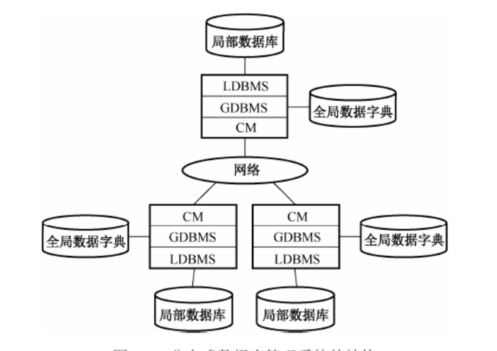

1. LDBMS（局部DBMS）：局部场地上的数据库管理系统的功能是建立和管理局部数据库，提供场地自治能力、执行局部应用及全局查询的子查询。
2. GDBMS（全局DBMS）：全局数据库管理系统的主要功能是提供分布透明性。协调全局事务的执行，协调各局部DBMS以完成全局应用，保证数据库的全局一致性，执行并发控制，实现更新同步，提供全局恢复功能
3. 全局数据字典。存放全局概念模式、分片模式、分布模式的定义及其各模式之间映像的定义；存放有关用户存取权限的定义，以保证全局用户的合法权限和数据库的安全性；存放数据完整性约束条件的定义，其功能与集中式数据库的数据字典类似。
4. CM（通信管理）。在分布数据库各场地之间传送消息和数据，完成通信功能。

DDBMS功能的分割和重复及其不同的配置策略就导致了各种架构。

1. 全局控制集中的DDBMS。全局控制成分GDBMS集中在某一节点上，由该节点完成全局事务的协调和局部数据库转换等一切控制功能，全局数据字典只有一个，也放在该节点上，它是GDBMS执行控制的依据。优点是控制简单，易实现更新一致性，但是由于控制在某一特定的节点上，不仅容易形成瓶颈而且系统较脆肉，一旦节点故障，系统就会瘫痪
2. 全局控制分散的DDBMS。全局控制成分GDBMS分散在网络的每一个节点上，全局数据字典每个节点也有一份，每个节点都能完成全局事务的协调和局部数据库转换，每个节点既是全局事务的参与者又是些调整，一般称为这类结构为完全分布的DDBMS。优点是节点独立，自治性强，单个节点退出或进入系统均不会影响整个系统的运行。但是全局空的协调机制和一致性的维护都比较复杂。
3. 全局控制部分分散的DDBMS。将GDBMS和全局数据字典分散在某些节点上，是介于前两种情况之间的架构。

局部DBMS一个重要性质是（同构/异构），分三级（硬件，操作系统和局部DBMS），因为硬件和操作系统的不同将由通信软件处理和管理。

异构比同构更加复杂，它要解决不同的DBMS之间及不同的数据模型之间的转换。对于无法避免的不同厂商组成的DDBMS（无法避免异构）。要解决异构数据库模型的同种化问题，需要寻找合适的公共数据模型，采用公共数据模型与异构数据模型（局部）之间的转换，不采用各节点之间一对一转换。这样可以减少转移次数。设N个节点，用公共数据模型时转换次数为2N，而个节点之间一对一转换需N次。

### 3.7 数据仓库

#### 3.7.1 数据仓库的概念

数据仓库是一个面向主题的、集成的、相对稳定的、且随时间变化的数据集合，用于支持管理决策。

1. 面向主题的操作型数据库的数据组织面向事务处理任务（面向应用），各个业务系统之间各自分离，而数据仓库中的数据是按照一定的主题域进行组织的。主题是一个抽象的概念，是指用户使用数据仓库进行决策时所关心的重点方面，一个主题通常与多个操作型信息系统相关。
2. 集成的在数据仓库的所有特性中，是最重要的。面向事务处理的操作型数据库通常与某些特定的应用相关，数据库之间相互独立，并且往往是异构的。而数据仓库中的数据在对原有分散的数据库数据**抽取、清理**的基础上经过系统**加工、汇总和整理**得到的，必须消除元数据的不一致性，比保证数据仓库内的信息是关于整个企业的一致的全局信息。
3. 相对稳定的操作型数据库中的数据通常实时更新，数据根据需要及时发生变化。数据仓库的数据主要供企业分析决策，所涉及的数据操作主要是数据查询，一旦数据进入数据仓库后，一般情况下被长期保留。
4. 随时间变化的操作型数据库主要关系某一个时间段的数据，而数据仓库中的数据通常包含历史信息，系统记录了企业从过去某一时点（如开始应用数据仓库的时间）到目前的各个阶段的信息。可以通过这个查询对未来趋势和发展历程做出定量分析和预测。数据仓库反应历史变化的属性主要表现在：
   1. 数据仓库的数据时间期限要远远长于传统操作型数据系统中的数据时间期限，传统操作型数据系统中的数据时间期限可能为数十天或数个月，数据仓库中的数据时间期限往往数年到几十年
   2. 传统操作型数据系统中的数据含有当前值的数据，这些数据在访问时是有效的，当然数据的当前值也能被更新，但数据仓库中的数据仅仅是一系列某一时刻产生的复杂的快照
   3. 传统操作型数据系统可能包含或者不包含时间元素，但是数据仓库中**一定**包含时间元素

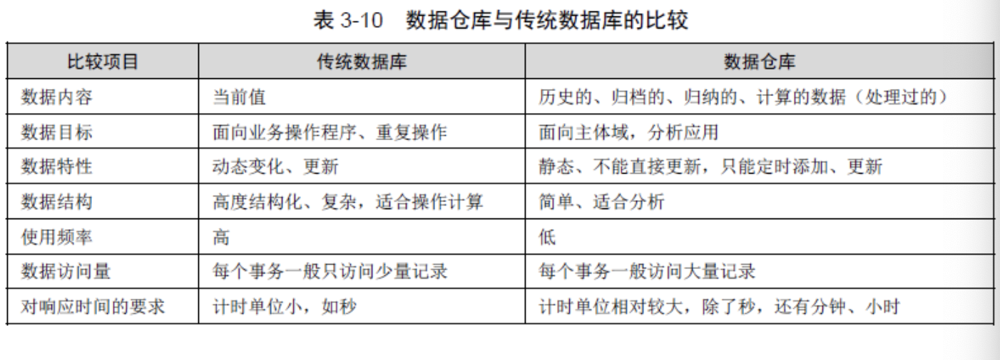

#### 3.7.2 数据仓库的结构

数据仓库系统要包含数据源、数据准备去、数据仓库数据库、数据集市/知识挖掘库及各种管理和应用工具。

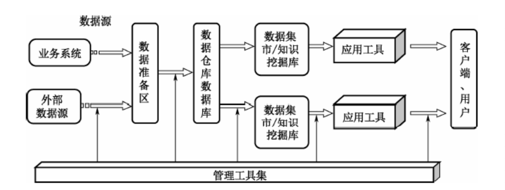

具体步骤：

1. 从数据源抽取相关的数据到数据准备区
2. 数据准备区对数据进行净化处理，并加载到数据仓库数据库
3. 根据用户需求将数据导入数据集市和知识挖掘库中。
4. 用户使用可以利用OLAP（联机分析处理）在内的多种数据仓库应用工具向数据集市/知识挖掘库或数据仓库进行决策查询分析或知识挖掘。

数据仓库的创建、应用可以利用各种数据仓库管理工具辅助完成。

##### 3.7.2.1 数据仓库的参考框架

数据仓库的参考框架由**数据仓库基本功能层、数据仓库管理层和数据仓库环境支持层**组成。

- 数据仓库基本层：包含数据源、准备区、数据仓库结构、数据集市或知识挖掘库，以及存取和使用部分。本层功能是从数据源抽取数据，对所抽取的数据进行筛选、清理，将处理的数据导入或者说加载到数据仓库中，根据用户的需求设立数据集市，完成数据仓库的复杂查询、决策分析和知识的挖掘等。
- 数据仓库管理层：数据仓库的正常运行除了需要仓库管理层提供的基本功能外，还需要对这些基本功能进行管理与支持的结构框架。该层由数据仓库的数据管理和数据仓库的元数据管理组成。
  - 数据仓库的数据管理层包含数据抽取、新数据需求与查询管理，数据加载、存储、刷新和更新系统，安全性与用户授权管理系统及数据归档、恢复及净化系统等四部分。
- 数据仓库的环境支持层。该由数据仓库数据传输层和数据仓库基础层完成。数据仓库中不同结构之间的数据传输需要数据仓库的传输层来完成。
  - 数据仓库的传输层包含数据传输和传送网络、客户/服务器代理和中间件、复制系统及数据传输层的安全保障系统。

##### 3.7.2.2 数据仓库的架构（大众观点）

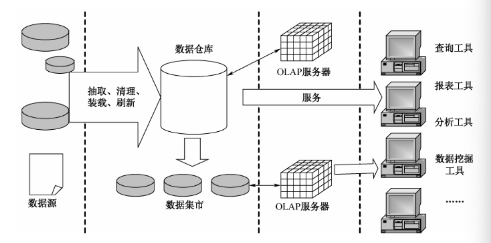

1. 数据源：数据仓库系统的基础，是整个系统的数据源泉。通常包括企业内部信息和外部信息。**内部信息**包括存放于RDBMS（关系型DBMS）中的各种业务处理数据和各类文档数据。**外部信息**包括各类法规法律、市场信息和竞争对手的信息。
2. 数据的存储与管理。是整个数据仓库的核心。数据仓库真正关键是数据的存储和管理。数据仓库的组织管理方式决定它有别于传统数据库，同时也决定了其对外部数据的表现形式。针对现有各业务系统的数据，进行抽取、清理并有效集成，按照主题进行组织。数据仓库按照数据的覆盖范围可以分为企业级数据仓库和部门级数据仓库
3. OLAP服务器：对分析需要的数据进行有效集成，按多维模型予以组织，一边进行多角度、多层次的分析，并发现趋势。其具体实现可以分为：
   1. ROLAP：基本数据和聚合数据均放在RDBMS中
   2. MOLAP：基本数据和聚合数据均放于多位数据库中
   3. HOLAP：基本数据存放于RDBMS中，聚合数据存放于多位数据库中
4. 前端工具。主要包括各种报表工具、查询工具、数据分析工具、数据挖掘工具及各种机遇数据仓库或数据集市的应用开发工具。其中数据分析工具主要针对于OLAP服务器，报表工具、数据挖掘工具主要针对数据仓库。

#### 3.7.3 数据仓库的实现方法

数据仓库的特性决定了数据仓库的设计不同于传统的数据库设计方法。

数据仓库的建立是一个过程，从建立简单的基础框架着手，不断丰富和完善整个系统。这一过程将由以下几个部分构成：需求分析、概念模型设计、逻辑模型设计、物理模型设计和数据仓库生成。

从整体角度看，数据仓库的实现方法主要有自顶向下，自底向上和联合三种

##### 3.7.3.1 自顶向下

首先应先找出数据仓库解决方案所需要满足的商业需求，把商业需求视为数据仓库的首要任务。数据仓库是一种功能而不是一种特征，数据仓库保存信息，并以外部工具易于显示和操作的方式组织这些信息。

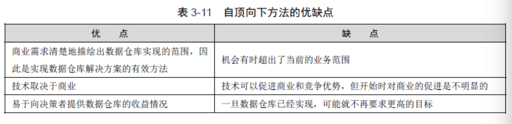

1. 实现单位比较熟悉技术，并具有根据商业需求采用自顶向下方法开发应用程序的丰富经验。
2. 决策层完全清楚数据仓库的预测目标
3. 决策层完全清楚数据仓库用作哪些机构的决策支持工具
4. 决策层完全清楚数据仓库已经是商业过程中的一个子过程。

##### 3.7.3.2 自底向上

自底向上一般从实现和基于技术的原形入手。先选择一个特定的，众所周知的商业问题的子集，再为该子集制定方案。实现自底向上一般是比较快的。自底向上可以使一个单位在发展时用尽可能少的经费和时间，就可以在做出有效的投入之前评估技术的收益情况。在数据仓库领域，自底向上方法是快速实现数据集市，部门级数据仓库的有效手段。

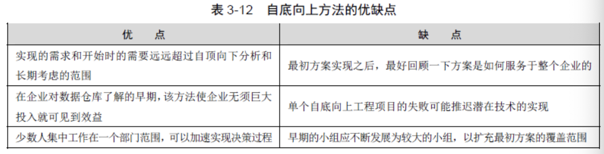

规划和实现数据仓库的自底向上方法一般用于

1. 企业还没有确实掌握数据仓库技术，希望进行技术评估来决定运行该技术的方式、地点和时间
2. 企业希望了解实现和运行数据仓库所需要的各种费用情况
3. 企业在对数据仓库进行投资选择。自底向上方法对于希望从数据仓库投资中快速得到回报的用户是非常有效的。

##### 3.7.3.3 联合方法

在以上两种方法的联合方法中，企业在保持自底向上方法的快速实现和基于应用的同时，还可以利用自顶向下的方法的规划和决策性质。这依赖于

1. 自顶向下的结构、标准和设计小组。可以从一个项目向另一个项目传递知识，也可以吧战术决策变为战略决策
2. 自底向上方法的项目向组，负责直接在短期实现一个集中的部门级的商务解决方法。

一般用于：

1. 实现企业拥有经验丰富的设计师，有能力建立、证明、应用和维护数据结构、技术结果及企业模型，可以很容易的从具体转移到抽象
2. 企业拥有固定的项目小组，完全清楚数据仓库技术应用的产锁。可以清楚看到当前的商务需求。

联合方法适合数据仓库技术的快速试运行，并且保留了建立长远的决策方案的机会。

### 3.8 数据挖掘

#### 3.8.1 数据挖掘的概念

数据挖掘技术是人们长期对数据库技术进行研究和开发的结果。数据挖掘使数据库技术进入了一个更高级的阶段，它不仅能对过去的数据进行查询和遍历，并且能够找出过去数据之间的潜在联系，从而促进信息的传递。现在数据挖掘技术在商业应用中可以马上投入使用，因为对这种技术进行支持的三种基础技术已经成熟，他们是**海量数据搜集、强大的多处理器计算机和数据挖掘算法**。

从技术角度来看，数据挖掘就是从**大量的、不完全的、有噪声的、模糊的、随机的**实际应用数据中，提取**隐含其中的、人们事先不知道的、但又是潜在有用的信息和知识**的过程。

> 知识：从广义上理解，数据、信息也是知识的表现形式，但是人们更把概念、规则、模式、规律和约束等看作知识。原始数据可以是结构化的，如关系型数据库中的数据；也可以是半结构化的，如文本、图形和图像数据；甚至是分布在网络上的异构型数据。

从商业角度来看，数据挖掘是一种新的商业信息处理技术，其主要特点是对商业数据库中的大量业务数据进行抽取、转换、分析和其他模型化处理，从而提取辅助商业决策的关键性数据。

数据挖掘可以描述为：按企业既定业务目标，对大量的企业数据进行探索和分析，解释隐藏的、未知的或验证已知的规律性，并进一步将其模块化的先进有效的方法。

数据挖掘技术已开始就是面向应用的。它不仅是面向特定数据库的简单检索查询调用，而且要对这些数据进行微观、中观、乃至宏观的统计、分析、综合和推理，以知道实际问题的求解，企图发现事件间的相互关联，甚至利用已有的数据对未来的活动进行预测。

#### 3.8.2 数据挖掘的功能

数据挖掘通过预测未来趋势及行为，做出前摄的、基于知识的决策。数据挖掘的目标是从数据库中发现隐含的、有意义的知识，功能：

1. 自动预测趋势和行为数据挖掘自动在大型数据库中寻找预测性信息，遗忘需要进行大量手工分析的问题如今可以迅速直接由数据本身得出结论。一个典型的例子是市场预测问题，数据挖掘使用过去有关促销的数据来寻找未来投资中回报最大的用户，其他可预测的问题包括预报破产及认定对指定事件最可能做出反应的群体。
2. 关联分析数据关联是数据库中存在的一类重要的可被发现的知识。若两个或多个变量的取值之间存在某种规律性，就称为关联。关联可以分为简单关联，时序关联，因果关联。关联分析的目的是找出数据库中隐藏的关联网。
3. 聚类数据库中的记录可被划分为一系列有意义的自己，即聚类。聚类增强了人们对客观现实的认识，是概念描述和偏差分析的先决条件。聚类技术主要包括传统的模式识别方法和数学分类学。
4. 概念描述就是对某类对象的内涵进行描述，并概括这类对象的有关特征。概念描述分为特征性描述和区别性描述，前者描述某类对象的共同特征，后者描述不同类对象之间的区别。生成一个类的特征性描述之设计该类对象中所有对象的共性。
5. 偏差检测数据库中的数据常有一些异常记录，从数据库检测这些偏差很有意义。偏差包括很多潜在的知识，如分类中的反常实例、不满足规则的特例、观测结果于模型预测值的偏差、量值随时间的变化等。偏差检测的基本方法是，寻找观测结果与参照只之间有意义的差别。

#### 3.8.3 数据挖掘常用技术

##### 3.8.3.1 关联分析

主要用于发现不同事件之间的关联性，即一个事件发生的同时，另一个事件也经常发生。关联分析的重点在于快速发现那些有实用价值的关联发生的时间。其主要依据是事件发生的概率和条件概率应该符合一定的统计意义。

对于结构化的数据，以客户的购买习惯数据为例，利用关联分析，可以发现客户的关联购买需要。

对于非结构化的数据，以空间数据为例，利用关联分析，可以发现地理位置的关联性。例如，85%的靠近高速公路的大城镇与水相邻

##### 3.8.3.2 序列分析

序列分析主要用于发现一定时间间隔内接连发生的事件。这些事件构成一个序列，发现的序列应该具有普遍意义，其依据除了统计上的概率以外还要加上时间约束。

##### 3.8.3.3 分类分析

分类分析通过分析具有类别的样本的特点，得到决定样本属于各种类别的规则或方法。利用这些规则和方法对于未知类别的样本分类时应该具有一定的准确度。其主要方法有基于统计学的贝叶斯方法、神经网络方法、决策树方法及支持向量机等

利用分类技术，可以根据顾客的消费水平和基本特征对顾客进行分类，找出对商家有较大利益贡献的重要客户的特征，通过对其进行个性化服务，提供他们的忠诚度。

利用分类技术，可以将大量的半结构化的文本数据，进行分类，例如将图片进行分类

##### 3.8.3.4 聚类分析

聚类分析时根据物以类聚的原理，将本身没有类别的样本聚集成不同的组，并且对每一个这样的组进行描述的过程。其主要依据是聚到同一个组中的样本应该彼此相似，而属于不同组的样本应该足够不相似。

仍以客户关系管理为例，利用聚类技术，根据客户的个人特征及消费数据，可以将客户群体进行细分，例如可以得到这样一个消费群体：女性占91%，全部无子女、年龄在31-40占70%，高消费级别占64%，买过针织品的占91%，买过厨房用品的占89%，买过园艺用品的占79%，针对不同的客户群，可以实施不同的营销和服务方式。

对于空间数据，根据地理位置和障碍物的存在情况可以自动进行区域划分。

对于文本数据，利用聚类技术可以根据文档的内容自动划分类别，从而便于文本的检索

##### 3.8.3.5 预测

预测与分类相似，但预测是根据样本的已知特征估算某个连续类型的变量的取值过程，而分类则只是用于判别样本所属的离散类别而已。预测常用的技术是回归分析

##### 3.8.3.6 时间序列

分析时间序列分析的是随时间而变化的时间序列，目的是预测未来发展趋势，或者寻找相似发展模式或者是发现周期性发展规律。

#### 3.8.4 数据挖掘的过程

数据挖掘是指一个完整的过程，该过程从大兴数据库中挖掘先前未知的，有效的，可实用的信息，并使用这些信息作出决策或丰富知识。

流程如下：

1. 问题定义在开始数据挖掘之前，最先也是最重要的要求就是熟悉背景知识，弄清用户的需求。想要充分发挥数据挖掘的价值，必须对目标有一个清晰明确的定义，即决定到底想干什么。
2. 建立数据挖掘库：要进行数据挖掘必须收集要挖掘的数据资源。一般建议把要挖掘的数据都收集到一个数据库中，而不是采用原有的数据库或数据仓库。这是因为大部分情况下需要修改要挖掘的数据，而且还会遇到采用外部数据的情况；另外，数据挖掘还要对数据进行各种纷繁复杂的统计分析，而数据仓库可能不支持这些数据结构
3. 分析数据：通常所进行的对数据深入调查的过程。从数据集中找出规律和趋势，用聚类分析区分类别，最终要达到的目的就是搞清楚多因素相互影响的，十分复杂的关系，发现因素之间的相关性
4. 调整数据：通过123操作，对数据的状态和趋势有了进一步的了解，这是要尽可能对问题解决的要求能**进一步明确化、进一步量化**。针对问题的需求对数据进行增删，按照对整个数据挖掘过程的新认识**组合或生成一个新的变量**，以体现对状态的有效描述。
5. 模型化：在问题进一步明确，数据结构和内容进一步调整的基础上，就可以建立形成知识的模型。这一环节是数据挖掘的核心环节，一般运用神经网络，决策树，数理统计，时间序列分析等方法来建立模型
6. 评价和解释：评估5得到的模式模型，确定哪些是有效的、有用的模式。评价的一种方法是直接使用原先建立的挖掘数据库中的数据来进行检验，另一种方法是另找一批数据并对其进行检验，再一种方法是在实际运行的环境中取出新鲜数据进行检验。

数据挖掘过程的分布实现，不同的步骤需要不同专长的人员

- 业务分析人员：要求精通业务，能够解释业务对象，并根据各业务对象确定出用于数据定义和挖掘算法的业务需求
- 数据分析人员：精通数据分析技术，并较熟练的掌握统计学，有能力吧业务需求转化为数据挖掘的各步操作，并为美不操作选择合适的技术
- 数据管理人员：精通数据管理技术，并从数据库或数据仓库中收集数据。

### 3.9 NoSQL

Not Only SQL,在互联网web2.0网站的兴起，传统的关系数据库在应付web2.0网站，特别是超大规模和高并发的SNS类型的web2.0纯动态网站已经显得力不从心，暴露了很多难以克服的问题，而非关系型的数据库则由于本身的特点得到了非常迅速的发展。

NoSQL的出现打破了长久以来关系型数据库与ACID理论大一统的局面。NoSQL数据存储不需要固定的表结构，通常也不存在链接操作。在大数据存取上具备关系型数据库无法比拟的性能优势。

和关系型数据库相比，NoSQL具有的优点

1. 易拓展：NoSQL数据库种类繁多，但是一个共同的特点是去掉了关系数据库的关系型特性。数据之间没有关系，这就很容易拓展。
2. 大数据量，高性能：NoSQL数据库都具有非常高的读写性能，尤其在大数量下，同样表现优秀。这得益于它的无关系性，数据库的结构简单。一般MySQL使用QueryCache，每次表一更新Cache就失效，在Web2.0的交互频繁应用中，性能优化不高。而NoSQL的Cache是记录集的。
3. 灵活的数据类型：NoSQL无须事先为要存储的数据建立字段，随时可以存储自定义的数据格式。
4. 高可用：NoSQL在不太影响性能的情况，就可以方便地实现高可用的架构。比如Cassandra，HBase模型，通过复制模型也能实现高可用

当然NoSQL也存在一些问题（并未形成一定标准，各种产品层出不穷，内部混乱，缺乏相关专家技术的支持）

### 3.10 大数据

指无法在一定时间范围内用常规软件工具进行捕捉、管理和处理的数据集合，是需要新处理模式才能有更强的决策力，洞察发现力和流程优化能力的海量、高增长率和多样化的信息资产

##### 3.10.1 大数据的特点

- Volume：数据体量巨大
- Variety：数据类型繁多。这种类型的多样性也让数据备份为结构化数据和非结构化数据。
- Value：价值密度低。价值密度的高低与数据总量的大小成反比。以监控为例，监控24h的视频可能就1min有用
- Velocity：处理速度快。这是大数据区分于传统数据挖掘的最显著特征。

##### 3.10.2 传统数据与大数据的比较

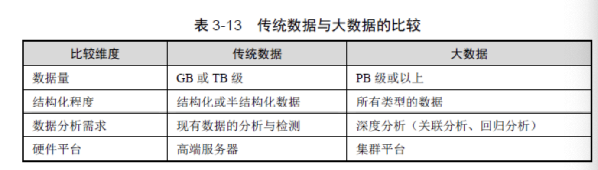

##### 3.10.3 大数据处理技术

- 大数据采集
- 大数据预处理
- 大数据存储及管理
- 大数据分析及挖掘
- 大数据展现和应用（大数据检索、大数据可视化、大数据应用、大数据安全等）

##### 3.10.4 大数据应用

如金融服务，医疗保健，零售业，制造业，政府机构等

## 4 计算机网络

### 4.1 网络架构与协议

#### 4.1.1 网络互联模型

OSI/RM构造了由下到上的七层模型

1. 物理层：透明的完成相邻节点之间**原始比特流的传输**。“透明”是指物理层不需要关心比特代表的意义，只需要考虑如果发送即可。物理层在传输介质基础上作为系统和通信介质的接口，为数据链路层提供服务。
2. 数据链路层：负责在两个相邻节点之间的线路上无差错的传送以帧为单位的数据，通过**流量控制和差错控制**，将原始不可靠的物理层链接变成无差错的数据通道，并解决**多用户竞争问题**，使之对网络层显现一条可靠的链路。
3. 网络层：**通信子网的最高层**。在数据链路层服务的基础上，实现整个通信子网内的链接，并通过网络连接交换网络服务数据单元（packet）。主要**解决数据传输单元分组在通信子网中的路由选择、拥塞控制和多个网络互联**的问题。网络层建立网路链接为传输层提供服务。
4. 传输层：既是**负责数据通信的最高层**，又是面向网络通信的低三层（1，2，3）和面向信息处理的高三层（5，6，7）之间的**中间层**，是**资源子网和通信子网的桥梁**，其主要是为两台计算机的通信提供可靠的端到端的数据传输服务。传输层反映并扩展了网络层子系统的服务功能，并通过传输层地址为高层提供传输数据的通信端口，使系统之间高层资源的贡献不必考虑数据通信方面的问题。
5. 会话层：利用传输层提供的端到端数据传输服务，**具体实施服务请求者与服务提供者之间的通信、组织和同步他们的会话活动，并管理他们的数据交换过程**。会话层提供服务通常需要经过**建立连接、数据传输和释放连接**三个阶段。会话层是最薄的有一层常被省略。
6. 表示层：处理的是用户信息的表示问题。端用户之间传送的数据包包含语义和语法两个方面。语义是数据的内容及其含义，它由应用层负责处理；语法是与数据表示形式有关的方面，例如数据格式，编码和压缩等。表示层主要用于**处理应用实体面向交换的信息的表示方法，包括用户数据的结构和在传输时的比特流的表示**。这样，即使每个应用系统有各自的信息表示法，但被交换的信息类型和述职仍能用一种共同的方法来描述。
7. 应用层：直接面向用户的一层。**在实际应用中，通常把会话层和表示层归入到应用层**，使OSI/RM成为一个简化的五层模型。

TCP/IP结构模型（非正式）

根据已开发的协议标准和通信任务将其大致分为四个比较独立的层次

1. 网络接口层：大致对应OSI/RM的数据链路层和物理层，TCP/IP协议不包含具体的物理层和数据链路层，只定义了网络接口层作为物理层的接口规范。网络接口层处于TCP/IP的**最底层**，主要负责管理**为物理网络准备数据所需的全部服务程序和功能**。
2. 网络互联层：也称为网络层、互联网层或网际层，负责将数据报独立的从信源传送到信宿，主要解决路由选择、阻塞控制和网络互联的问题，功能上类似于OSI/RM的网络层
3. 传输层：传输层负责在信源和信宿之间提供端到端的数据传输服务。类似OSI/RM的传输层
4. 应用层：直接面向用户应用，为用户方便的提供各种对网络资源的访问服务，包含了OSI/RM会话层和表示层中的部分功能。

#### 4.1.2 常见的网络协议

##### 4.1.2.1 应用层协议

- FTP：文件传输协议，是网络上两台计算器传送文件的协议，运行在**TCP**之上，通过Internet将文件从一台计算机传到另一台计算机的一种途径。**FTP的传输模式包括Bin（二进制）和ASCII（文本文件）**，除了文本文件以外，都应该使用二进制模式传输。FTP在客户机和服务器之间需要建立**两条TCP链接**，一条用于传输控制信息（21端口），一条用于传送文件内容（20端口）。
- TFTP：简单文件传输协议，是用来在客户机与服务器之间进行简单文件传输的协议，提供不复杂，开销不大的文件传输服务。TFTP建立在**UDP**之上，提供不可靠的数据流传输服务，不提供存取授权与认证机制，**使用超时重传方式来保证数据的到达**
- HTTP：超文本传输协议，是用于从WWW服务器传输超文本到本地浏览器的传送协议。它可以使浏览器更加高效，使网络传输更少。HTTP建立在**TCP**之上，能保证计算机正确快速的传输超文本文档，还确定传输文档中的哪一部分，以及哪部分内容首先显示等。
- SMTP：简单邮件传输协议，建议在**TCP**之上，是一种提供可靠且有效的电子邮件传输的协议。SMTP是建模在FTP文件传输服务商的一种邮件服务，主要用于传输系统之间的邮件信息，并提供与电子邮件相关的通知
- DHCP：动态主机配置协议，建立在**UDP**之上，是基于客户机/服务及模式设计的。所有的IP网络设定数据都有DHCP服务器集中管理，并负责处理客户端的DHCP要求；客户端则会使用服务器分配下来的IP环境数据。DHCP通过租约（默认8天）的概念，有效且动态地分配客户端的TCP/IP设定。当租约过半时，客户机需要向DHCP服务器申请续租；当租约超过87.5%，如果仍然没有喝当初提供IP的DHCP服务器联系上，则开始联系其他的DHCP服务器。
- Telnet：远程登录协议，是登录和仿真程序，建立在**TCP**之上，他的基本功能是允许用户登录进入远程计算机系统，目前较新的版本是在本地执行更多的处理，可以提供更好的响应，并且减少了通过链路发送到远程计算机的信息数量
- DNS：域名系统，在Internet上域名和IP地址之间一一对应，机器之间只能互相识别IP地址，域名和IP之间的转换工作成为域名解析，域名解析需要专门的域名解析服务器来完成，DNS就是进行域名解析的服务器。DNS通过对用户友好的名称查找计算机和服务。当用户在应用程序中输入DNS名称，DNS服务可以将此名称解析为与之相关的其他信息，例如，IP地址
- SNMP：简单网络管理协议：为了解决Internet上的路由器管理问题而提出，它可以在IP、IPX、AppleTalk和其他传输协议上使用。**SNMP是指一系列网络管理规范的集合，包括协议本身、数据结构的定义和一些相关概念**。

##### 4.1.2.2 传输层协议

- TCP：整个TCP/IP协议族中最重要的协议之一，他在IP协议提供的不可靠的数据服务的基础上，采用了重发技术。为应用程序提供了一个可靠的、面向连接的、全双工的数据传输服务。TCP协议一般用于传输数据量比较少，且对可靠性要求高的场合。
- UDP：不可靠、无连接的协议，可以确保应用程序间的通信，与TCP相比，UDP是一种无连接的协议，错误检测若得多。即，TCP提供可靠性，UDP提高传输速率，UDP一般用于传输数据量大，对可靠性要求不是很高，但要求速度快的场合

##### 4.1.2.3 网络层协议

- IP：IP所提供的服务通常被认为是**无连接和不可靠的**，**它将差错监测和流量控制之类的服务授权给了其他的各层协议**。这正是TCP/IP协议能够高效工作的一个重要保证。网络层的功能主要由IP来提供，除了提供端到端的分组分发功能外，IP还提供了很多扩充功能，例如，为了克服数据链路层对桢大小的限制，网络层提供了数据分块和重组功能，这使得很大的IP数据包能以较小的分组在网络上传输。
- ARP：**用于动态的完成IP地址向物理地址的转换**，物理地址通常指计算机的网卡地址，也称为MAC地址，每块网卡都有唯一的地址；RARP用于动态完成物理地址向IP地址的转换。
- ICMP：专门用于发送差错报文的协议，由于IP协议是一种尽力传送的通信协议，即传送的数据可能丢失、重复、延迟或者乱序传递，所以需要一种尽量避免差错并能发生差错时报告的机制，即ICMP的功能（**IP错误的时候发送差错报告**）
- IGMP：允许Internet中的计算机参加多播，是计算机用作向相邻**多目路由器**报告多目组成员的协议。多目路由器是支持组播的路由器，它向本地网络发送IGMP查询，计算机通过发送IGMP报告来应答查询。多目路由器负责将组播包转发到网络中所有组播成员。

#### 4.1.3 IPv6

IPv4面临地址空间耗尽，路由表急剧膨胀，缺乏QoS的支持，本身并不提供任何安全机制、移动性差等问题。尽管采用了一些新的机制来解决这些问题，如DHCP技术，NAT技术，CIDR技术等，但都不可避免地要引入其他新的问题，问题没有得到根本解决，于是IETF在1995.12推出了IPv6协议。

##### 4.1.3.1 IPv6地址表示

一个32位的IPv4地址以8个位为一段分成4段，每段之间用点.分开，（255是每段的最大值，2的8次方-1）。而IPv6地址的128位是以16位为一段，共分为8段，每段的16位转为一个4位的16进制数字，每段之间用冒号分开。

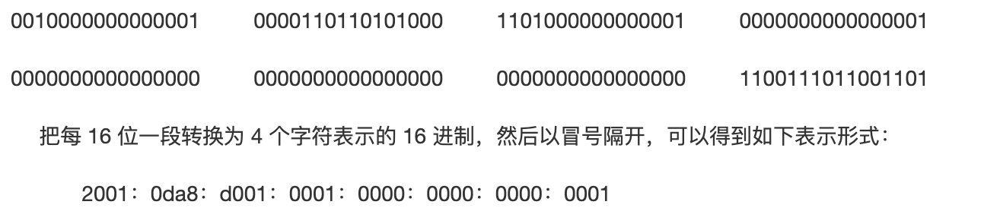

##### 4.1.3.2 IPv6压缩地址表示

在IPv6中，常见到使用包含一长串0的地址，为了方便书写，每一段的前导0可以省略，0001可以简写为1，0000即简写为0，上述可以简写为

对于连续2段以上为0的字段，可以用：：来表示，进行再次压缩。如果出现两个连续2段以上为0的字段，仅能简写一次，即：：有且只能出现一次。

##### 4.1.3.3 内嵌IPv4的IPv6地址

这种表示法的地址是第一部分使用十六进制表示，而IPv4部分采用十进制。这是过度机制所用的IPv6的特有的表示法。如a111::1:3:255.255.255.255，这个地址的后半部分就是一个IPv4地址

##### 4.1.3.4 IPv6地址类型

IPv4有单播、广播和组播地址类型，在IPv6里面，广播已经不再使用。IPv6仍然存在3种地址类型

- 单播IPv6：单播地址唯一标识一个IPv6节点的接口。发送往单播地址的数据包最终传递给这个地址所标识的接口，为适应负载均衡，IPv6协议允许多个接口使用相同的IPv6地址，只要他们对于主机上的IPv6协议表现为一个接口。
- 多播IPv6：多播地址标识一组IPv6节点的接口，发送往多播地址的数据包会被该多播组所有的成员处理
- 泛播IPv6：泛播地址指派给多个节点的接口。发送往泛播地址的数据包只会传递给其中的一个接口。

##### 4.1.3.5 IPv6的优势

1. 更大的地址空间，32->128
2. 更小的路由表。IPv6地址分配一开始就遵循路由汇聚的原则，使路由器能在路由表中用一条记录标识一个子网，大大减少了路由器中路由表的长度，提高了路由器转发数据包的速度。
3. 增加了增强的组播和对流记录，使网络上的多媒体应用又了长足发展的机会，为服务质量（QoS）控制提供了良好的网络平台。
4. 加入了对自动配置的支持。这是对DHCP协议的改进和扩展，使网络（尤其是局域网）的管理更加方便和快捷
5. 更高的安全性，使用IPv6网络时，用户可以对网络层的数据进行加密，并对IP报文进行校验，增强了网络的安全性。

##### 4.1.3.6 IPv4到IPv6的过度技术

1. 双协议栈技术：双栈技术通过节点对IPv4和IPv6双协议栈的支持，从而支持业务共存
2. 隧道技术：在IPv4网络中部署隧道，实现在IPv4网络上对IPv6业务的承载，保证业务的共存和过度。具体隧道技术包括：6to4隧道；6over4隧道；ISATAP隧道
3. NAT-PT技术：使用网关设备连接IPv4和IPv6网络，当IPv4和IPv6节点相互访问时，NAT-PT网关实现两种协议的转换地址和地址的映射。

### 4.2 局域网和广域网

#### 4.2.1 局域网基础知识

特点

1. 地理分布范围较小，一般为数百米至数千米的区域范围内
2. 数据传输速率高，早起局域网速率为10Mbps-100Mbps，现在普遍为1000Mbps，可适用于语音图像视频等各种业务数据信息的高速交换
3. 数据误码率第，局域网通常采用短距离基带传输，可以使用高质量的传输媒体，从而提高数据传输质量
4. 一般以PC为主题，还包括终端和各种外设，网络中一般不架设主骨干网系统
5. 协议相对简单，结构灵活，建网成本低，周期短，便于管理和扩充。构成局域网的网络拓扑结构主要分为：
   1. 星形结构：类似蜘蛛网，中间是一个枢纽（网络交换设备），所有节点连接到这个枢纽上，一般办公室局域网都是这种结构。
   2. 总线结构：采用总线结构方式的网络，是由一条共享的通信线路将所有节点连接在一起，这条共享的通信线路可以使一根同轴电缆或者其他介质（类似老的电视机？）
   3. 环形结构：与总线接口类似，由一条共享的通信线路将所有节点连接在一起，区别是环形结构中共享线路是闭合的，它将所有节点排列成一个环，每个节点只与其两个邻居直接相连。一个节点想给另一个节点发送信息，报文必须经过之间的所有节点
   4. 网状结构：任何节点之间彼此之间都会由一根物理通信线路相连，任何节点出现故障都不会影响到其他节点，但是布线麻烦，网络建设成本很高，控制方法也很复杂。较少使用（感觉听起来类似Mesh？）

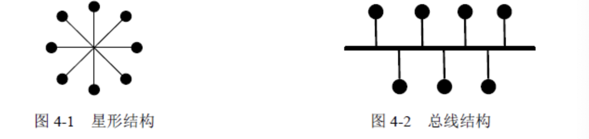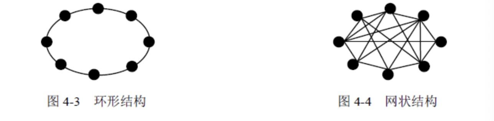

#### 4.2.2 无限局域网

WLAN主要运用射频（RF）技术取代原来局域网中不可缺少的传输介质来完成数据的传输任务。

##### 4.2.2.1 拓扑结构

无线局域网主要分为两大类

1. 基础设施网络：整个网络都采用无线通信的方式，但系统中存在接入点（AP），通过接入点将一组节点逻辑上联系在一起，形成一个局域网。AP作用与网桥类似，负责在802.11和802.3的MAC协议之间进行转换。一个AP覆盖的部分称为一个基本业务域，而AP控制的所有节点组成一个基本业务集，有两个以上的基本业务域可以组成一个分布式系统。
2. Ad hoc网络：整个网络都使用无线通信的方式，直接通过无线网卡实现点对点连接。与基础设施网络相比，没有AP这样的设备，可拓展性和灵活性更好，但路由和协调控制等技术都难以解决（没有主要的AP，类似去中心化？没有一个实际节点统筹，对于全体来说，如果节点A和节点B距离近的话可以通过无线网卡直接通信，但是如果A想和C通信，而C较远，B和C较近的话，A会通过B一跳与C通信，如果B断开，A无法和C通信）。

多数情况下，无线通信通常作为有线通信的一种补充和拓展，这种部署配置下，多个AP通过线缆连接在有线网络上，以使无线用户能够访问网络的各部分。

##### 4.2.2.2 IEEE 802.11 标准

IEEE802委员会为无线局域网开发了一组标准，即IEEE802.11标准，定义了媒体访问控制层（MAC层）和物理层。物理层定义了工作在2.4GHz的ISM（工业，科学和医学）频段上的扩频通信方式，总数据传输速率设计为2Mbps。在MAC层采取载波监听多路访问/冲突避免协议（CSMA/CA）**采用主动避免碰撞和非被动侦测的方式来解决冲突问题**。

802.11业务主要限于数据存取，在速率和传输距离上都不能满足人们的需要，因此，IEEE在制定更高速度的标准上，产生了802.11a和802.11b分支，后续又推出了802.11g，802.11n，802.11ac的标准，**主要是以物理层的不同作为区分，区别直接表现在工作频段和数据传输率、最大传输距离等指标上**。而工作在MAC层标准又分为IEEE 802.11h、IEEE 802.11e和IEEE 802.11i等，**h是a的拓展，目的是兼容其他的5GHz频段的标准，e是IEEE为满足QoS方便要求制定的标准；i规定使用802.1x认证和密钥管理方式**。

##### 4.2.2.3 3G通信技术

第三代移动通信及其技术的简称

- WCDMA（宽频CDMA）：支持者主要是以GSM（全球移动通信系统）为主的欧洲厂商。这套系统能够架设在GSM网络上，对于系统提供商而言，可以较轻易的过度。中国联通获得给予WCDMA技术制式的3G业务经营许可
- CDMA 2000 ，以美国高通北美公司为主导提出。这套系统是从窄频CDMA One数字标准衍生出来的，可以从原CDMA One结构直接升级到3G，建设成本低廉。但是使用CDMA的地区只有日本、韩国和北美，因此支持者较少。中国电信获得基于CDMA 200技术制式的3G经营许可
- TD-SCDMA，由中国大唐电信制定的3G标准，该标注将智能天线，同步CDMA和软件无线电等技术融于其中，在频谱利用率，对业务支持具有灵活性、频率灵活性及成本等方面具有独特优势。由于对中国市场重视，全国一半以上设备厂商宣布可以支持TD-SCDMA标准。中国移动获得基于TD-SCDMA技术制式的3G经营许可

##### 4.2.2.4 4G通信技术

第四代移动通信及其技术的简称，是集3G与WLAN于一体并能够传输高质量视频图像且图像传输质量与高清晰度电视不相上下的技术产品，能够以100Mbps速度下载，上传也能达到20Mbps。此外，4G可以在DSL和有线电视调制解调器没有覆盖的地方部署，然后再扩展到整个地区。

主要有两个方向 LTE和WiMAX，LTE可以进一步分为TD-LTE和FDD-LTE

1. TD-LTE：分时长期演进：TDD 即 时分双工，是移动通信技术使用的双工技术之一，与FDD频分双工向对应。TD-LTE与TD-SCDMA实际上没有关系，TD-LTE是TDD版本的LTE技术，FDD-LTE的技术是FDD版本的LTE技术。TD-SCDMA是CDMA（码分多址）技术，TD-LTE是OFDM（正交频分复用）技术。两者不同

2. FDD-LTE：频分双工长期演进，目前该标准的产业发展领先于TD-LTE。FDD-LTE已称为当前世界上采用的国家及地区最广泛的终端种类最丰富的一种4G标准，其演进路线和速率为：GSM（9k）**-** GPRS（42k）**- ** EDGE（172k）**-**  WCDMA（364k）**-**HSDPA/HSUPA（14.4M)  **-**  HSDPA+/HSUPA+(42M) **-**  FDD-LTE(300M)

3. WiMAX：全球微波互联接入，WiMAX另一个名字是802.16.WiMAX技术既被纳入到了3G技术也被纳入到了4G技术。802.16 工作的频段是无需授权频段，范围在2GHz到66GHz之间，而802.16a则是采用2G到11GHz无需授权频段的宽带无线接入系统，其频段带宽可根据需求在1.5M至20MHz范围调整，具有更好高速移动下无缝切换的IEEE 802.16m的技术正在研发，因此802.16使用的频谱可能比其他任何无线技术更丰富，优点如下

   1. 对于一直的干扰，窄的信道带宽有利于避开干扰，而且有利于节省频谱资源。
   2. 灵活的带宽调整能力，有利于运营商或用户协调频谱资源
   3. WiMAX可以实现的50公里的无线信号传输距离是无线局域网不能比拟的，网络覆盖面积是3G发射塔的10倍，只要少数基站能够实现全程覆盖，使无线网络的覆盖面积大大提升

   但WiMAX网络在移动性上有先天的缺陷，无法满足（大于等于50km/h）的网络的无缝链接

#### 4.2.3 广域网技术

主要提供面向通信的服务，支持用户使用计算机进行远距离的信息交换，与局域网相比，其覆盖范围广、通信的距离远、需要考虑的因素增多，例如，线路的冗余、带宽的利用和差错处理等。广域网一般由电信部门负责组建、管理和维护，并向全社会提供面向通信的有偿服务、流量统计和计费问题

#### 4.2.4 网络接入技术

##### 4.2.4.1 PSTN接入

公用交换电话网络，指李彤电话线拨号接入Internet，通常计算机要安装一个Modem（调制解调器），将电话线插入Modem上，在计算机上利用拨号程序输入接入号码进行接入，速度较低，一般低于64Kbps

##### 4.2.4.2 ISDN接入

综合业务数字网，是在电话网络的基础上构造的纯数字方式的综合业务数字网，能为用户提供包括语音、数据、图像和传真等在内的各类综合业务。ISDN的基本速率接口为2B+D信道，共144Kbps带宽，一般使用RJ45

##### 4.2.4.3 ASDL接入

非对称数字用户线路，服务端设备和用户端设备之间通过普通的电话线连接，无须对入户线缆进行改造，就可以为现有的大量电话铜壶提供ADSL宽带接入。ADSL特点是上行速度和下行速度不一样，并且下行速度大于上行速度。目前较成熟的ADSL标准有两种

- G.DMT：全速率的ADSL标准，提供8Mbps下行速率和1.5Mbps的上行速率，但是要求用户安装分离器
- G.Lite：速率较慢，不需要用户端进行线路的分离，1.5Mbps下行速率和512Kbps上行速率

##### 4.2.4.4 FTTx+LAN接入

光纤通信是指利用光导纤维（光纤）传输光波信号的一种通信方法，相对于以电为媒介的通信方式而言，主要优点有传输频带宽，通信容量大；传输损耗小；抗电磁干扰能力强；线径细，重量轻；资源丰富等

1. FTTx技术。以千兆以太网技术为主干，充分利用光纤通信技术完成接入。实现高速以太网的宽带技术常用的方式是FTTx+LAN（光纤+局域网），根据光纤深入用户的程度分为五种

   1. FTTC：Fiber to The Curb，光纤到路边。
   2. FTTZ：                     Zone，光纤到小区
   3. FTTB：                     Building，光纤到楼
   4. FTTF：                     Flower，光纤到楼层
   5. FTTH：                     Home，光纤到户

2. 无源光纤网络（PON）技术：PON是实现FTTB的关键技术，在光分支点不需要节点设备，只需要安装一个简单的光分支器即可，因此具有节省光缆资源、带宽资源共享、节省机房投资、设备安全性高、建网速度快和综合建网成本低等优点。目前，PON主要有APON（ATM PON）和EPON（Ethernet PON）两种。

   1. APON：选择ATM和POM作为网络协议和平台，其节点到前端的距离可长达10-20km，或者更长，采用无源双星型拓扑结构，使用时分复用和时分多址技术，可以实现信元中继，局域网互联，电路仿真，普通电话业务等；
   2. EPON：以太网技术发展的新趋势，其下行速率为100Mbps或者1000Mbps，上行为100Mbps。在EPON中，传送的是可变长度的数据包，最长可为55535个字节，简化了网络结构、提高了网络速度

3. 同轴+光纤接入：同轴光纤技术（HFC）是将光缆敷设到小区，然后通过广电转换节点，利用有线电视（CATV）的总线式同轴电缆连接到用户，提供综合电信业务的技术。这种方式可以充分利用CATV原有的网络，由于具有建网快、造价低等特点，使其逐渐成为最佳的接入方式之一，HFC是由光纤干线网和同轴分配网通过光节点结合而成，一般光纤干线网采用星型结构，同轴电缆分配网采用树形结构。

   HFC的用户端需要使用一个成为CableModem（电缆调制解调器）的设备，它不单纯是一个调制解调器，还集成了调谐器、加/解密设备、桥接器、网络接口卡、虚拟专网代理和以太网集线器的功能与一身，无需拨号，可提供随时在线的永远连接。HFC采用频分复用技术和64QAM调制，上线速率达10Mbps，下行更高

### 4.3 网络互连与常用设备

**网络互连是为了将两个以上具有独立自治能力、同构或异构的计算机网络连接起来，实现数据流动，扩大资源共享的范围，或者容纳更多的用户**。网络互连包括局域网与局域网的互连、局域网和广域网的互连、广域网和广域网的互连，这可以扩大资源共享的范围，使更多的资源可以被更多的用户共享。

##### 4.3.1 网络互连设备

网络互连时，各节点一般不能简单的直接相连，需要通过中间设备来实现。按照OSI/RM的分层原则，这个中间设备要实现不同网络之间的协议转换功能，根据它们工作的协议层不同进行分类，网络互连设备中有中继器（实现物理层协议转换，在电缆间转换二进制信号）、网桥（实现物理层和数据链路层协议转换）、路由器（实现网络层和以下各层协议转换），网关（提供最低层到传输层或者以上各层的协议转换）和交换机等。

| 互连设备   | 工作层次    | 主要功能                                                     |
| ---------- | ----------- | ------------------------------------------------------------ |
| 中继器     | 物理层      | 对接收信号进行再生和发送，只起到扩展传输距离的作用，对高层协议是透明的，但使用个数有限（以太网仅支持4个） |
| 网桥       | 数据链路层  | 根据桢物理地址进行网络之间的信息转发，可缓解网络通信繁忙度，提高效率，只能够连接相同MAC层的网络 |
| 路由器     | 网络层      | 通过逻辑地址进行网络之间的信息转发，可完成异构网络之间的互联互通，只能连接使用相同网络层协议的子网 |
| 网关       | 高层（4-7） | 最复杂的网络互连设备，用于连接网络层以上执行不同协议的子网   |
| 集线器     | 物理层      | 多端口中继器                                                 |
| 二层交换机 | 数据链路层  | 传统意义上的交换机，多端口网桥                               |
| 三层交换机 | 网络层      | 带路由功能的二层交换机                                       |
| 多层交换机 | 高层（4-7） | 带协议转换的交换机                                           |

随无线技术运用的日益广泛，目前，市面上基于无线网络的产品非常多，主要有无线网卡、无线AP、无线AP和无线路由器

##### 4.3.2 交换技术

在计算机网络中，当用户较多而传输的距离较远时，通常不采用两点固定连接的专用线路，而是采用交换技术，使通信传输线路为各个用户共用，以提高传输设备的利用率，降低系统费用。

按照实际的数据传送技术，交换技术可分为：

1. 电路交换：数据传送前先设置一条通路。**在线路释放之前，该通路由一对用户独占**
2. 报文交换：报文从源点传送到目的地采用存储转发的方式，在传送报文时，同时只占用一段通道。在交换节点中需要缓冲存储，报文需要排队。因此，**报文交换不能满足实时通信的要求**。
3. 分组交换：交换方式和报文交换类似，但报文被分成分组传送，并且规定了最大的分组长度。在数据报文分组交换中，目的地需要重新组装报文；在虚电路分组交换中，在数据传送之间必须通过虚呼叫设置一条虚电路。在数据网络中使用最广泛。

根据各自特点，不同交换技术适应不同场合。

- 交互式通信，报文交换肯定不适合
- 较轻和间歇式负载来说，电路交互最合适。
- 较重或持续的负载来说，使用租用的线路以电路交换方式通信更合适；对必须交换中等数据到大量数据时，可用分组交换方法

##### 4.3.3 路由技术

根据路由选择协议的应用范围，可分为

1. 内部网关协议（IGP）：指在一个自治系统（AS）内运行的路由选择协议，主要宝库欧RIP（路由信息协议）、OSPF（开放式最短路径优先），IGRP（内部网关路由协议）和EIGRP（增强型IGRP）等。**AS指同构型的网关连接的互连网络，通常由一个网络管理中心控制**
2. 外部网关协议（EGP）：两个AS之间使用的路由选择协议，最新的EGP主要有BGP（边界网关协议），主要功能是控制路由策略
3. 核心网关协议（GGP）：Internet有个主干网，所有AS都连到主干网上，主干网中的网关称为核心网关，核心网关之间交互路由信息使用的是GGP

路由协议使用的算法来看，可以分为

1. 距离向量协议：计算网络中所有链路的矢量和距离，并以此为依据来确定最佳路径，这类协议会定期向相邻路由器发送全部或部分路由表
2. 链路状态协议。使用为每个路由器创建的拓扑数据库来创建路由表，通过计算最短路径来形成路由表。这类协议会定期向相邻路由器发送网络链路状态信息
3. 平衡型协议：结合1和2的优点。

### 4.4 网络工程

#### 4.4.1 网络规划

网络规划应该以需求为基础，同时考虑技术和工程的可行性。网络规划包括网络需求分析、可行性分析和现有网络的分析与描述

##### 4.4.1.1 网络需求分析

网络建设的成败很大程序取决于网络实施前的规划工作。

基本任务是深入调查用户网络建设的背景、必要性、上网的人数和信息量等，然后进行纵向的、更加细致的需求分析和调研，在确定地理布局、设备类型、网络服务、通信类型和通信量、网络容量和新能，以及网络现状等与网络建设目标相关的几个主要方面情况的基础上形成分析报告，为网络设计提供依据。

1. 功能需求：指用户希望利用网络来完成什么功能，然后根据使用需求、实现成本、为了来发展和总预算投资等因素对网络的组建方案进行认证的设计和推敲
2. 通信需求：了解用户需求的通信类型、通信频度、通信时间和通信量等
3. 性能需求：包括容量（带宽）、利用率、最优利用率、吞吐量、可提供负载、精确度、效率、延迟（等待时间）、延时变化量、响应时间、最优网络利用率、端到端的差错率、精确度和网络效率等
4. 可靠性需求：包括精确度、错误率、稳定性、无故障时间、数据备份等。
5. 安全需求：衡量网络安全的指标是可用性、完整性（信息的完整、精确和有效，不因人为或非人为的原因改变信息内容）和保密性（信息只能通过一定放his向有权知道其内容的人员透露）。
6. 运行和维护需求。指网络运行和维护费用方面的需求
7. 管理需求。管理需求主要包括用户管理（创建和维护用户账户及其访问权限）、资源管理、配置管理、性能管理（监视和跟踪网络活动，维护和增强系统性能）和网络维护（防止、检查和解决网络故障问题）

##### 4.4.1.2 可行性研究

在网络规划阶段，又一个很重要的活动，那就是系统可行性研究，通常从技术可行性、经济可行性、法律可行性和用户使用可行性等方面进行论证。

##### 4.4.1.3 对现有网络的分析和描述

如果是在现有网络系统的基础上进行升级，那么需要对现有网络进行分析，并系统化的描述出来。主要从这几个方面进行：

1. 服务器数量和位置：**通常服务器所在的中心机房就是网络瓶颈所在**，因此，服务器的数量和位置是确定网络瓶颈、解决网络拥塞的前提
2. 客户机的数量和位置：对客户机的数量和位置进行分析，便于发现在客户机相对集中的地方是否存在瓶颈，结合地理位置确认客户机的网络接入位置是否合理，当存在拥堵现象时，可以重新设计该区域及周边区域的网络结构，均衡网络负载。
3. 同时访问的数量：了解网络中并发访问的情况，并发访问的最大值也就是网络的峰值，是考验网络负载能力的重要参数。可借助一些工具进行连续多天24小时全天候跟踪以进行分析
4. 每天的用户数：每天用户数可以从侧面反映网络的负载和流量
5. 每次使用的时间：每次网络访问的持续时间将影响到整个模型的建立，对并发的流量预计有很大的影响，因为其必将对并发人数有影响
6. 每次数据传输的数据量：即每笔业务所产生的数据流量
7. 网络拥塞的时间段。可以针对这个时间段所发生的数据库、用户数、业务类型进行重点分析，从而找到问题
8. 采用的协议。不同的协议对网络的传输介质和使用的设备，及应用的规划会有不同方面的影响因素
9. 通信模式。对通信模式的分析，包括双工模式或单工模式、速度和通信地域范围等

结合对现有网络的调研与分析，并在其基础上进行新的网络规划，能够通过以下措施更有效的保证用户的原始投资

1. 不要推倒重来，要给予现有设别的基础上进行升级和改造
2. 将现有的设备降级使用（核心设备降级为分层级使用，类似本来是集群master节点，换成slave了，或者本身存储热数据，现在存储冷数据），新增更先进的设备，提供网络性能

#### 4.4.2 网络设计

在网络规划的基础上，设计一个能够解决用户问题的方案。

##### 4.4.2.1 网络逻辑结构设计

体现网络设计核心思想的关键阶段，在这一阶段根据需求规范和通信规范，选择一种比较适宜的逻辑结构，并给予该逻辑机构实施后续的资源分配规划、安全规划等内容。

**此阶段不设计网络元素的具体物理位置。**

此阶段最后应该得到一份逻辑网络设计文档输出的内容应包括：

1. 逻辑网络设计图
2. IP地址方案
3. 安全方案
4. 具体的软件、硬件、广域网连接设备和基本的服务
5. 雇佣和培训新网络员工的具体说明
6. 出不对软件、硬件、服务、网络雇用人员和培训的费用估计

##### 4.4.2.2 网络物理结构设计

对逻辑网络设计的物理实现，通过对设备具体物理分布、运行环境等的确定，确保网络的物理连接符合逻辑连接的要求。**这一阶段，网络设计者需要确定具体的软硬件、连接设备、布线和服务。**

网络物理设计文档必须尽可能详细、清晰，输出的内容如下：

1. 物理网络图和布线方案
2. 设备和部件的详细列表清单
3. 软件、硬件和安装费用的估计
4. 安装日程表，用以详细说明实际和服务或中断的时间机器线
5. 安装后的测试计划
6. 用户培训计划

##### 4.4.2.3 分层设计

在计算机网络设计中，主要采用分层（分级）设计模型，类似于软件工程中的结构化设计。通过一些通用规则来设计网络，就可以简化设计、优化带宽的分配和规划。在分层设计中，引入了三个关键层的概念，分别是核心层、汇聚层和接入层。

- 接入层：面向用户连接或访问网络的部分称为接入层。允许终端用户连接到网络。接入层交换机具有低成本和高端口密度特性。
- 汇聚层/分布层：接入层和核心层之间的部分，**完成网络访问策略控制、数据包处理、过滤、寻址，以及其他数据处理的任务**。汇聚层交换机是多台接入层交互集的汇聚点，**它必须能够处理来自接入层设备所有的通信量，并提供到核心层的上行链路**。相比接入层交换机，需要更高的性能，更少的接口和更高的交互速率。
- 核心层（网络主干部分）：**主要目的在于通过高速转发通信，提供优化、可靠的骨干传输结构**，因此，核心层交换机应拥有更高的可靠性，性能和吞吐量。核心层为网络提供了骨干组件或高速交换组件，在纯粹的分层设计中，核心层只完成数据交换的特殊任务。需要根据网络需求的地理距离、信息流量和数据负载的轻重来选择核心层技术，常用技术包括ATM，100Base-Fx和千兆以太网等。**在主干网中，考虑到高可用性的需求，通常使用双星（树）结构**，即采用两台同样的交换机，与汇聚层交换机分别连接，并使用链路聚合技术实现双机互连。

#### 4.4.3 网络实施

在网络设计的基础上进行设备的购买、安装、调试和系统切换工作，步骤如下

1. 工程实施计划
2. 网络设备到货验收
3. 设备安装：一般分为综合布线系统、机房工程、网络设备、服务器、系统软件和应用软件等几个部分。
4. 系统测试：
   1. 网络设备测试：针对交换机、路由器、防火墙和线缆等传输介质和设备的测试
   2. 网络系统测试：系统的连通性、链路传输率、吞吐率、传输时延和丢包率、链路利用率、错误率、广播帧和组播帧和冲突率等方面的测试
   3. 网络应用测试：DHCP，DNS，Web，Email和FTP等服务性能的测试
5. 系统试运行：验证系统在功能和性能上是否达到预期目标的重要阶段，也是对系统进行不断调整，直至达到用户要求的重要时刻。
6. 用户培训
7. 系统转换：
   1. 直接转换
   2. 并行转换
   3. 分段转换

### 4.5 网络存储技术

主流的存储技术有三种。

##### 4.5.1 直接附加存储（DAS）

DAS是将存储设备通过SCSI（小型计算机系统接口）电缆直接连到服务器，其本身是硬件的堆叠，存储操作依赖于服务器，不带任何存储操作系统。因此也称SAS（服务器附加存储）

适用环境：

1. 服务器在地理分布上很分散，通过SAN或NAS在它们之间进行互连非常困难时
2. 存储系统必须被直接连接到应用服务器上时
3. 包括许多数据库应用和应用服务器在内的应用，它们需要直接连到存储器上时。

DAS直接将存储设备连接到服务器上，导致它在传递距离、连接数量、传输速率等方面都受到限制，因此当存储容量增加时，DAS很难扩展；另外由于数据的读取都要通过服务器来处理，会导致服务器的处理压力增加，数据处理和传输能力将大大降低，且当服务器宕机时更会波及存储数据。（感觉类似个人电脑的模式，直接挂在电脑上）

##### 4.5.2 网络附加存储（NAS）

使用NAS技术的存储设备不再通过I/O总线附属于某个特定的服务器，而是通过网络接口与网络直接相连，由用户通过网络访问。

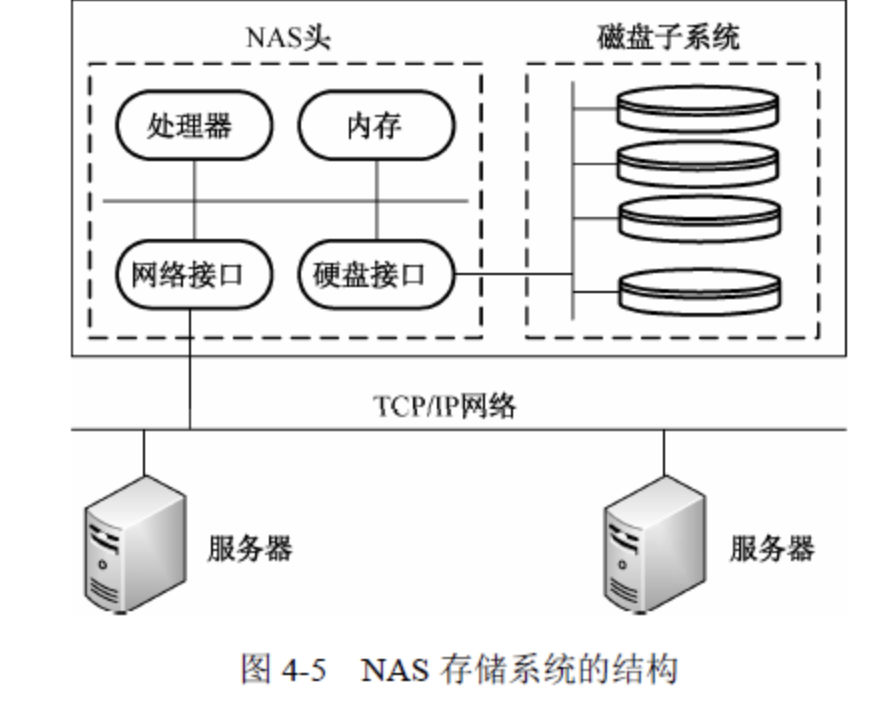

**NAS存储设备去掉了通用服务器的大多数计算功能，仅提供文件系统功能**，降低设备成本，并且为方便存储设备到网络直接能以最有效的方式发送数据，专门优化了系统硬件和软件架构。NAS以数据为中心，将存储设备与服务器分离，其存储设备在功能上完全独立于网络中的主服务器，**客户机和存储设备之间的数据访问不再需要文件服务器的干预，同时它允许客户机与存储设备直接进行直接的数据访问**，所以响应速度快数据传输速率也很高。

NAS支持多种TCP/IP网络协议，主要是NFS（网络文件系统）和CIFS（通用Internet文件系统）进行文件访问。

NAS可以很经济的解决存储容量不足的问题，但难以获得满意的性能。

##### 4.5.3 存储区域网络（SAN）

SAN时通过专用交换机将磁盘阵列与服务器连接起来的高速专用子网。他没有采用文件共享存取方式，而是采用块（block）级别存储。**SAN是通过专用高速网将一个或多个网络存储设备和服务器连接起来的专用存储系统。**最大特点是将存储设备从传统的以太网中分离出来，成为独立的存储区域网络。

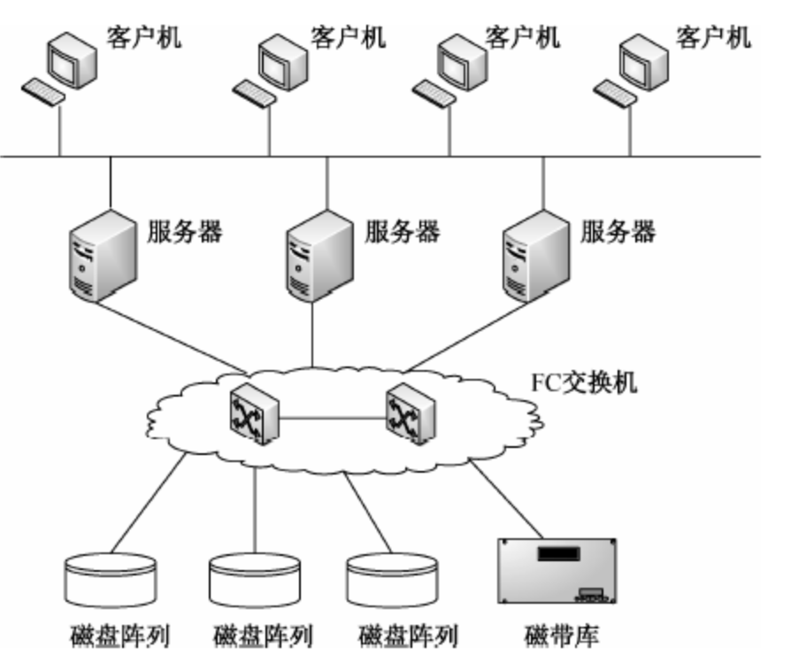

根据数据传输过程中采用的协议，技术划分为FC SAN和IP SAN。还有一种新兴的IB SAN

1. FC SAN。（光纤通道），主要特性有：热插拔性，高速带宽，远程连接，连接设备数量大等。他是当今最昂贵和最复杂的存储架构，需要大量投资。

   由接口（SCSI、FC）、连接设备（交换机、路由器）和协议（IP,SCSI）。再加上附加的存储设备和服务器就构成一个SAN系统，它是专用、高速、高可靠的网络，允许独立、动态的增加存储设备，使得管理和集中控制更加简化。

   FC SAN成本高和复杂，使用了FC（光纤），需要每个服务器上都有FC适配器，专用的FC交换机和独立的布线基础架构。使得成本大大增加

2. IP SAN，给予IP网络实现数据块级别存储方式的存储网络。由于设备成本低，配置技术简单，可共享和使用大容量的存储空间，得到广泛的应用。

   具体用用上，IP存储主要是指ISCSI（Internet SCSI），ISCSI基于IP网络实现SAN架构，既具备了IP网络配置和管理简单的优势，又提供了SAN架构所拥有的强大功能和扩展性。ISCSI是连接到一个TCP/IP网络的直接寻址的存储哭，通过使用TCP/IP协议对SCSI指令分装，使指令能够通过IP网络传输，过程不依赖于地点。

   优势在于：建立在SCSI、TCP/IP这些稳定和熟悉的标准上，安装成本和维护费用很低。其次ISCSI支持的一般的以太网交互集而不是特殊的光纤通道交换机，从而减少了异构网络和电缆；ISCSI通过IP传输命令，没有距离限制。

   缺点在于：存储和网络是一个物理结构，协议本身开销较大，协议本身需要频繁的将SCSI命令封装到IP包及解析，这两个因素都造成了带宽的占用更和朱处理器的负担。但，随着专门处理ISCSI指令的芯片的开发（解决主处理器的负担问题），以及10G以太网的普及（解决带宽问题），ISCSI能够更好发展。

### 4.6 综合布线

综合布线时一种模块化的、灵活性极高的建筑物内或建筑群之间的信息传输通道。综合布线由不同系列和规格的布线组成，其包括：传输介质，相关连接硬件（配线架、连接器、插座、插头、适配器）及电气保护设备等

根据《综合布线系统工程设计规范》（GB503110-2007），综合布线系统可分为

1. 工作区：**一个独立的需要设置终端设备的区域** 宜划分为一个工作区（有点像弱电箱）。工作区应由配线子系统的信息插座模块延伸到终端设备出的连接缆线及适配器组成。
2. 配线子系统：配线子系统应由**工作区**的信息插座模块、**信息插座模块至电信间**配线设备的配线电缆和光缆、电信间的配线设备及设备缆线和跳线等组成
3. 干线子系统：应由**设备间至电信间**的干线电缆和光缆，安装在设备间的建筑物配线设备及设备缆线和跳线组成。
4. 建筑群子系统：应由连接**多个建筑物之间**的主干电缆和光缆、建筑群配线设备及设备缆线和跳线组成
5. 设备间：每幢建筑物的适当地点进行网络挂你和信息交换的场地。
6. 进线间：建筑物外部通信和信息管线的入口部位，并可作为入口设施和建筑群配线设备的安轧辊场地
7. 管理：管理应对工作区、电信间、设备间、进线间的配线设备、缆线、信息插座模块等设施，按一定的模式进行标识和记录。

## 5 系统性能评价

### 5.1 性能指标

#### 5.1.1 计算机

1. 时钟频率：很大程度决定计算机的运算速度。CPU的工作节拍是由主时钟来控制的，主时钟不断产生固定频率的时钟脉冲。现在不止看这个，还得看单个CPU的核心数量。
2. 高速缓存：可以提高CPU的运行效率。一般使用两级高速缓存，也存在三级。由静态RAM组成，结构较复杂，在CPU管芯面积不能太大的情况下，L1不会很大。采用回写结构的高速缓存。它对读和写提供缓存；采用写通结构的高速缓存，仅对读有效。L2和L3也会影响CPU性能，原则上越大越好
3. 运算速度：计算机工作能力和生产效率的主要表征，取决于给定时间CPU能处理的数据量和CPU的主频，一般用MIPS（百万条指令/秒）和MFLOPS（百万次浮点运算/秒）。
4. 运算精度：计算机处理信息时能直接处理的二进制数据的位数，位数越多，精度越高。单片机中，主要是用8位和16位
5. 内存的存储容量：内存用来存储数据和程序，直接与CPU进行信息交换，内存容量越大，可存储的数据和程序越多，从而减少磁盘信息交换的次数，运行效率从而提高。
6. 存储器的存取周期：内存完成一次读/写操作需要的时间成为存储器的存取时间/访问时间。连续两次读（或写）所需的最短时间成为存储周期。周期越短，系统性能越好，目前大概是几到几十ns。
7. 数据处理速率：PDR的计算公式是PDR=L/R，L=0.85\*每条定点指令的位数+0.15\*每条浮点指令的位数+0.4\*定点操作数的位数+0.15\*浮点操作数的位数，R=0.85\*平均定点加法时间+0.09\*平均浮点加法时间+0.06\*平均浮点乘法时间。**PDR主要用来度量CPU和主存储器的速度，没有涉及高速缓存和多功能等。因此PDR不能度量机器的整体速度。**
8. 响应时间：某一事件从发生到结束的这段时间，可以是原子的，也可以是有几个响应时间复合而成的。
   1. 0.1s：用户感觉不到任何延迟
   2. 1.0s：用户愿意接受的系统立即响应的时间极限。超过，意味着用户会感觉到延迟
   3. 10s：用户保持注意力执行本次任务的极限，如果超过这个时间还得不到有效的反馈，客户会在等待计算机完成当前操作时转向其他的任务
9. RASIS特性：可靠性（Reliability），可用性（Availability），可维护性（Serviceability），完整性（Integraity）和安全性（Security）的统称，具体在17.5介绍
10. 平均故障响应时间：TAT，从出现故障到该故障得到确认修复前的这段时间。这指标反映的是服务水平，越短对用户系统影响越小
11. 兼容性：一个系统的硬件或软件与另一个系统或多种操作系统的硬件或软件的兼容力，指系统间某些方面具有的并存性，即两个系统之间存在一定程度的通用性。

#### 5.1.2 网络

1. 设备级性能指标：网络设备提供的通信量的特征，是确定网络性能的一个重要因素。计算机网络设备（主要是路由器）的标准性能指标主要包括吞吐量（信道的最大吞吐量为“信道容量”）、延迟、丢包率和转发速度等
2. 网络级性能指标：可达性、网络系统的吞吐量、传输速率、信道利用率、信道容量、带宽利用率、丢包率、平均传输延迟、平均延迟抖动、延迟/吞吐量的关系、延迟抖动/吞吐量的关系、丢包率/吞吐量的关系等
3. 应用级性能指标：QOS、网络对语言应用的支持程度、网络对视频应用的支持程度、延迟/服务质量的关系、丢包率/服务质量的关系、延迟抖动/服务质量的关系等
4. 用户级性能指标：计算机网络是一种长周期运行的系统，可靠性和可用性是长周期运行系统非常重要的服务性能，是决定系统是否有实际使用价值的重要参数。
5. 吞吐量：在没有帧丢失的情况下，设备能够接受的最大速率。网络吞吐量可以帮助寻找网络路径中的瓶颈。网络吞吐量很依赖当前网络的负载情况，需要在不同时间分别测试，这样才能得到对网络吞吐量的全面认识。

#### 5.1.3 操作系统

1. 系统的可靠性
2. 系统的吞吐量，系统在单位时间内所处理的信息量，以每小时或每天所处理的各类作业的数量来度量
3. 系统响应时间，指用户从提交作业到得到计算结果这段时间，又称周转时间
4. 系统资源利用率，指系统中各个部件、各种设备的使用程度。它用给定时间内，某一设备实际使用时间所占比例来度量
5. 可移植性

#### 5.1.4 数据库管理系统

数据库为了保证存储在其中的数据的安全和一致，必须有一组软件来完成相应的管理任务，这组就是DBMS。

1. 数据库描述功能：定义数据库的全面逻辑结构，局部逻辑结构和其他各种数据库对象
2. 数据库管理功能：包括系统配置与管理，数据存取与更新管理，数据完整性管理和数据安全性管理
3. 数据库的查询和操作功能：包括数据检索和修改
4. 数据库维护功能：包括数据引入引出管理，数据库结构维护，数据恢复功能和性能监测。

衡量数据库管理系统的主要性能指标包括数据库本身和管理系统两部分。

数据库和数据库管理系统的性能指标包括

- 数据库的大小
- 单个数据库文件的大小
- 数据库中表的数量
- 单个表的大小
- 表中允许的记录（行）数量
- 单个记录（行）的大小
- 表上所允许的索引数量
- 数据库所允许的索引数量
- 最大并发事务处理能力
- 负载均衡能力
- 最大连接数

#### 5.1.5 Web服务器

主要性能指标

- 最大并发连接数
- 响应延迟
- 吞吐量（每秒处理的请求数）
- 成功请求数
- 失败请求数
- 每秒点击次数
- 每秒成功点击次数
- 每秒失败点击次数
- 尝试连接数
- 用户连接数

### 5.2 性能计算

主要方法有：

- 定义法：根据其定义直接获取其理想数据
- 公式法：一般适用根据基本定义所衍生出的复合性能指标的计算
- 程序检测法：通过实际测试来得到其实际值
- 仪器检测法：通过实际测试来得到其实际值

##### 5.2.1 MIPS的计算方法

MIPS = 指令条数/（执行时间\*10^6）=Fz/CPI=IPC\*Fz

Fz为处理机的工作主频，CPI为每条指令所需的平均时钟周期数，IPC为每个时钟周期平均执行的指令条数。例如计算Penitium IV/2.4E处理机的运算速度，Penitium IV/2.4E处理机的IPC=2，因此结果是MIPS = 2 * 2400 = 4800MIPS

##### 5.2.2 峰值计算

计算机每秒钟能完成的浮点计算最大次数，包括理论浮点峰值和实测浮点峰值。

理论浮点峰值时该计算机理论上能达到的每秒钟能完成浮点计算的最大次数，由主频决定

##### 5.2.3 等效指令速度

--放弃

