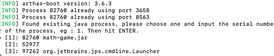
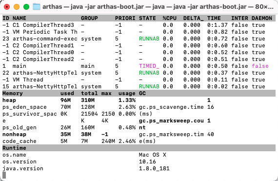
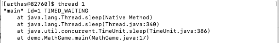
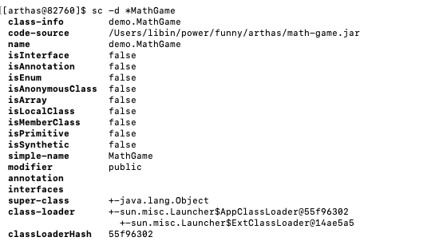
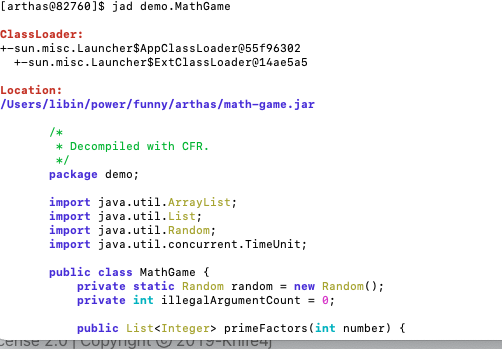
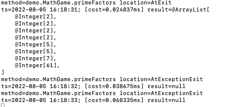
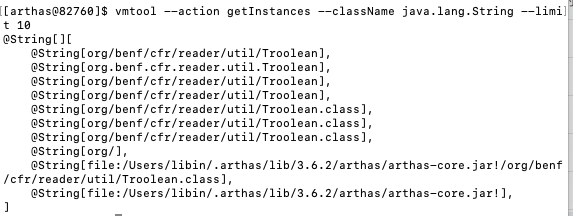

# Arthas

```shell
## 启动arthas 并选择对应的程序
java -jar arthas-boot.jar
```



```shell
## 打开当前系统的实时数据面板
dashboard
```



```shell
## 打印线程X的栈, 支持grep 管道，注意两边空格
thread 1 [ | grep '']
```



```shell
## 查找JVM里加载的类
sc -d *MathGame
## 查看所有Filter的实现类
sc javax.servlet.Filter
## 查看所有的StringUtils
sc *StringUtils

## 查询类的具体函数
sm java.math.RoundingMode
## 查询函数的具体属性
sm -d java.math.RoundingMode
## 查询特定的函数，比如查询构造函数
sm java.math.RoundingMode <init>

```



```shell
## 查看反编译代码
jad demo.MathGame
```



```shell
## 查看函数参数、返回值、异常信息,一般只能打印100次
watch demo.MathGame primeFactors returnObj
```



```shell
## 搜索内存对象
vmtool --action getInstances --className java.lang.String --limit 10
```




## 以下是

```shell
## 打印所有的System Properties信息,可以使用管道
sysprop [ | grep xxxx]
## 设置新的value
sysprop testKey testValue
## 获取环境变量
sysenv [ | grep xxx]
## 设置新的环境变量
sysenv testKey testValue
## 打印jvm的详细信息
jvm
```

