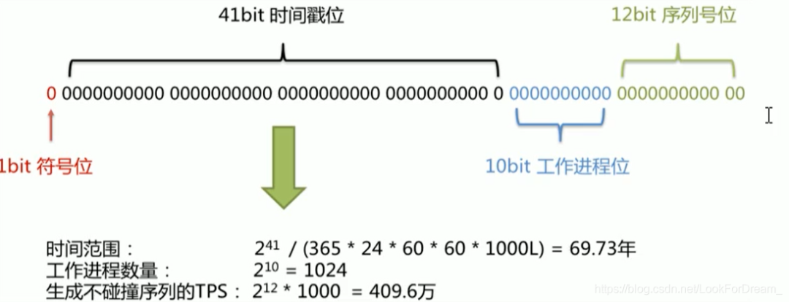
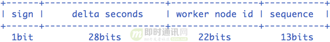

# 分布式唯一ID生成方案

> 背景：
>
> UUID无序，对于使用MySQL进行数据存储的软件来说，使用UUID虽然能够解决全局唯一ID的要求（其实本质上也无法实现，在极快的QPS的情况下，UUID也有可能重复），但是UUID作为无序的id在座位MySQL的主键时，会对MySQL的B+Tree造成很大的影响，每次插入都会对主键的B+树进行很大的修改，会导致中间节点产生分裂（页分裂），也会创造很多不饱和的节点，会大大的影响插入的性能。
>
> 同时由于UUID无序，无法实现趋势上递增，单调递增的要求
>
> 采用数据库自增对于后期数据库分库分表会产生极大的影响

## 1.  Twitter的分布式自增ID算法，Snowflake

Twitter的分布式雪花算法SnowFlake，经测试SnowFlake每秒可以产生26万个自增可排序的ID

- twitter的SnowFlake生成ID能够按照时间有序生成
- SnowFlake算法生成ID的结果是一个64Bit大小的整数，为一个Long型（转换成字符串后长度最多19）
- 分布式系统内不会产生ID碰撞（由datacenter 和 workerID做区分）并且效率较高

### 1.1 内容

在Java中64bit的证书是long类型，所以在SnowFlake算法生成的ID就是long类存储的

#### 1.1.1 第一部分

二进制的最高位是符号位，1标识负数，0标识负数，这里固定位0

#### 1.1.2 第二部分

时间戳，毫秒，41位可以表示2^ 41-1个数字，转换成单位年是69.73年

#### 1.1.3 第三部分

工作机器id，10Bit用来记录工作ID，可以部署在2^10个节点，本质上可以任意分配这几个节点具体的内容

#### 1.1.4 第四部分

12bit的序列号可以用来标识的整数位 2^12  = 4096，可以表示同一机器同一个时间戳产生的4096个序号。

### 1.2 优缺点

##### 优点

- 毫秒数在高维，自增序列在低位，整个ID都是趋势递增的
- 不依赖数据库等第三方系统，以服务的方式部署，稳定性更高，生成ID的性能也是非常高的
- 可以根据自身业务特性分配bit位，非常灵活

##### 缺点

- 依赖机器时钟，如果机器时钟回拨，会导致重复ID生成
- 在单机上是递增的，但由于涉及到分布式环境，每台机器上的时钟不可能**完全同步**，有时候会出现不是全局递增的情况，此缺点可以认为无所谓，一般分布式ID只要求**趋势递增**，并不会严格要求递增，90%的需求只要求趋势递增。

## 2.  百度开源的分布式唯一ID生成器 UidGenerator

UidGenerator工程是百度开源的基于Snowflake算法的唯一ID生成器（百度对Snowflake算法进行了改进），引入了高性能队列高性能队列disruptor中RingBuffer思想，进一步提升了效率。

在技术实现上，UidGenerator有以下关键特性：

> 1）UidGenerator通过借用未来时间来解决sequence天然存在的并发限制；
>
> 2）采用RingBuffer来缓存已生成的UID, 并行化UID的生产和消费；
>
> 3）同时对CacheLine补齐，避免了由RingBuffer带来的硬件级「伪共享」问题。

### 2.1 内容

#### 2.1.1 第一部分

固定符号标识

#### 2.1.2 第二部分

delta seconds，当前时间，对于时间基点（任意）的增量值（偏移量），单位**秒**，最多支持8.7年

#### 2.1.3 第三部分

机器id，最多支持420次机器启动，内置实现是在启动时由数据库分配，默认分配策略为用后即弃，后续可提供复用策略

#### 2.1.4 第四部分

每秒下支持的并发序列，理论上支持每秒2^13=8192个

### 2.2 比雪花优化的地方（基于组件源码解释）

时钟回拨：**直接报错**

CachedUidGenerator是DefaultUidGenerator的重要改进实现。它的核心利用了RingBuffer，它本质上是一个数组，数组中每个项被称为slot。CachedUidGenerator设计了两个RingBuffer，一个保存唯一ID，一个保存flag。RingBuffer的尺寸是2^n，n必须是正整数。

> Ring Buffer的概念，其实来自于Linux内核（Maybe），是为解决某些特殊情况下的竞争问题提供了一种免锁的方法。这种特殊的情况就是当生产者和消费者都只有一个，而在其它情况下使用它也是必须要加锁的。
>
> 环形缓冲区通常有一个读指针和一个写指针。读指针指向环形缓冲区中可读的数据，写指针指向环形缓冲区中可写的缓冲区。通过移动读指针和写指针就可以实现缓冲区的数据读取和写入。在通常情况下，环形缓冲区的读用户仅仅会影响读指针，而写用户仅仅会影响写指针。如果仅仅有一个读用户和一个写用户，那么不需要添加互斥保护机制就可以保证数据的正确性。如果有多个读写用户访问环形缓冲区，那么必须添加互斥保护机制来确保多个用户互斥访问环形缓冲区。

## 3.  Leaf - 美团点评分布式ID生成系统

参照美团点评官方技术博客